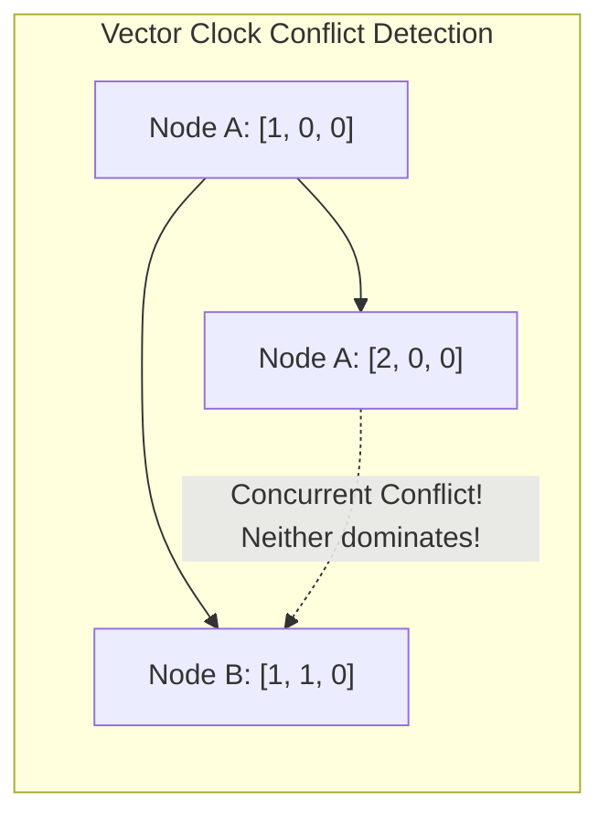

# Physical Clocks, Logical Clocks, and Vector Clocks

## Overview
Tracking the order of events across independent distributed machines is one of the hardest challenges in software engineering. Computers possess physical quartz clocks that drift due to thermal fluctuations, making physical wall-clock timestamps unreliable for determining event causality.

Distributed systems categorize clocks into three distinct paradigms:
- **Physical Clocks (Time-of-Day & Monotonic)**: Measure real elapsed physical time, synchronized imperfectly via NTP.
- **Logical Clocks (Lamport Timestamps)**: Track causal sequence order using monotonically increasing counters ($O(1)$ scalar).
- **Vector Clocks**: Track multi-node causal dependencies across concurrent processes ($O(N)$ vector), capable of detecting concurrent conflicts.

## Why It Matters
If Server A's clock runs 200ms faster than Server B's clock, an event that occurred on Server B *after* Server A can receive an earlier timestamp. Relying on physical wall-clock timestamps for Last-Write-Wins (LWW) causes silent data loss and inverted history bugs.

## Core Concepts & Mechanics
1. **Physical Clock Types & Synchronization**:
   - *Time-of-Day Clock*: Reports UTC time. Jumps forward and backward during NTP synchronization adjustments; **never use to measure elapsed duration**.
   - *Monotonic Clock*: Measures elapsed processor ticks (`System.nanoTime()`). Guaranteed to never jump backward; perfect for measuring timeouts and latencies.
   - *Network Time Protocol (NTP)*: Synchronizes server clocks over the internet, typically achieving accuracy within 10ms to 50ms (and occasionally drifting seconds off).
2. **Lamport Timestamps (Total Logical Order)**:
   - Every node maintains an integer counter $C$.
   - When a node executes an internal event: $C = C + 1$.
   - When sending a message, the node attaches its counter $C$.
   - When receiving a message with counter $C_{msg}$, the node updates its clock:
     $$C = \max(C, C_{msg}) + 1$$
   - *Limitation*: If $C(A) < C(B)$, you **cannot** determine whether $A$ caused $B$ or if $A$ and $B$ were concurrent!
3. **Vector Clocks (Causality & Conflict Detection)**:
   - For a cluster of $N$ nodes, each node maintains an array of $N$ integers: $V[1..N]$.
   - Node $i$ increments its own index on local event: $V[i] = V[i] + 1$.
   - On message receive, merge vectors: $V_{local}[j] = \max(V_{local}[j], V_{msg}[j])$.
   - **Causality Rule**:
     - Event $A$ causally preceded Event $B$ ($A \rightarrow B$) if and only if every element in $V_A \le V_B$ and at least one element is strictly smaller ($V_A < V_B$).
     - If neither dominates, **Event A and Event B occurred concurrently** (a conflict that requires domain resolution!).

## Trade-offs
| Clock Mechanism | Space Complexity | Detects Concurrency? | Real Physical Duration? |
| :--- | :--- | :--- | :--- |
| **Physical (NTP)** | $O(1)$ (64-bit float) | No (Clock skew causes false ordering)| **Yes (Measures real seconds)** |
| **Lamport Timestamp**| $O(1)$ (Single integer)| No (Provides total order, not causality)| None |
| **Vector Clock** | **$O(N)$ (Grows with nodes)**| **Yes (Mathematically proves causality)** | None |
| **Google TrueTime** | $O(1)$ | Yes (Bounds uncertainty via atomic clocks)| **Yes (Bounded real time)** |

## When to Use / When NOT to Use
### When to Use Vector Clocks
- Decentralized multi-master systems where concurrent updates must be detected and merged (e.g., shopping carts in Amazon Dynamo or Riak).

### When to Use Monotonic Physical Clocks
- Measuring API response latencies, circuit breaker timeouts, cache expirations locally on a single machine.

## Real-World Examples
- **Google TrueTime (Spanner)**: Rather than reporting a single timestamp, TrueTime returns a time interval $[t_{earliest}, t_{latest}]$ guaranteed to contain the absolute real physical time, with an uncertainty bound $\epsilon \le 7$ms backed by atomic clocks and GPS receivers in each datacenter. Spanner waits out the uncertainty window ($2\epsilon$) to guarantee linearizable multi-region commits.
- **Riak KV & Amazon Dynamo**: Use vector clocks to detect concurrent updates to the same shopping cart, presenting both versions (siblings) to the application layer to merge.

## Common Pitfalls
- **Using `System.currentTimeMillis()` for Timers**: Using time-of-day clocks to calculate request elapsed time; an NTP sync can adjust the clock backward, reporting negative latencies or premature timeout drops.
- **Unbounded Vector Clock Growth**: In systems with high node churn, vector clocks expand indefinitely with thousands of dead node IDs, requiring vector truncation (pruning) heuristics.

## Key Takeaways
- Physical quartz clocks drift; never rely on NTP timestamps for strict ordering.
- Lamport Timestamps provide a consistent total order; **Vector Clocks detect concurrent conflicts**.
- Use **monotonic clocks** to measure elapsed time on a single machine.

## Common Interview Questions
1. Why is physical wall-clock time unreliable for determining the order of events in distributed systems?
2. How do Vector Clocks mathematically distinguish between causally related events and concurrent events?
3. How does Google Spanner's TrueTime API use atomic clocks to achieve global linearizability?

## Further Reading
- [Leslie Lamport: Time, Clocks, and the Ordering of Events in a Distributed System (1978)](https://lamport.azurewebsites.net/pubs/time-clocks.pdf)
- [James C. Corbett et al.: Spanner: Google’s Globally-Distributed Database (OSDI 2012)](https://research.google/pubs/pub39966/)
