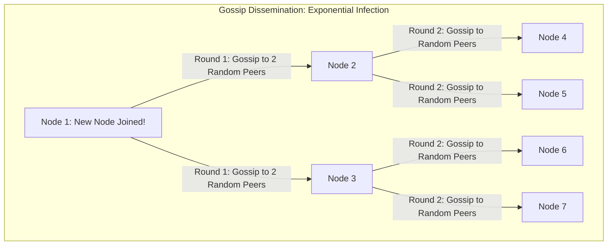
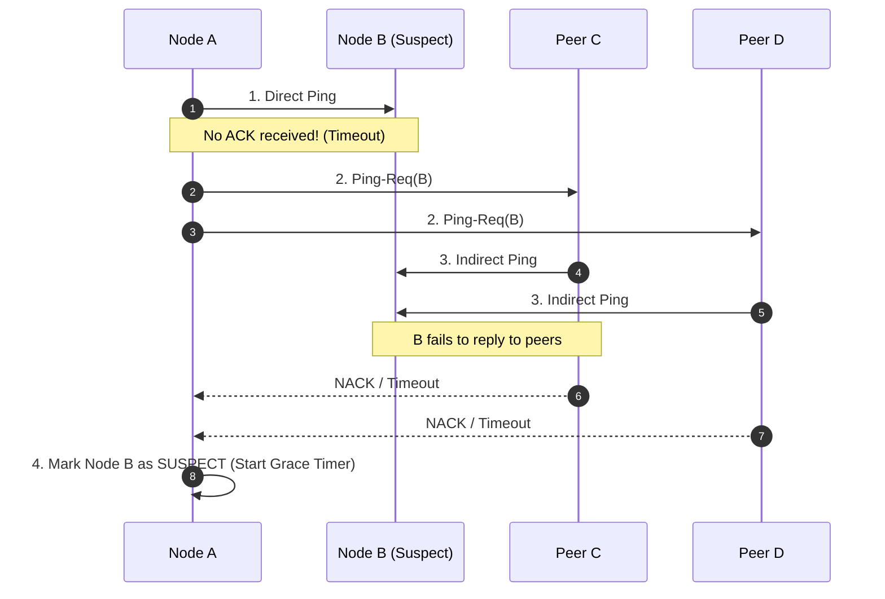

# Gossip Protocols and Failure Detection

## Overview
In large-scale decentralized systems containing thousands of nodes (e.g., Apache Cassandra, Consul, Amazon Dynamo), maintaining a centralized coordinator to track cluster membership and server health creates a single point of failure and network bottleneck.

A **Gossip Protocol** (or epidemic algorithm) is a decentralized, peer-to-peer communication protocol where nodes periodically exchange state and failure information with randomly selected peers, rapidly spreading cluster state across the network like an epidemic virus.

## Why It Matters
Centralized heartbeats fail at scale: 10,000 servers all pinging a central master generate 10,000 requests per second, overwhelming the master's network interface. Gossip protocols achieve **$O(\log N)$ dissemination time** while bounding the network overhead on every individual machine to a constant $O(1)$.

## Core Concepts & Mathematical Properties
1. **Epidemic Dissemination**:
   - Every $T$ seconds (e.g., 1 second), each node selects $k$ random peer nodes from its local membership list and transmits its known cluster state.
   - Information spreads exponentially: the number of infected nodes doubles in each round.
   - For a cluster of $N$ nodes, complete state dissemination occurs in:
     $$\text{Rounds} = O(\log N)$$
     *Example*: In a cluster of **10,000 servers**, a status update reaches 100% of all nodes in approximately **14 rounds (14 seconds)**!
2. **SWIM Protocol (Structured Weakly-Consistent Infection-Style Process Group Membership)**:
   - Modern state-of-the-art failure detector used by HashiCorp Consul.
   - Decouples failure detection from state dissemination.
   - *Direct Ping*: Node A sends a `ping` to Node B. If B replies `ack`, B is healthy.
   - *Indirect Ping*: If B does not reply, Node A sends `ping-req` to 3 random peers (C, D, E), asking them to ping B directly. This prevents false alarms caused by localized network path degradation between A and B.
   - *Suspicion Mechanism*: If indirect pings also fail, B is marked `Suspect` for a grace period before being declared dead.

## Trade-offs
| Dimension | Centralized Heartbeat (ZooKeeper/etcd) | Gossip Protocol (SWIM / Cassandra) |
| :--- | :--- | :--- |
| **Scalability Limit** | Moderate (Clusters of 10-100 nodes) | **Massive (Clusters of 10,000+ nodes)** |
| **Single Point of Failure**| Central master is a SPOF | **Zero SPOFs (Fully peer-to-peer)** |
| **Convergence Speed** | Immediate (Master updates state) | **Eventual ($O(\log N)$ time delay)** |
| **Per-Node Network Cost**| Scales with cluster size | **Constant $O(1)$ bandwidth per node** |

## When to Use / When NOT to Use
### When to Choose Gossip Protocols
- Cluster membership and failure detection in massive clusters (100 to 10,000 nodes): Cassandra, ScyllaDB, Consul, Redis Cluster.

### When NOT to Use Gossip
- Systems requiring instantaneous, strongly consistent cluster topology agreement (use Raft/etcd instead).

## Real-World Examples
- **HashiCorp Consul & Serf**: Built on the **SWIM** gossip protocol, managing cluster membership and node discovery across thousands of multi-cloud VMs.
- **Apache Cassandra**: Uses gossip to exchange cluster topology, schema definitions, token ring assignments, and node health every second.

## Common Pitfalls
- **Gossip Bandwidth Amplification**: Sending entire full cluster state payloads in every gossip packet instead of delta digests, saturating network interfaces on large clusters.
- **Premature Node Ejection**: Setting gossip failure timeouts too aggressively, causing temporary CPU spikes or garbage collection pauses to declare healthy nodes dead.

## Key Takeaways
- Gossip protocols disseminate state in $O(\log N)$ rounds with constant $O(1)$ overhead per node.
- The **SWIM protocol** uses indirect pings (`ping-req`) to eliminate false alarms from bad network links.
- Gossip provides **eventual consistency** for cluster membership, not instantaneous linearizability.

## Common Interview Questions
1. How does the SWIM protocol detect node failures while minimizing false positives?
2. Why does a Gossip protocol scale to 10,000 nodes when centralized heartbeat architectures fail?
3. What is the mathematical propagation speed of an epidemic gossip algorithm?

## Further Reading
- [Das, Gupta, and Motivala: SWIM: An Efficient Protocol for Weakly-Consistent Infection-Style Process Group Membership (IEEE DSN 2002)](https://www.cs.cornell.edu/projects/Quicksilver/public_pdfs/SWIM.pdf)
- [HashiCorp: Serf Gossip Protocol Architecture](https://www.serf.io/docs/internals/gossip.html)
