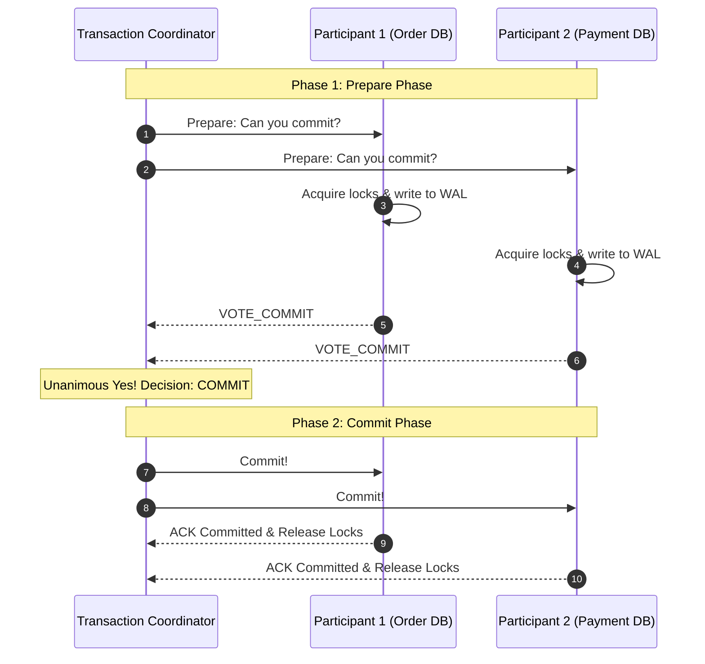

# Distributed Transactions: Two-Phase Commit (2PC) and 3PC

## Overview
A **distributed transaction** is an atomic set of operations spanning multiple independent database nodes or microservices. Maintaining ACID guarantees across network boundaries requires atomic commitment protocols:
- **Two-Phase Commit (2PC)**: A classical coordinator-driven protocol guaranteeing all participating nodes either commit or abort together.
- **Three-Phase Commit (3PC)**: A non-blocking variant introducing an intermediate pre-commit phase with timeouts.

## Why It Matters
2PC is the traditional bedrock of enterprise databases, but it carries a notorious operational flaw: **it is a blocking protocol**. If the coordinator crashes during Phase 2 after participants have voted yes, all participants must wait indefinitely, holding database row locks open and stalling the entire enterprise until the coordinator recovers.

## Core Concepts & Protocol Phases

### Two-Phase Commit (2PC) Mechanics
1. **Phase 1: Prepare (Voting)**:
   - Coordinator sends `PREPARE` message to all participants.
   - Each participant checks constraints, executes the mutation locally, writes changes to its local WAL, acquires exclusive row locks, and votes `VOTE_COMMIT` or `VOTE_ABORT`.
2. **Phase 2: Commit (Decision)**:
   - If **all** participants voted `VOTE_COMMIT`: Coordinator logs `COMMIT` to its WAL and broadcasts `COMMIT` to all participants. Participants commit, release locks, and reply `ACK`.
   - If **any** participant voted `VOTE_ABORT` or timed out: Coordinator broadcasts `ABORT`. All participants roll back and release locks.

### The Blocking Problem of 2PC
- If the Coordinator crashes after participants vote `VOTE_COMMIT`, participants are trapped in an uncertain state. They cannot unilaterally commit (in case another participant voted no), nor can they abort (in case the coordinator decided to commit). They **must remain blocked holding locks**.

### Three-Phase Commit (3PC)
- Decomposes Phase 2 into **Pre-Commit** and introduces timeouts in all states to make the protocol non-blocking in fail-stop failure models.
- *Reality*: 3PC assumes a synchronous network with bounded message delays; in real asynchronous networks subject to partitions, **3PC fails to prevent split-brain inconsistencies**, rendering it rarely used in production.

## Trade-offs
| Protocol | Consistency Guarantee | Availability / Fault Tolerance | Throughput Capacity |
| :--- | :--- | :--- | :--- |
| **Two-Phase Commit (2PC)** | **Strict Atomic ACID** | **Extremely Poor (Blocks on coordinator failure)**| Low (< 500 TPS due to lock wait)|
| **Three-Phase Commit (3PC)**| High (in synchronous networks)| Non-blocking in theory | Low |
| **Saga Pattern** | Eventual Consistency | **Maximum (Decoupled, non-blocking)** | **Massive (Tens of thousands TPS)**|

## When to Use / When NOT to Use
### When to Use 2PC
- Distributed relational SQL engines operating over low-latency private datacenter LANs (CockroachDB, Google Spanner, Citus).

### When NOT to Use 2PC
- Microservice architectures communicating over public internet or across cloud regions! A single slow service or network hiccup freezes the entire distributed transaction. Use the **Saga Pattern** instead.

## Real-World Examples
- **XA Transactions (JTA)**: The enterprise standard implementation of 2PC across relational databases and JMS message queues (e.g., Oracle, IBM MQ).
- **Google Spanner**: Uses Paxos for leader replication and Two-Phase Commit for cross-distributed-shard transactions, utilizing TrueTime atomic clocks to minimize 2PC commit-wait durations.

## Common Pitfalls
- **Distributed Deadlocks**: Two cross-shard 2PC transactions acquiring locks on Shard A and Shard B in reverse order, creating distributed deadlocks requiring complex distributed cycle-detection algorithms to resolve.
- **Cascading Connection Pool Exhaustion**: A slow participant stalling Phase 1, forcing all other participants to hold database connections open until backend connection pools saturate.

## Key Takeaways
- 2PC guarantees atomicity across shards, but is **inherently blocking** if the coordinator crashes.
- 2PC is suitable for internal distributed databases (Spanner), but an anti-pattern across microservices.
- Prefer event-driven **Sagas** and eventual consistency for distributed application workflows.

## Common Interview Questions
1. Why is Two-Phase Commit considered a blocking protocol, and what happens if the coordinator crashes?
2. Why is Three-Phase Commit rarely implemented in real-world distributed cloud networks?
3. How does Google Spanner mitigate the latency penalties of Two-Phase Commit?

## Further Reading
- [Jim Gray: Notes on Data Base Operating Systems (2PC Formulation, 1978)](https://dl.acm.org/doi/10.5555/647433.723863)
- [Designing Data-Intensive Applications: Distributed Transactions in Practice (DDIA Chapter 9)](https://dataintensive.net/)
