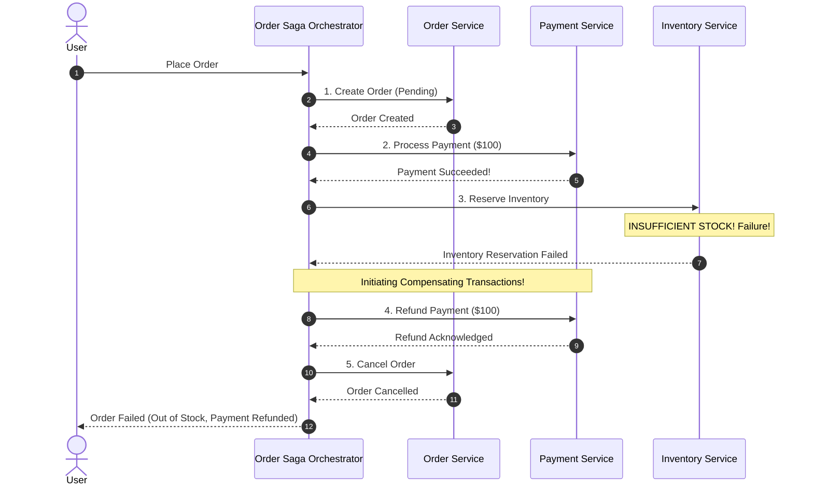

# The Saga Pattern: Distributed Long-Running Transactions

## Overview
In microservice architectures, maintaining data consistency across independent database boundaries without the high latency and blocking hazards of Two-Phase Commit (2PC) is accomplished using the **Saga Pattern**.

A **Saga** is a sequence of independent local transactions. Each local transaction updates the database of a single service and publishes an event or message. If a step fails, the saga executes a series of **compensating transactions** that semantically undo the changes made by preceding steps.

## Why It Matters
In microservices, each service strictly owns its private database. A checkout flow involving `OrderService`, `PaymentService`, and `InventoryService` cannot execute a single ACID transaction. Sagas embrace **Eventual Consistency**, allowing each service to operate at maximum speed without holding cross-service database locks.

## Core Concepts & Saga Coordination Models

### 1. Orchestrated Sagas (Centralized Coordinator)
- A dedicated **Saga Orchestrator** (State Machine) sends command messages to participant services and awaits reply events.
- *Advantages*: Easy to understand; complete visibility of workflow status in a single state machine diagram; simplifies tracking and timeouts.
- *Disadvantage*: Centralized point of architectural coupling.

### 2. Choreographed Sagas (Decentralized Events)
- Services publish domain events to a shared message broker (Kafka/RabbitMQ); other services listen and react independently.
- *Advantages*: Loosely coupled; highly decentralized.
- *Disadvantages*: Difficult to visualize; risk of circular event dependencies; tracing failures across 10 event queues is complex.

### 3. Compensating Transactions (Semantic Rollback)
- In a traditional database, rollback restores the previous byte state.
- In a Saga, you cannot simply "rollback" because subsequent operations may have already read the intermediate state. Instead, you execute a **compensating transaction** that semantically reverses the action (e.g., executing a *Refund* to reverse a *Payment*, or sending an *Apology Email*).

## Trade-offs
| Feature | Orchestrated Saga | Choreographed Saga | Two-Phase Commit (2PC) |
| :--- | :--- | :--- | :--- |
| **Coupling** | Moderate (Orchestrator knows flow)| **Low (Decentralized events)** | High (Strict lock coordination)|
| **Observability** | **Exceptional (Inspect state machine)**| Poor (Distributed event trail) | Moderate |
| **Consistency** | Eventual | Eventual | **Strict ACID** |
| **Lock Contention**| **Zero (Local transactions only)** | **Zero (Local transactions only)**| High (Holds global row locks) |

## When to Use / When NOT to Use
### When to Use Sagas
- Distributed checkout flows, travel booking (flight + hotel + car), subscription billing workflows, supply chain order processing.

### When NOT to Use Sagas
- Complex multi-row accounting reconciliations where intermediate states must never be visible to any observer (use a single relational database instead).

## Real-World Examples
- **Uber Ride Booking Saga**: When a rider requests a trip, an orchestrator coordinates driver dispatch, customer credit hold, dynamic pricing, and notification emission. If no drivers accept within 2 minutes, compensating actions release the credit hold and notify the user.
- **AWS Step Functions & Temporal.io**: Enterprise workflow orchestration platforms specifically engineered to execute fault-tolerant, resilient Saga state machines with automated retries and compensation.

## Common Pitfalls
- **Missing Idempotency on Compensations**: If the orchestrator retries a refund compensation call due to network timeout, the payment service must be **strictly idempotent** to avoid refunding the customer twice.
- **Dirty Reads of Intermediate States**: A user sees their order marked as "Paid" during step 2, but step 3 fails and reverts it 500ms later, confusing customer service agents (mitigated by using explicit state flags: `PENDING_PAYMENT`, `PAYMENT_FAILED`).

## Key Takeaways
- Sagas coordinate distributed business transactions through local ACID commits and **compensating transactions**.
- Prefer **Orchestrated Sagas** for complex multi-step workflows to maintain central visibility.
- All compensating transactions and saga steps must be strictly **idempotent**.

## Common Interview Questions
1. How does a compensating transaction differ from an ACID database rollback?
2. What are the trade-offs between Choreography and Orchestration in the Saga pattern?
3. How do you handle a scenario where a compensating transaction itself fails?

## Further Reading
- [Hector Garcia-Molina and Kenneth Salem: Sagas (ACM SIGMOD 1987)](https://www.cs.cornell.edu/andru/cs711/2002fa/reading/sagas.pdf)
- [Temporal.io: Distributed Sagas and Workflow Orchestration](https://temporal.io/)
