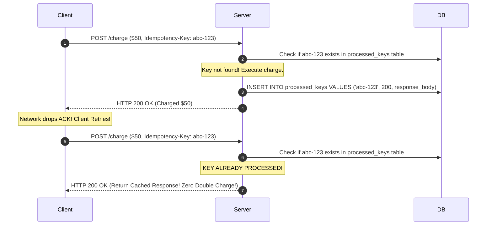

# Idempotency and Message Delivery Guarantees

## Overview
In distributed networks, messages can be lost, delayed, duplicated, or reordered due to network retries and socket disconnects. Distributed systems define three standard **message delivery guarantees**:
- **At-Most-Once**: Messages may be lost, but are never duplicated (e.g., UDP fire-and-forget).
- **At-Least-Once**: Messages are guaranteed never to be lost, but may be delivered multiple times due to retries.
- **Exactly-Once (Effectively-Once)**: Every message is processed exactly once by the destination application logic.

Achieving practical exactly-once processing in the real world is accomplished by combining **At-Least-Once delivery with strict application-level Idempotency**.

## Why It Matters
Without idempotency, a network timeout during a credit card payment causes the client app to retry the API call, charging the customer's card twice. In distributed messaging, network retries guarantee that duplicate messages *will* arrive; idempotency guarantees safety.

## Core Concepts & Mathematical Definition
An operation is **idempotent** if applying it multiple times produces the exact same system state as applying it once:
$$f(f(x)) = f(x)$$

### HTTP Method Idempotency Standards
- **`GET`, `HEAD`, `OPTIONS`**: Safe and Idempotent (Read-only).
- **`PUT`**: Idempotent (`UPDATE users SET age = 30 WHERE id = 1` produces identical state regardless of executions).
- **`DELETE`**: Idempotent (Deleting an item once removes it; subsequent deletes find it already gone).
- **`POST`**: **NOT Idempotent by default** (`POST /transfers` creates a new transfer on every invocation).

## How It Works: The Idempotency Key Architecture
To make non-idempotent operations (`POST`) safe:
1. **Client Generates Unique Key**: The client generates a unique UUID `Idempotency-Key: 9b1deb4d-3b7d-4bad-9bdd-2b0d7b3dcb6d`.
2. **Atomic Lock / Check**:
   - Backend opens a database transaction:
     `INSERT INTO idempotency_keys (key, status, response) VALUES ('...', 'PROCESSING', NULL) ON CONFLICT DO NOTHING;`
   - If insertion succeeds: Process payment -> Store serialized response payload -> Mark status `'COMPLETED'`.
   - If insertion conflicts (key already exists):
     - If status is `'PROCESSING'`: Return HTTP 409 Conflict (Concurrent in-flight duplicate).
     - If status is `'COMPLETED'`: **Immediately return the cached response body** without re-executing business logic.

## Trade-offs
| Guarantee | Latency | Complexity | Risk |
| :--- | :--- | :--- | :--- |
| **At-Most-Once** | Lowest | Minimal | Data loss under network blips |
| **At-Least-Once** | Low | Low to Moderate | Duplicate processing bugs |
| **Effectively-Once (At-Least-Once + Idempotent)**| Low to Moderate | Moderate (Requires deduplication table)| **Zero data loss, Zero duplicates** |

## When to Use / When NOT to Use
### When Strict Idempotency is Mandatory
- Payment gateways, billing subscriptions, inventory reservations, order placements, bank transfers.

### When At-Most-Once Suffices
- High-frequency video streaming frames, mouse cursor telemetry, non-critical logging where losing 0.01% of packets is negligible.

## Real-World Examples
- **Stripe API**: Industry gold standard for idempotency. All mutating POST endpoints accept an `Idempotency-Key` header. Stripe guarantees that retrying an API call within 24 hours with the same key returns the original charge result without double-billing.
- **Apache Kafka Idempotent Producer**: Attaches a Producer ID (PID) and a monotonically increasing sequence number to every message batch. The broker rejects any batch with a duplicate sequence number.

## Common Pitfalls
- **Caching Before Commit**: Caching the idempotency response before the database transaction commits; if the database transaction rolls back, future retries receive a cached "Success" response for an action that never committed!
- **Non-Expiring Keys**: Storing idempotency keys forever in an unpartitioned relational table, eventually slowing down index lookups (enforce a 24 to 72-hour TTL).

## Key Takeaways
- True "Exactly-Once" over networks is a mathematical impossibility; it is realized in practice as **At-Least-Once delivery paired with Idempotent consumer processing**.
- Use **Idempotency Keys** with atomic database constraints on all mutable POST endpoints.
- Always cache the original response body to ensure identical return payloads on duplicate retries.

## Common Interview Questions
1. How do you design an idempotent payment processing endpoint?
2. Why is true "exactly-once" delivery impossible in distributed systems, and how do we simulate it?
3. How does the Two Generals' Problem prove that reliable consensus is impossible over an unreliable link?

## Further Reading
- [Stripe Engineering: Designing Robust and Predictable APIs with Idempotency](https://stripe.com/blog/idempotency)
- [RFC 7231: Hypertext Transfer Protocol (HTTP/1.1): Semantics and Content (Section 4.2.2 Idempotent Methods)](https://datatracker.ietf.org/doc/html/rfc7231#section-4.2.2)
