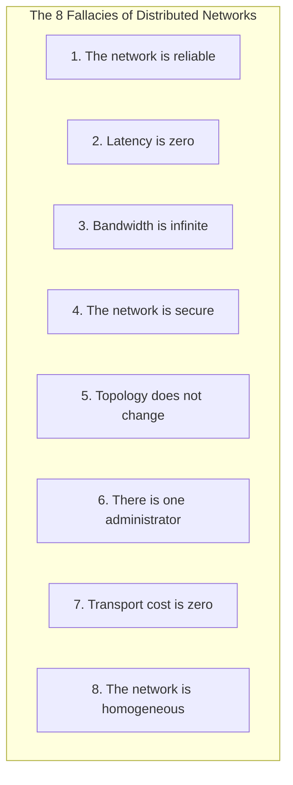

# The 8 Fallacies of Distributed Computing

## Overview
In 1994, L. Peter Deutsch and James Gosling at Sun Microsystems formulated **The Fallacies of Distributed Computing**: eight fundamental false assumptions that software engineers routinely make when transitioning from single-node monolithic applications to distributed networks.

Every major distributed systems outage can be traced directly back to an engineer implicitly assuming that one of these eight statements was true.

## Why It Matters
When engineers assume these fallacies to be true, they design fragile systems that freeze during packet drops, expose plain-text microservice ports to internal lateral movement, crash during cloud autoscaling events, and produce multi-million dollar cloud egress bills.

## Deconstructing the 8 Fallacies & Their System Design Antidotes

### 1. "The network is reliable"
- *The Reality*: Fiber cables get severed by construction backhoes, switches crash, Wi-Fi drops packets, and TCP connections randomly reset.
- *Antidote*: Design for failure from day one. Implement **Timeouts**, **Exponential Backoff with Jitter**, **Circuit Breakers**, and **Idempotent Retries**.

### 2. "Latency is zero"
- *The Reality*: In-memory function calls take 10 nanoseconds. A cross-datacenter RPC takes 50 milliseconds (**5,000,000x slower**).
- *Antidote*: Minimize chatty microservice RPCs. Coalesce requests, leverage **batching**, and cache hot reads at the edge.

### 3. "Bandwidth is infinite"
- *The Reality*: Network cards saturate at 10 Gbps or 40 Gbps. Large payloads congest switches and trigger bufferbloat.
- *Antidote*: Use compact binary serialization (**Protocol Buffers** instead of JSON), compress data streams (Zstandard), and offload large media blobs to CDNs.

### 4. "The network is secure"
- *The Reality*: Attackers routinely compromise edge perimeter firewalls and pivot laterally inside internal private VPCs.
- *Antidote*: **Zero Trust Architecture**. Encrypt all east-west internal traffic with **Mutual TLS (mTLS)** and enforce strict authorization at every service boundary.

### 5. "Topology does not change"
- *The Reality*: In modern Kubernetes and cloud clusters, IP addresses are ephemeral. Servers scale up, crash, and re-provision constantly.
- *Antidote*: Use dynamic **Service Discovery (Consul, CoreDNS)** rather than hardcoded IP addresses.

### 6. "There is one administrator"
- *The Reality*: Different teams manage different services, databases, firewalls, and cloud accounts, deploying breaking configuration changes independently.
- *Antidote*: Contract-driven API design (OpenAPI/Protobuf), semantic versioning, and Consumer-Driven Contract testing.

### 7. "Transport cost is zero"
- *The Reality*: Serializing and deserializing JSON payloads consumes substantial CPU cycles. Furthermore, cloud providers charge **$0.01 to $0.02 per GB for cross-AZ and cross-region data egress**.
- *Antidote*: Co-locate chatty services within the same Availability Zone where possible; use binary serialization to cut CPU marshalling overhead.

### 8. "The network is homogeneous"
- *The Reality*: Systems run across diverse hardware architectures, operating systems, mobile devices, and legacy protocols.
- *Antidote*: Standardize on open, platform-agnostic wire protocols (HTTP/2, gRPC, JSON).

## Trade-offs
| Architectural Approach | Advantage | Disadvantage |
| :--- | :--- | :--- |
| **Defensive Resiliency (Assuming Network Fails)**| High uptime, graceful degradation under failure | Higher code complexity (retries, fallbacks) |
| **Naive Optimism (Assuming Fallacies are True)** | Faster initial development velocity | Catastrophic production outages at scale |

## Real-World Examples
- **AWS S3 Outage (2017)**: An engineer entered a typo command to take a small number of billing servers offline; because other services assumed zero-latency local communication, a hidden dependency cascade caused AWS services worldwide to stall waiting on billing status, bringing down large parts of the internet.

## Common Pitfalls
- **Indefinite Socket Timeouts**: Setting socket timeout to 0 (infinite wait); when downstream hangs, upstream threads block forever, cascading thread exhaustion throughout the entire microservice fleet.
- **Ignoring Cross-AZ Egress Bills**: Transferring petabytes of analytics data across cloud availability zones, generating unexpected $100,000 monthly cloud egress invoices.

## Key Takeaways
- The network is **never** reliable, latency is **never** zero, and bandwidth is **never** infinite.
- Always configure strict timeouts, retries with backoff, and circuit breakers.
- Treat internal network links as hostile and insecure by default (Zero Trust).

## Common Interview Questions
1. How does the fallacy "Latency is zero" manifest as a failure mode when migrating from a monolith to microservices?
2. What are the security implications of assuming "The network is secure" inside a cloud VPC?
3. How does the fallacy "Topology does not change" influence service discovery design in Kubernetes?

## Further Reading
- [L. Peter Deutsch: The Eight Fallacies of Distributed Computing (Sun Microsystems, 1994)](https://en.wikipedia.org/wiki/Fallacies_of_distributed_computing)
- [Arnon Rotem-Gal-Oz: Fallacies of Distributed Computing Explained](https://www.rgoarchitects.com/Files/fallacies.pdf)
