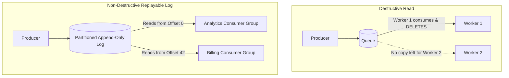

# Message Queues vs Pub/Sub vs Distributed Event Streaming

## Overview
Asynchronous communication decouples microservices in time and space, smoothing traffic spikes and enabling resilient data flows. Asynchronous messaging falls into three distinct architectural patterns:
- **Point-to-Point Message Queue**: Messages are delivered to exactly one consumer from a pool of workers; the message is deleted from the queue upon successful acknowledgment (e.g., RabbitMQ, AWS SQS).
- **Publish/Subscribe (Pub/Sub)**: Publishers broadcast messages to a topic; all subscribed consumers receive a distinct copy of every message (e.g., Google Cloud Pub/Sub, Redis Pub/Sub).
- **Distributed Event Streaming (Append-Only Log)**: Messages are appended sequentially to an immutable, partitioned, disk-backed commit log; multiple consumer groups read independently at their own pace and can replay historical events (e.g., Apache Kafka, Apache Pulsar).

## Why It Matters
Using a simple message queue like RabbitMQ for an audit logging pipeline that needs historical replay is disastrous—messages disappear the second they are acknowledged. Conversely, deploying a complex 50-node Apache Kafka cluster for a basic background email delivery queue is massive over-engineering.

## Core Concepts & Architectural Comparison
| Paradigm | Message Lifecycle | Consumer Model | Replayability | Ordering Guarantees |
| :--- | :--- | :--- | :--- | :--- |
| **Point-to-Point Queue** | Deleted after consumer ACK | Competing consumers (1 worker per msg)| **None** | FIFO per queue (optional) |
| **Pub/Sub (Traditional)**| Discarded after fan-out delivery | Independent subscribers | None | Per topic |
| **Event Streaming (Kafka)**| **Retained on disk for days/years** | **Consumer Groups with Offsets** | **Infinite historical replay** | **Strict per-partition ordering** |

## Trade-offs
| Feature | Message Queues (RabbitMQ / SQS) | Event Streams (Apache Kafka) |
| :--- | :--- | :--- |
| **Routing Flexibility** | **Complex routing keys & exchanges (AMQP)**| Simple partition key routing |
| **Message Granularity** | Individual message acknowledgment & retry | Offset-based batch commit |
| **Throughput Capacity** | 10,000 - 50,000 msg/sec | **Millions of msg/sec (Zero-Copy OS sequential disk)**|
| **Operational Overhead**| Low to Moderate | High (Cluster brokers, ZooKeeper/KRaft, rebalancing)|

## When to Use / When NOT to Use
### When to Choose a Message Queue (RabbitMQ / SQS)
- Discrete task dispatching (e.g., "Send this password reset email", "Transcode this PDF").
- Workloads requiring complex individual message routing, priority queues, and individual message dead-letter retries.

### When to Choose Event Streaming (Apache Kafka)
- Real-time clickstream analytics, financial transaction event logs, event sourcing, CDC change feeds, systems requiring multi-consumer historical replay.

## Real-World Examples
- **Stripe Webhook Delivery**: Uses **RabbitMQ / SQS** to manage discrete webhook delivery tasks to external merchant URLs, leveraging visibility timeouts and individual retry backoffs.
- **LinkedIn Activity Stream**: Built **Apache Kafka** to ingest trillions of daily user clicks, pageviews, and search events, streaming them simultaneously into real-time fraud detection engines and Hadoop offline warehouses.

## Common Pitfalls
- **Using Redis Pub/Sub for Critical Messages**: Redis Pub/Sub is fire-and-forget; if a consumer disconnects for 50 milliseconds during a deployment, all messages published during that window are permanently lost with zero buffer.
- **Kafka Queue Anti-Pattern**: Attempting to use Kafka like a task queue where individual tasks take 10 minutes to process; a slow task halts consumption for that entire partition (Head-of-Line blocking).

## Key Takeaways
- Queues are for **tasks** (destructive read); Streams are for **events** (immutable log, replayable).
- Kafka provides high throughput via sequential disk I/O and consumer group offset tracking.
- Traditional queues excel at granular per-message retries and complex routing.

## Common Interview Questions
1. Why does Apache Kafka scale write throughput significantly better than traditional AMQP message brokers like RabbitMQ?
2. What happens to Kafka consumer groups when a new consumer instance joins the group?
3. In what scenarios is a destructive message queue preferred over an append-only event stream?

## Further Reading
- [Jay Kreps: The Log: What every software engineer should know about real-time data's unifying abstraction (2013)](https://engineering.linkedin.com/distributed-systems/log-what-every-software-engineer-should-know-about-real-time-datas-unifying)
- [RabbitMQ Documentation: Core Concepts and AMQP 0-9-1](https://www.rabbitmq.com/tutorials/amqp-concepts.html)
