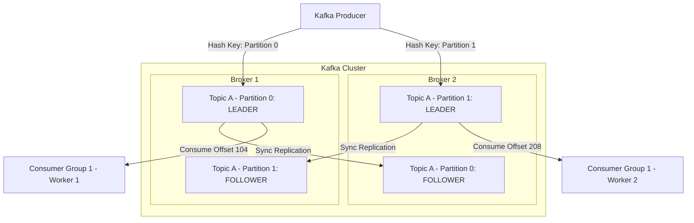

# Apache Kafka Architecture Deep Dive

## Overview
**Apache Kafka** is a distributed, partitioned, replicated, commit-log service engineered for high-throughput, fault-tolerant event streaming. Originally developed at LinkedIn, Kafka processes trillions of events daily across global technology companies.

## Why It Matters
Kafka achieves throughput rates that leave traditional message brokers in the dust—routinely handling **millions of messages per second per broker**. It achieves this not through mysterious magic, but through brilliant hardware-aligned mechanical sympathy: **Sequential Disk I/O**, **Page Cache Utilization**, and **OS Zero-Copy Network Splicing**.

## Core Concepts & Architectural Primitives
1. **Topics & Partitions**:
   - A **Topic** is a logical stream of messages.
   - Topics are horizontally divided into **Partitions**.
   - The **Partition is the fundamental unit of parallelism and scale in Kafka**.
   - Messages within a partition are strictly ordered by sequential 64-bit integer **Offsets**.
   - *Ordering Guarantee*: Messages are strictly ordered **within a partition**, NOT across the entire topic!
2. **Producers & Partition Keys**:
   - Producers hash the message key (`hash(key) % num_partitions`) to assign it to a partition. Messages with the identical key (e.g., `user_id = 42`) are guaranteed to land on the same partition, preserving causal ordering.
3. **Consumer Groups & Offset Management**:
   - Multiple consumers form a **Consumer Group**.
   - Each partition is consumed by **exactly one consumer worker** within a group.
   - Consumers track their position by committing their current **Offset** (stored in an internal Kafka topic: `__consumer_offsets`).
4. **In-Sync Replicas (ISR) & ACKs**:
   - Each partition has 1 Leader and $N-1$ Followers.
   - **ISR (In-Sync Replicas)**: The subset of replicas caught up with the leader.
   - `acks=0`: Producer fire-and-forget (zero wait).
   - `acks=1`: Leader writes to local log and acknowledges.
   - `acks=all` (or `-1`): Leader waits for all In-Sync Replicas to acknowledge (**Guarantees zero data loss**).

## Why Kafka is Blazing Fast: Mechanical Sympathy
- **Sequential Disk Appends**: Kafka writes exclusively to append-only log segments. Sequential disk access on modern drives is as fast as random RAM access (~600 MB/s).
- **Page Cache Exploitation**: Rather than managing complex JVM heap caches (which cause massive GC pauses), Kafka relies entirely on the Linux OS Page Cache.
- **Zero-Copy Network Transfers (`sendfile` syscall)**:
  Data moves directly from OS Page Cache to the Network Interface Card (NIC) buffer via DMA (Direct Memory Access), **completely bypassing user-space CPU memory copying**.

## Trade-offs
| Feature | Advantage | Trade-off / Cost |
| :--- | :--- | :--- |
| **Partition Parallelism** | Massive linear read/write throughput | Adding partitions changes hash key mapping; high partition counts add file descriptor overhead |
| **Disk Retention** | Replayable history for days/months | Disk storage capacity management required |
| **Consumer Group Scale** | Effortless horizontal scale-out | Max consumers in a group is capped by partition count! |

## When to Use / When NOT to Use
### When to Choose Apache Kafka
- Large-scale event-driven architectures, real-time analytics pipelines, event sourcing, activity tracking, Change Data Capture (CDC).

### When NOT to Choose Kafka
- Small teams needing a simple task queue with individual message acknowledgments and immediate dead-letter handling (use RabbitMQ or SQS).

## Real-World Examples
- **LinkedIn**: Operates over 100 Kafka clusters with 4,000+ brokers, ingesting over **7 trillion messages per day**.
- **Netflix**: Uses Kafka as the central nervous system connecting all microservice telemetry to real-time analytics and alerting platforms.

## Common Pitfalls
- **More Consumers Than Partitions**: Deploying 20 consumer pods for a topic with only 10 partitions; 10 pods will sit completely idle because a partition cannot be shared within the same group!
- **Consumer Rebalance Storms**: A consumer taking too long to process a batch of records exceeds `max.poll.interval.ms`. The Kafka coordinator assumes the consumer died, kicks it out of the group, and triggers a massive stop-the-world **Consumer Rebalance** across all workers.

## Key Takeaways
- The **Partition** is the unit of scalability, parallelism, and ordering in Kafka.
- Kafka achieves millions of messages per second using **Sequential Disk Appends**, **Linux Page Cache**, and **Zero-Copy `sendfile`**.
- Consumer count in a group cannot exceed the number of partitions.

## Common Interview Questions
1. How does Apache Kafka achieve extreme throughput using OS zero-copy data transfer?
2. What happens during a Kafka consumer rebalance, and what triggers it?
3. How do partition keys guarantee message ordering for specific business entities?

## Further Reading
- [Neha Narkhede et al.: Kafka: The Definitive Guide (O'Reilly)](https://www.oreilly.com/library/view/kafka-the-definitive/9781491936153/)
- [Apache Kafka Documentation: Design and Implementation](https://kafka.apache.org/documentation/#design)
