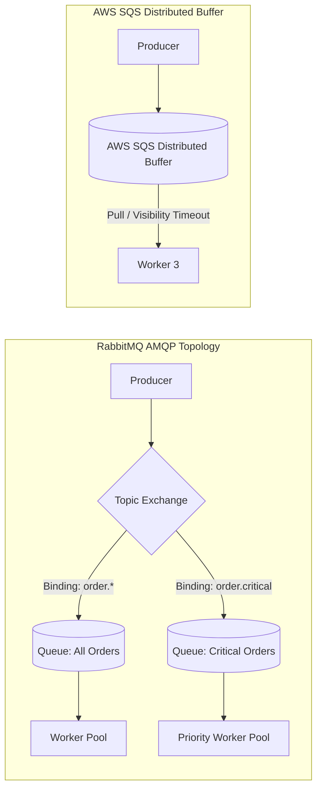

# RabbitMQ and AWS SQS Architecture

## Overview
For asynchronous task execution, background worker coordination, and complex message routing, dedicated message queue brokers remain the industry standard:
- **RabbitMQ**: An open-source, highly versatile message broker implementing the **AMQP 0-9-1 (Advanced Message Queuing Protocol)** standard, featuring programmable exchanges, bindings, and flexible routing.
- **AWS SQS (Simple Queue Service)**: A fully managed, serverless, infinitely scalable distributed message queue offering Standard (at-least-once, best-effort ordering) and FIFO (exactly-once, strict ordering) queues.

## Why It Matters
Unlike distributed streaming logs (Kafka), RabbitMQ and SQS are **pure task queues**. They provide granular per-message acknowledgments, individual message redelivery delays, message prioritization, and automatic dead-letter queueing without requiring complex partition management.

## Core Concepts & Architectural Comparison

### 1. RabbitMQ AMQP Mechanics
- Producers **never publish directly to a queue**; they publish to an **Exchange**.
- Exchanges inspect message metadata and route copies to bound queues:
  - **Direct Exchange**: Routes messages based on exact matching of routing keys (`error` -> Error Queue).
  - **Fanout Exchange**: Broadcasts every message to 100% of bound queues (Pub/Sub pattern).
  - **Topic Exchange**: Sophisticated wildcard routing (e.g., `usa.sports.*` or `*.critical.#`).
  - **Headers Exchange**: Routes based on arbitrary HTTP-like header attributes.
- **Consumer Prefetch (QoS)**: Limits how many unacknowledged messages a worker can hold simultaneously, preventing fast workers from starving and slow workers from drowning.

### 2. AWS SQS Serverless Mechanics
- **Push vs Pull**: Consumers continuously poll SQS using long polling (`WaitTimeSeconds = 20`).
- **Visibility Timeout**: When Worker A pulls a message, the message is **NOT deleted**; it is made invisible to other workers for a configured duration (e.g., 30 seconds).
  - If Worker A processes the task and calls `DeleteMessage`, the message is permanently removed.
  - If Worker A crashes or times out, the visibility timeout expires, and the message automatically reappears in the queue for another worker to process.
- **SQS Standard vs FIFO**:
  - *Standard*: Unlimited throughput, at-least-once delivery, best-effort ordering.
  - *FIFO*: Capped at 3,000 msgs/sec (with batching), strictly ordered within Message Group IDs, deduplication within 5-minute windows.

## Trade-offs
| Dimension | RabbitMQ | AWS SQS |
| :--- | :--- | :--- |
| **Routing Capability** | **Unmatched (Direct, Topic, Fanout, Headers)**| Primitive (Queue-only, requires SNS for fan-out)|
| **Management Overhead** | High (Requires managing Erlang VM clusters) | **Zero (100% Fully Managed Serverless)** |
| **Scaling Model** | Vertical node scaling / Quorum queues | **Virtually infinite automated elasticity** |
| **Protocol Support** | AMQP, MQTT, STOMP, WebSockets | Proprietary AWS HTTP API |

## When to Use / When NOT to Use
### When to Choose RabbitMQ
- On-premise or multi-cloud enterprise deployments requiring sophisticated topic/header routing rules, sub-millisecond local LAN latency, and priority queuing.

### When to Choose AWS SQS
- Cloud-native applications on AWS, serverless architectures (triggering AWS Lambda), variable bursty workloads where zero maintenance is required.

## Real-World Examples
- **Stripe Asynchronous Jobs**: Leverages distributed queues with custom visibility timeouts to schedule payment webhooks and API retry notifications with exponential backoff.
- **E-Commerce Order Processing (RabbitMQ)**: Orders are published to a Topic Exchange with routing key `order.created`. The exchange routes the message simultaneously to an `inventory-queue`, a `shipping-queue`, and an `email-queue` in parallel.

## Common Pitfalls
- **RabbitMQ Queue Backlog RAM Collapse**: Letting millions of messages accumulate in a traditional RabbitMQ queue; unread messages spill from Erlang memory to disk, severely degrading broker throughput (mitigated by using **Quorum Queues**).
- **Short SQS Visibility Timeouts**: Setting a 10-second visibility timeout on a job that takes 15 seconds to execute; the message reappears while Worker A is still working, causing duplicate concurrent processing by Worker B!

## Key Takeaways
- RabbitMQ excels at **complex in-broker routing** via AMQP exchanges and bindings.
- SQS is **fully managed and infinitely elastic**, utilizing **visibility timeouts** for fault-tolerant worker processing.
- Set consumer prefetch in RabbitMQ and long polling in SQS to maximize processing efficiency.

## Common Interview Questions
1. How does the AWS SQS Visibility Timeout mechanism guarantee fault-tolerant task execution?
2. Explain the difference between a Direct Exchange, a Fanout Exchange, and a Topic Exchange in RabbitMQ.
3. What is Consumer Prefetch in RabbitMQ, and why is it critical for balancing worker loads?

## Further Reading
- [RabbitMQ: Official AMQP 0-9-1 Specification Guide](https://www.rabbitmq.com/tutorials/amqp-concepts.html)
- [AWS Documentation: How Amazon SQS Queues Work](https://docs.aws.amazon.com/AWSSimpleQueueService/latest/SQSDeveloperGuide/welcome.html)
