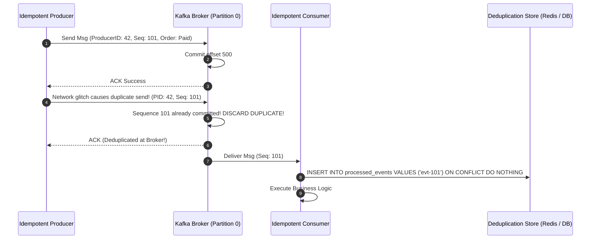

# Message Delivery Guarantees, Ordering, and Deduplication

## Overview
Building reliable asynchronous event architectures requires rigorous handling of the three universal networking hazards: **message loss**, **message duplication**, and **out-of-order delivery**.

Production architectures guarantee data integrity through the union of **Idempotent Producers**, **Partition-Level Sequence Ordering**, and **Consumer Deduplication Stores**.



## Why It Matters
Network timeouts make duplicates inevitable. If a producer transmits a message and the network drops the broker's acknowledgment packet, the producer *must* retry. If consumers do not deduplicate, customers will be billed twice, inventory will decrement twice, and data integrity will be corrupted.

## Core Concepts & Mechanical Implementation

### 1. Delivery Guarantees Matrix
- **At-Most-Once**: Consumer commits offset *before* processing the message. If the consumer crashes during processing, the message is lost forever.
- **At-Least-Once**: Consumer processes the message and commits offset *after* completing database writes. If the consumer crashes right before committing, the next worker re-processes the message (guarantees zero data loss, but introduces duplicates).
- **Effectively-Once**: Combines At-Least-Once delivery with **Consumer Deduplication**.

### 2. Message Ordering Guarantees
- In distributed streaming (Kafka/Pulsar), **ordering is only guaranteed within a single partition**, never globally across topics!
- *Partition Key Selection*: To preserve strict causal ordering for an entity, all events related to that entity must share the same partition key:
  $$\text{Partition} = \text{MurmurHash3}(\text{account\_id}) \pmod{\text{NumPartitions}}$$
  All transactions for `account_id = 99` flow sequentially through Partition 3, guaranteeing in-order FIFO processing.

### 3. Consumer-Side Deduplication Strategies
- **Deduplication Table (Unique Constraint)**:
  Every message contains a globally unique `event_id` (UUID). The consumer writes to the database inside a transaction:
  ```sql
  BEGIN;
  INSERT INTO processed_events (event_id, processed_at) VALUES ('evt-uuid-123', NOW());
  -- If unique constraint fails, abort transaction! Duplicate detected!
  UPDATE accounts SET balance = balance + 100 WHERE id = 42;
  COMMIT;
  ```
- **Redis TTL Bitmaps / Sets**: For high-throughput streams, check event existence in an in-memory Redis key with a 48-hour expiration (`SET event:123 1 NX EX 172800`).

## Trade-offs
| Architecture Strategy | Processing Throughput | Consistency Guarantee | Operational Cost |
| :--- | :--- | :--- | :--- |
| **At-Most-Once** | Blazing Fast | Zero (Tolerates message loss) | Lowest |
| **At-Least-Once (Naive)**| High | Risky (Duplicates will corrupt state)| Low |
| **Effectively-Once (Dedup)**| Moderate | **Absolute Mathematical Correctness** | Moderate (Requires dedup storage) |

## When to Use / When NOT to Use
### When Effectively-Once (Deduplication) is Mandatory
- Financial ledgers, payment processing, billing counters, inventory deduction, order fulfillment.

### When At-Least-Once without Deduplication Suffices
- Idempotent state synchronization where messages represent full state overwrites (e.g., `SET user:name = "Alice"`).

## Real-World Examples
- **Apache Flink Exactly-Once State Processing**: Uses the **Chandy-Lamport distributed snapshotting algorithm**, injecting checkpoint barriers into data streams to periodically record consistent state snapshots across all operators and Kafka offsets.
- **Kafka Transactions (`read_committed`)**: Coordinates atomic multi-partition writes, ensuring consumer groups only read events from producers whose transactions officially committed.

## Common Pitfalls
- **Changing Partition Counts with Keyed Data**: Increasing the partition count of a live Kafka topic changes the output of `hash(key) % N`, causing subsequent events for `account_id = 99` to route to a different partition, immediately breaking sequential ordering!
- **Committing Offsets Before Storage Writes**: A consumer pulling 100 messages, committing the offset immediately, and crashing while writing to PostgreSQL, permanently losing all 100 messages.

## Key Takeaways
- Never promise "Exactly-Once" without implementing **idempotent consumers** and **deduplication stores**.
- Message ordering in Kafka is guaranteed **only within a single partition**.
- Always commit offsets *after* business logic transactions complete successfully.

## Common Interview Questions
1. How does an idempotent Kafka producer eliminate network duplicate writes at the broker layer?
2. Why does changing the partition count of an existing Kafka topic break ordering guarantees for keyed messages?
3. How do you implement consumer-side deduplication using a relational database unique constraint?

## Further Reading
- [Apache Kafka Documentation: Exactly-Once Semantics in Apache Kafka](https://www.confluent.io/blog/exactly-once-semantics-are-possible-heres-how-apache-kafka-does-it/)
- [K. Mani Chandy and Leslie Lamport: Distributed Snapshots: Determining Global States of Distributed Systems (ACM TOCS 1985)](https://lamport.azurewebsites.net/pubs/chandy.pdf)
