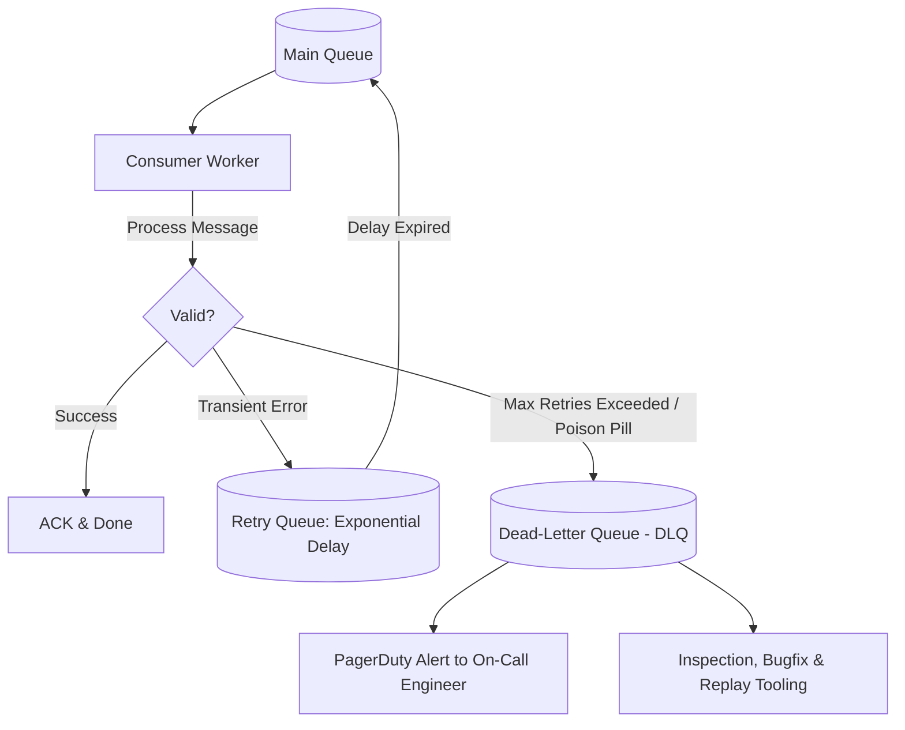

# Dead-Letter Queues (DLQ) and Retry Strategies

## Overview
In asynchronous message processing, transient failures (e.g., database network blips) must be retried automatically, while unprocessable "poison pill" messages (e.g., malformed payloads, corrupted JSON) must be isolated to prevent them from blocking the processing pipeline indefinitely.

This fault-tolerant lifecycle is managed through **Exponential Backoff Retries** and **Dead-Letter Queues (DLQ)**.

## Why It Matters
Without a Dead-Letter Queue, a single corrupted message crashing a consumer will be redelivered in an infinite loop (the **Poison Pill Anti-Pattern**), consuming 100% of consumer CPU, generating millions of error logs, and completely halting processing for all subsequent legitimate messages.

## Core Concepts & Mechanical Implementation

### 1. The Poison Pill Problem
- A message arrives containing invalid syntax or triggering an unhandled NullPointerException.
- The consumer crashes without acknowledging the message.
- The message broker detects consumer disconnect and immediately redelivers the message to the next worker.
- Worker 2 crashes. Worker 3 crashes. The entire consumer fleet enters a death spiral.

### 2. Retry Strategies: Exponential Backoff with Full Jitter
Immediate retries compound network congestion (the "Retry Storm"). Instead, retry delays must increase exponentially with randomized jitter:
$$\text{Delay} = \text{random}(0, \min(\text{MaxDelay}, \text{BaseDelay} \times 2^{\text{attempt}}))$$
- Attempt 1: Wait 1 - 2 seconds.
- Attempt 2: Wait 2 - 4 seconds.
- Attempt 3: Wait 4 - 8 seconds.

### 3. Dead-Letter Queue (DLQ) Routing Mechanics
- The message broker tracks a delivery count header (`x-delivery-count` or `ApproximateReceiveCount`).
- If `delivery_count > max_receive_count` (typically 3 to 5 attempts):
  - The broker automatically intercepts the message, strips it from the main queue, and publishes it to a dedicated **Dead-Letter Queue (`orders-dlq`)**.
  - Processing on the main queue resumes immediately without disruption.

## Trade-offs
| Architecture | Recovery Automation | Operational Maintenance | Poison Pill Resilience |
| :--- | :--- | :--- | :--- |
| **Naive Immediate Retry** | Instant for quick glitches | None | **Catastrophic (Death spiral)** |
| **Tiered Retry Queues + DLQ** | **High (Resolves transient issues)**| Requires DLQ monitoring | **Absolute (Isolates bad messages)** |
| **Infinite Retries** | Zero data ever lost | Memory leak / queue congestion | Terrible |

## When to Use / When NOT to Use
### When DLQs are Mandatory
- 100% of all asynchronous production message consumers (RabbitMQ, SQS, Kafka, Celery).

### What NOT to Put in a DLQ
- Ephemeral telemetry where stale data is useless (e.g., live vehicle GPS coordinates older than 30 seconds should simply be dropped).

## Real-World Examples
- **AWS SQS Dead-Letter Queues**: Natively configured with a single click: set `maxReceiveCount = 3` and designate a target DLQ ARN. When an AWS Lambda worker fails 3 times, SQS moves the message to the DLQ and emits a CloudWatch alarm.
- **Uber Event Ingestion**: Employs a multi-tier Kafka retry topology: `topic-main` -> `topic-retry-1m` -> `topic-retry-10m` -> `topic-dlq`, allowing transient partner API outages to self-heal without human intervention.

## Common Pitfalls
- **The "Dark" DLQ (Unmonitored Black Hole)**: Routing bad messages to a DLQ but failing to set up alerting or dashboards; 500,000 customer payment events accumulate in the DLQ unnoticed until customers complain to support!
- **Retrying Non-Transient Errors**: Blindly retrying HTTP 400 Bad Request or schema validation errors; bad syntax will *never* succeed on retry, needlessly wasting CPU and delay queues.

## Key Takeaways
- Never deploy an asynchronous worker without an **Exponential Backoff Retry** policy and a **Dead-Letter Queue**.
- A Dead-Letter Queue without **active alert thresholds** is an operational black hole.
- Build administrative tooling to **inspect, edit, and replay** messages from the DLQ back to the main queue once bugs are deployed.

## Common Interview Questions
1. How does a Dead-Letter Queue prevent poison pill messages from crashing a consumer cluster?
2. Why is adding randomized jitter to exponential backoff critical during downstream outages?
3. How do you implement retry queues in Apache Kafka where individual message delays are not natively supported?

## Further Reading
- [AWS Architecture: SQS Dead-Letter Queues](https://docs.aws.amazon.com/AWSSimpleQueueService/latest/SQSDeveloperGuide/sqs-dead-letter-queues.html)
- [Uber Engineering: Reliable Reprocessing and Dead Letter Queues with Apache Kafka](https://www.uber.com/blog/reliable-reprocessing-and-dead-letter-queues-with-apache-kafka/)
