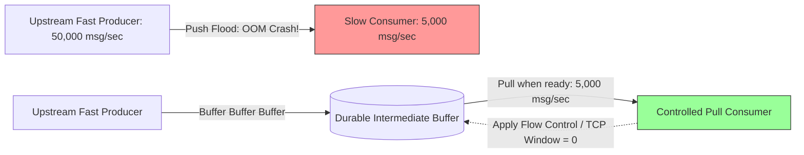

# Backpressure and Flow Control in Distributed Messaging

## Overview
**Backpressure** is a reactive flow-control mechanism exerted by a downstream consumer against an upstream producer when incoming data arrival velocity exceeds consumer processing capacity.

Without backpressure, unconsumed messages accumulate in memory buffers until consumer processes crash with Out-Of-Memory (OOM) errors, destabilizing the entire distributed pipeline.



## Why It Matters
In any distributed system, different tiers process data at different speeds. A web frontend can ingest 50,000 webhook events per second, but downstream machine learning inference or relational database writes may be capped at 5,000 operations per second. Backpressure ensures systems degrade gracefully under load rather than collapsing catastrophically.

## Core Concepts & Mechanical Mechanisms

### 1. Push vs Pull Architectures
- **Push Models (Inherently Vulnerable)**:
  - Broker pushes messages to consumers as soon as they arrive.
  - If a consumer takes 200ms per task, a burst of 10,000 messages instantly saturates consumer socket buffers and JVM heap memory.
- **Pull Models (Native Backpressure)**:
  - Consumers explicitly poll (pull) only the batch size they are currently capable of processing (`consumer.poll(max_records=100)`).
  - Backlog accumulates harmlessly in the durable message broker (Kafka/SQS), shielding consumers from memory exhaustion.

### 2. TCP Flow Control (Sliding Window)
- The lowest-level backpressure in networking.
- When an application's socket receive buffer fills up, the OS kernel decreases the advertised **TCP Receive Window (`rwnd`)**.
- If the buffer becomes 100% full, the OS advertises `rwnd = 0` (Zero Window), forcing the sending network card to physically halt packet transmission until the application reads from the buffer.

### 3. Reactive Streams Specification
- Standardized software contract (Project Reactor, RxJava, Akka Streams) implementing dynamic subscriber demand:
  ```java
  subscription.request(10); // "Send me exactly 10 items, no more!"
  ```

### 4. Load Shedding & Drop Strategies
When intermediate buffers become full:
- **Drop Oldest**: Discard the oldest items in the queue (ideal for live video/stock tickers where stale data is useless).
- **Drop Newest / Reject**: Reject incoming requests at the API Gateway with HTTP `429 Too Many Requests` or `503 Service Unavailable`.

## Trade-offs
| Flow Control Model | Producer Impact | Consumer Protection | Data Loss Risk |
| :--- | :--- | :--- | :--- |
| **Pull-Based Polling (Kafka)**| Buffer accumulates on broker | **Absolute (Consumer dictates pace)** | Zero (Retained on disk) |
| **Push with Rate Limiter** | Must throttle or reject clients | High | Zero if clients retry |
| **Drop on Full Buffer** | None | High | **High (Intentionally discards data)**|

## When to Use / When NOT to Use
### When Backpressure is Mandatory
- Real-time stream processing (Apache Flink, Spark Streaming), high-throughput message consumers, database write-behind buffers.

### When to Drop Data Instead
- Real-time multiplayer video gaming or live video streaming where older dropped packets must not stall the live real-time stream.

## Real-World Examples
- **Reactive Streams in Netflix Zuul**: Netflix rewrote its edge gateway (Zuul 2) using non-blocking asynchronous Netty and Reactive Streams, allowing slow backend services to apply backpressure directly to incoming client connections, preventing gateway thread exhaustion.
- **Kafka Consumer `max.poll.records`**: Allows consumers to specify the exact number of records retrieved per poll loop, guaranteeing workers never pull more work than their internal thread pools can process within `max.poll.interval.ms`.

## Common Pitfalls
- **Unbounded In-Memory Queues**: Initializing `new LinkedBlockingQueue<>()` without specifying an integer capacity limit in Java, allowing memory to expand until the process crashes via OutOfMemoryError.
- **Ignoring Backpressure Signals**: Catching queue rejection exceptions and continuously retrying in a tight `while(true)` loop without backoff, exacerbating the overload.

## Key Takeaways
- Pull-based consumer architectures (Kafka/SQS) provide **natural backpressure**.
- Never use unbounded in-memory queues in production software.
- When buffers reach maximum capacity, enforce **Load Shedding** (HTTP 429) to protect system stability.

## Common Interview Questions
1. How does pull-based message consumption in Apache Kafka provide native backpressure compared to push brokers?
2. What happens at the TCP layer when an application process stops reading from its socket buffer?
3. What are the trade-offs between "Drop Oldest", "Drop Newest", and "Block" when an in-memory queue fills up?

## Further Reading
- [The Reactive Manifesto (2014)](https://www.reactivemanifesto.org/)
- [Reactive Streams Specification](https://www.reactive-streams.org/)
