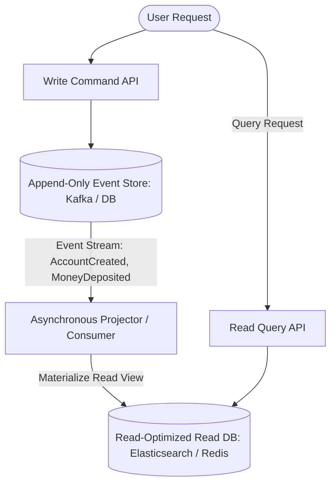

# Event Sourcing and Command Query Responsibility Segregation (CQRS)

## Overview
Traditional database architectures mutate current state in place using destructive SQL updates (`UPDATE accounts SET balance = 50 WHERE id = 1`), permanently erasing historical transitions.

Modern distributed systems frequently decouple state management through two complementary architectural patterns:
- **Event Sourcing**: Treats application state as an append-only log of immutable business events. Current state is derived by replaying the event log from the beginning of time.
- **CQRS (Command Query Responsibility Segregation)**: Strictly separates the write model (handling mutating **Commands**) from the read model (handling optimized **Queries**).

## Why It Matters
In financial systems, medical healthcare records, and legal auditing, knowing *what* the current balance is is insufficient—you must prove *how* it reached that balance. Event Sourcing provides an **indisputable, tamper-proof audit trail**. CQRS solves the problem of trying to optimize a single database schema for both high-concurrency normalized writes and complex denormalized search queries.

## Core Concepts & Mechanical Implementation

### 1. Event Sourcing Mechanics
- **Events are Immutable Facts**: Events represent actions that already occurred in the past (e.g., `OrderPlaced`, `PaymentReceived`, `ItemShipped`). Events are never updated or deleted.
- **Deriving Current State**:
  $$\text{Current State} = \sum_{i=1}^{N} \text{Event}_i$$
  *Example*:
  1. `AccountCreated(id=1, initial=0)` -> Balance = $0
  2. `MoneyDeposited(id=1, amount=100)` -> Balance = $100
  3. `MoneyWithdrawn(id=1, amount=40)` -> Balance = $60
- **Snapshots**: Replaying 10 million historical events to calculate a balance is too slow. The system periodically saves a **Snapshot** (e.g., every 1,000 events: `Snapshot(id=1, balance=60)`), replaying only subsequent events upon startup.

### 2. CQRS Mechanics
- **Command Path (Writes)**: Accepts `DepositMoneyCommand` -> Validates business rules -> Appends `MoneyDepositedEvent` to the Event Store -> Acknowledges success.
- **Query Path (Reads)**: Background projectors listen to the event stream, transform event payloads, and update read-optimized materialized views in specialized databases (e.g., writing to Elasticsearch for fast full-text search, or Redis for instant caching).

## Trade-offs
| Architecture | Event Sourcing + CQRS | Traditional CRUD Database |
| :--- | :--- | :--- |
| **Auditability & Compliance** | **100% Complete, Verifiable Audit Trail** | Poor (Requires manual audit tables)|
| **Read/Write Optimization** | Independent optimal database selection | Single schema compromise |
| **Architectural Complexity** | **Very High (Event versioning, projections)**| Low (Simple SQL queries) |
| **Data Consistency** | **Eventual Consistency on Read Path** | Strong Consistency (Immediate Read)|
| **Historical Time Travel** | Trivial (Replay events up to any date)| Impossible |

## When to Use / When NOT to Use
### When to Choose Event Sourcing & CQRS
- Banking systems, insurance policy lifecycle tracking, complex collaborative tools (Figma/Miro), e-commerce order workflows.

### When to AVOID Event Sourcing
- Simple CRUD applications, internal back-office admin portals, small startups validating product-market fit; the operational overhead will cripple engineering velocity.

## Real-World Examples
- **Git Version Control**: The ultimate real-world **Event Sourcing** engine. Git stores an immutable directed acyclic graph (DAG) of commit events. The files you see in your directory are simply a materialized projection of the current commit checkout!
- **Banking Ledgers**: Never store a single `balance` integer. Ledgers store individual debit and credit transactions; balance is dynamically aggregated from the transaction ledger.

## Common Pitfalls
- **Event Schema Evolution**: Modifying an event schema 2 years into production (e.g., adding mandatory fields); historical events stored in the database cannot be changed, requiring complex deserialization versioning adapters.
- **Querying the Event Store Directly**: Attempting to run complex SQL joins directly against the raw append-only event log; always project events into a dedicated read database (CQRS).

## Key Takeaways
- Event Sourcing stores **immutable past events**, not current state.
- **CQRS** decouples the write command model from read-optimized query projections.
- The read side of a CQRS system is **eventually consistent**.

## Common Interview Questions
1. How does Event Sourcing provide a 100% complete audit log compared to traditional database logging?
2. What is the role of Snapshots in an Event Sourcing architecture?
3. How do you handle schema migrations and breaking changes for events stored years ago?

## Further Reading
- [Martin Fowler: Event Sourcing](https://martinfowler.com/eaaDev/EventSourcing.html)
- [Greg Young: CQRS Documents (2010)](https://cqrs.files.wordpress.com/2010/11/cqrs_documents.pdf)
