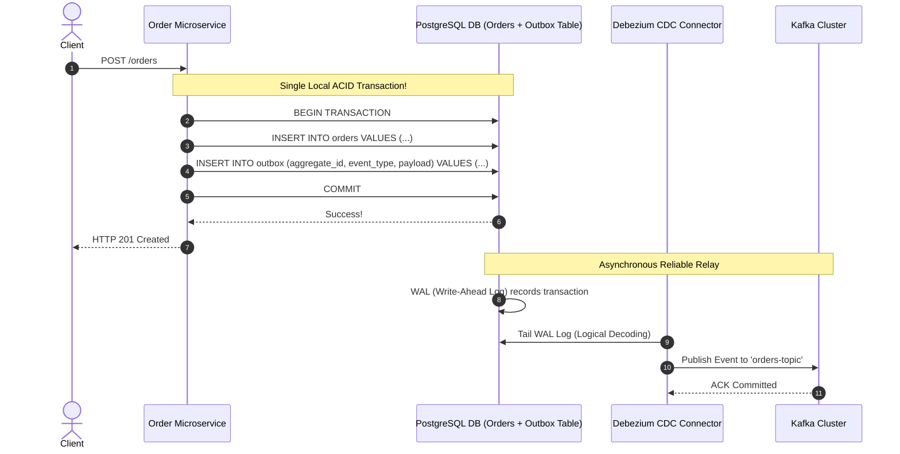

# The Transactional Outbox Pattern and Change Data Capture (CDC)

## Overview
In distributed microservices, a common requirement is to update an internal database *and* publish a corresponding notification event to a message broker (e.g., creating an order in PostgreSQL and emitting an `OrderCreated` event to Kafka).

Executing these two operations naively creates the notorious **Dual-Write Problem**: if either operation fails, the database and the message broker become permanently out of sync.

The **Transactional Outbox Pattern** paired with **Change Data Capture (CDC)** solves this dilemma by achieving atomic dual-writes using the database's native local ACID transaction log.



## Why It Matters
Consider the two failure modes of the naive dual-write approach:
1. *Write to DB first, then publish to Kafka*: If the app crashes or Kafka is temporarily unreachable after the DB commit, the event is **never published**. Downstream payment and shipping services never fulfill the order!
2. *Publish to Kafka first, then write to DB*: If the DB transaction fails a unique constraint or deadlocks after the message is sent, downstream services fulfill an order that **does not officially exist** in the primary database!

## Core Concepts & Mechanical Implementation

### 1. The Outbox Table Pattern
- Instead of calling Kafka directly, the microservice writes the event into a dedicated **`outbox` table inside the same local database transaction**:
  ```sql
  BEGIN;
  INSERT INTO orders (id, customer_id, total) VALUES (42, 99, 150.00);
  INSERT INTO outbox (event_id, event_type, payload, created_at) 
  VALUES ('uuid-1', 'OrderCreated', '{"id": 42, "total": 150.00}', NOW());
  COMMIT;
  ```
- Because both writes occur within a **single local ACID transaction**, they are physically guaranteed to either both succeed or both fail atomically!

### 2. Message Relay Mechanisms
How do events travel from the `outbox` table into Apache Kafka?
- **Option A: Polling Publisher (Simple, but High Latency)**:
  A background worker polls the table every second (`SELECT * FROM outbox WHERE status = 'PENDING' ORDER BY id LIMIT 100 FOR UPDATE SKIP LOCKED`), publishes to Kafka, and deletes the rows.
  *Drawbacks*: Adds polling latency and disk I/O load on the primary database.
- **Option B: Change Data Capture (CDC via Debezium - State of the Art)**:
  Tails the database **Write-Ahead Log (WAL)** in real time using logical decoding (PostgreSQL replication protocol).
  *Advantages*: **Zero polling overhead, sub-10ms delivery latency, zero database query load**.

## Trade-offs
| Mechanism | Latency | Database I/O Overhead | Operational Complexity |
| :--- | :--- | :--- | :--- |
| **Polling Publisher** | 1s - 5s (polling interval) | Moderate to High (frequent SQL scans)| Low |
| **CDC (Debezium + Kafka Connect)**| **Sub-50ms (real-time stream)** | **Near-Zero (reads binary WAL disk)** | Moderate (Requires Kafka Connect)|
| **Naive Dual-Write** | Low | Low | **Catastrophic data inconsistency bugs**|

## When to Use / When NOT to Use
### When the Outbox Pattern is Mandatory
- Whenever a database state modification must trigger an asynchronous event in another microservice, email system, or search index.

### When NOT to Use
- Pure streaming analytics pipelines that do not maintain an intermediate relational database.

## Real-World Examples
- **Debezium**: The open-source standard for CDC. Connects to PostgreSQL, MySQL, SQL Server, and Oracle, transforming row-level WAL database mutations into strongly typed JSON or Avro Kafka streams.
- **Shopify Flash Sales**: Uses the Transactional Outbox pattern to ensure that every inventory reservation in MySQL reliably triggers an inventory decrement event across distributed Kafka topics without dual-write race conditions.

## Common Pitfalls
- **Outbox Table Bloat**: In high-throughput systems, forgetting to prune or truncate processed rows from the `outbox` table, causing it to swell to 50 million rows and consuming gigabytes of disk space.
- **Ordering on Multi-Threaded Polling**: Using multiple workers to poll the outbox table concurrently without strict ordering, causing `OrderShipped` to be published to Kafka before `OrderCreated`.

## Key Takeaways
- Never execute naive dual-writes between a database and a message broker.
- The **Transactional Outbox Pattern** leverages local database ACID transactions to guarantee that events are always saved.
- **Change Data Capture (CDC)** tails the database Write-Ahead Log (WAL) to publish events to Kafka with zero polling overhead.

## Common Interview Questions
1. What is the Dual-Write problem in microservices, and why cannot Two-Phase Commit safely solve it?
2. How does Change Data Capture (CDC) read database modifications without running SQL queries?
3. How do you prevent outbox table bloat in high-throughput transactional databases?

## Further Reading
- [Chris Richardson: Transactional Outbox Pattern (Microservices.io)](https://microservices.io/patterns/data/transactional-outbox.html)
- [Debezium Official Documentation](https://debezium.io/documentation/reference/stable/)
