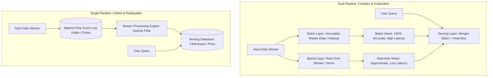

# Stream Processing: Lambda vs Kappa Architecture

## Overview
Big data platforms must satisfy two competing demands: **low-latency real-time processing** (serving live alerts and dashboards in seconds) and **accurate, comprehensive historical batch processing** (re-running analytical models over petabytes of historical data).

Architects balance these requirements through two foundational data architectures:
- **Lambda Architecture (Nathan Marz)**: Dual-pipeline model running a fast, real-time streaming speed layer in parallel with an accurate, comprehensive batch layer, merging results at query time.
- **Kappa Architecture (Jay Kreps)**: Single-pipeline model replacing the batch layer entirely with an append-only distributed event log (Kafka) and a single stateful stream processing engine (Apache Flink).

## Why It Matters
Maintaining a Lambda architecture requires writing, testing, and debugging your business logic **twice**: once in Java for the real-time speed layer (e.g., Storm/Flink) and once in Python/Scala for the offline batch layer (e.g., Spark/Hadoop). The **Kappa Architecture** unifies processing under a single codebase, radically simplifying engineering maintenance.

## Core Concepts & Architectural Comparison

### 1. Lambda Architecture Layers (Nathan Marz, 2011)
1. **Batch Layer (Immutable Master Storage)**:
   - Stores raw, immutable data append-only on HDFS or AWS S3.
   - Precomputes batch views using distributed MapReduce/Spark on an hourly or daily schedule. Guarantees 100% correctness.
2. **Speed Layer (Low-Latency Stream)**:
   - Processes only recent data arriving since the last batch run. Compensates for batch latency.
3. **Serving Layer**:
   - Indexes both batch views and real-time views, querying both and merging results on the fly.

### 2. Kappa Architecture Layers (Jay Kreps, 2014)
- **Eliminates the Batch Layer entirely**.
- **Everything is a Stream**: Historical data is simply a long stream of past events stored in an append-only commit log (Kafka/Pulsar) with long retention or tiering to S3.
- **Reprocessing Data**: When business logic or algorithms change:
  1. Start a second instance of the streaming job (Flink).
  2. Rewind the consumer offset to **Offset 0 (Beginning of Time)**.
  3. Stream through historical events at maximum read throughput into a new view table.
  4. Once caught up, switch queries to the new table and decommission the old job.

## Stream Processing Windowing Semantics
Modern streaming engines (Apache Flink, Kafka Streams) process unbounded continuous data streams using three primary windowing models:
1. **Tumbling Windows**: Fixed-size, non-overlapping time windows (e.g., calculate total sales every 5 minutes: `[12:00-12:05]`, `[12:05-12:10]`).
2. **Sliding (Hopping) Windows**: Fixed-size, overlapping time windows (e.g., calculate 1-hour average temperature, updating every 5 minutes).
3. **Session Windows**: Dynamic windows defined by periods of user inactivity (e.g., group web click events into a session; close session after 30 minutes of idle silence).

## Trade-offs
| Architectural Property | Lambda Architecture | Kappa Architecture |
| :--- | :--- | :--- |
| **Codebase Maintenance**| **Double Tax (Must write & maintain 2 distinct codebases)**| **Single Unified Codebase (Stream processing only)**|
| **Data Reprocessing** | Trivial (Rerun batch Spark script) | Requires replaying massive streaming log offsets |
| **Result Correctness** | Eventual consistency via batch reconciler | **Strictly consistent via stateful checkpointing** |
| **Operational Stack** | Heavy (Hadoop + Spark + Flink + Serving DB) | Lightweight (Kafka + Flink + Serving DB) |

## When to Use / When NOT to Use
### When to Choose Kappa Architecture
- Modern real-time streaming architectures, fraud detection, clickstream analytics, IoT monitoring. The default standard for modern distributed architectures.

### When Lambda Still Survives
- Legacy enterprise environments with massive machine learning pipelines that can only execute as heavy matrix batch jobs on petabyte-scale data lakes.

## Real-World Examples
- **Uber Mileage & Surge Pricing Engine**: Migrated from a dual Lambda architecture to a **Kappa architecture powered by Apache Flink and Kafka**, executing real-time geospatial surge pricing calculations in sub-second windows with zero dual-codebase bugs.
- **Netflix Real-Time Analytics (Keystone)**: Ingests over 500 billion events daily through a unified Kappa architecture, processing streaming telemetry with Flink to detect video playback degradation worldwide.

## Common Pitfalls
- **Event Time vs Processing Time Skew**: Calculating aggregations based on *Processing Time* (when the server receives the packet) rather than *Event Time* (when the user clicked the button on their phone), corrupting metrics due to mobile network delays. (Always use **Watermarks** in Apache Flink!).
- **Unbounded State Size in Stateful Streaming**: Joining two streams without setting an expiration window (TTL), causing Flink RocksDB state stores to grow indefinitely and exhaust memory.

## Key Takeaways
- **Lambda** duplicates logic across batch and speed layers; **Kappa** unifies everything into a single replayable streaming pipeline.
- Reprocess historical data in Kappa by rewinding stream offsets to the beginning of time.
- Always use **Event Time** and **Watermarks** to handle out-of-order and delayed network packets.

## Common Interview Questions
1. Why does the Kappa Architecture eliminate the need for a separate batch processing layer?
2. What is the difference between Event Time and Processing Time in stream processing?
3. How do Watermarks in Apache Flink allow stream processors to handle out-of-order and late-arriving events?

## Further Reading
- [Jay Kreps: Questioning the Lambda Architecture (O'Reilly Radar, 2014)](https://www.oreilly.com/radar/questioning-the-lambda-architecture/)
- [Nathan Marz and James Warren: Big Data: Principles and best practices of scalable realtime data systems (Lambda Book)](https://www.manning.com/books/big-data)
