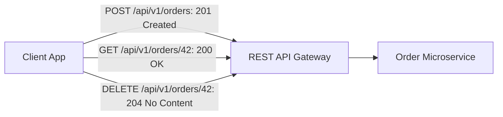

# REST Principles, Resource Modeling, and HTTP Status Codes

## Overview
**REST (Representational State Transfer)** is an architectural style defined by Roy Fielding in 2000 for designing networked distributed hypermedia systems. REST leverages existing standards of the web—primarily HTTP methods, URI identifiers, and status codes—to create stateless, cacheable, uniform client-server interfaces.

## Why It Matters
Inconsistent API design frustrates frontend engineers, creates security vulnerabilities, and prevents HTTP-level caching. Clean resource modeling ensures APIs are intuitive, self-describing, and maintainable across multi-year enterprise lifecycles.

## Core Concepts & Architectural Constraints
1. **Roy Fielding's 6 Architectural Constraints**:
   - *Client-Server Separation*: Decouples user interface from data storage.
   - *Statelessness*: Every request contains all context needed to process it; server holds zero session memory.
   - *Cacheability*: Responses explicitly declare cache rules (`Cache-Control`).
   - *Uniform Interface*: Identification of resources via URIs, manipulation of resources through representations, and self-descriptive messages.
   - *Layered System*: Client cannot tell whether it is communicating directly with the origin server or an intermediary proxy/CDN.
   - *Code on Demand (Optional)*: Servers can extend client functionality by transferring executable code (e.g., JavaScript).
2. **Resource-Oriented URI Modeling (Nouns vs Verbs)**:
   - **Correct (Nouns & Hierarchies)**:
     - `GET /api/v1/users/42/orders` (Fetch all orders for user 42)
     - `POST /api/v1/users/42/orders` (Create new order for user 42)
     - `DELETE /api/v1/orders/108` (Delete specific order)
   - **Anti-Pattern (Verbs in URIs - RPC Style)**:
     - `POST /api/v1/getUserOrders?id=42`
     - `POST /api/v1/deleteOrder`
3. **HTTP Verb Semantics**:
   - `GET`: Safe, idempotent read. Never mutates server state.
   - `POST`: Non-idempotent resource creation or action execution.
   - `PUT`: Complete resource replacement (idempotent).
   - `PATCH`: Partial resource update (e.g., updating only user email).
   - `DELETE`: Resource removal (idempotent).
4. **HTTP Status Code Selection Standards**:
   - **2xx Success**: `200 OK` (Standard success), `201 Created` (Resource created), `202 Accepted` (Async task queued), `204 No Content` (Deleted successfully, no return body).
   - **3xx Redirection**: `301 Moved Permanently` (SEO canonical redirect), `304 Not Modified` (Cached client ETag match).
   - **4xx Client Error**: `400 Bad Request` (Malformed JSON), `401 Unauthorized` (Missing/invalid auth token), `403 Forbidden` (Authenticated, but lacks RBAC permission), `404 Not Found`, `409 Conflict` (Duplicate unique constraint / race condition), `429 Too Many Requests` (Rate limit exceeded).
   - **5xx Server Error**: `500 Internal Server Error`, `502 Bad Gateway`, `503 Service Unavailable` (Server overloaded / maintenance), `504 Gateway Timeout`.

## Trade-offs
| Attribute | Pure RESTful Resource API | RPC / gRPC Style API |
| :--- | :--- | :--- |
| **Ergonomics for CRUD** | **Natural, intuitive, standardized** | Clunky (Requires custom action methods)|
| **Edge Cacheability** | **Maximum (Native HTTP GET caching)** | Poor (POST methods require custom caching) |
| **Complex Multi-Resource Actions**| Awkward (e.g., `/checkout` vs `/orders`)| **Natural (`OrderService.ExecuteCheckout()`)**|

## When to Use / When NOT to Use
### When to Use REST
- Public third-party developer APIs, mobile web backends, CRUD applications, webhooks.

### When to Use RPC / Action Style Instead
- Complex mathematical workflows, financial state machine triggers (e.g., `/api/v1/transfers/42/cancel`), internal microservice RPCs.

## Real-World Examples
- **Stripe REST API**: Universally acknowledged as the premier example of clean RESTful resource modeling. Resources are clean nouns (`/charges`, `/refunds`, `/customers`), utilizing standard HTTP verbs, status codes, and idempotency headers.

## Common Pitfalls
- **Returning HTTP 200 with Error JSON**: Returning `HTTP 200 OK` with payload `{"success": false, "error": "Invalid password"}`, breaking standard HTTP load balancer error tracking, circuit breakers, and monitoring metrics!
- **Using GET for Mutations**: Allowing `GET /users/delete?id=42`, causing search engine web crawlers (Googlebot) to inadvertently delete your entire database by prefetching links!

## Key Takeaways
- Use **plural nouns** for resource paths (`/users`, `/orders`), never verbs.
- Never return `HTTP 200` when an operation failed.
- `GET`, `PUT`, and `DELETE` must be strictly **idempotent**.

## Common Interview Questions
1. What is the difference between `PUT` and `PATCH` in RESTful API design?
2. What is the difference between HTTP `401 Unauthorized` and `403 Forbidden`?
3. Why should APIs never return HTTP 200 OK for failed operations?

## Further Reading
- [Roy Thomas Fielding: Architectural Styles and the Design of Network-based Software Architectures (PhD Dissertation, 2000)](https://www.ics.uci.edu/~fielding/pubs/dissertation/top.htm)
- [Stripe API Reference Guide](https://stripe.com/docs/api)
