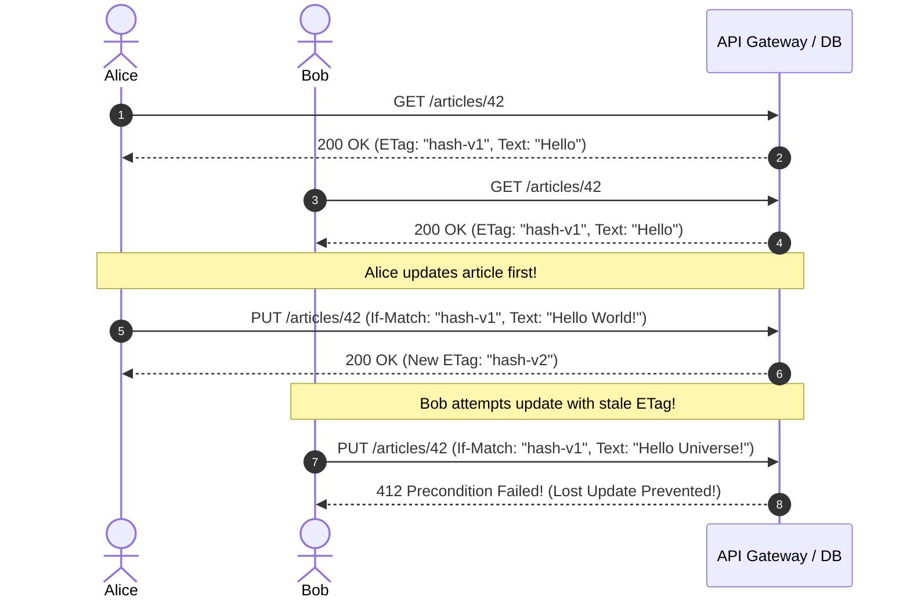

# Idempotency Keys and ETags for Safe API Operations

## Overview
In production web systems, network disruptions between clients and servers are inevitable. Designing safe, resilient APIs requires two standard architectural primitives:
- **Idempotency Keys**: Request headers (`Idempotency-Key: <uuid>`) allowing clients to safely retry mutating operations (POST) without creating duplicate payments or orders.
- **ETags (Entity Tags) & Conditional Headers**: Cache validators and optimistic concurrency control mechanisms (`If-Match`, `If-None-Match`) preventing lost updates and bandwidth waste.

## Why It Matters
Without idempotency keys, an unacknowledged timeout causes an e-commerce customer to tap "Checkout" three times, creating three separate credit card charges. Without ETags, two customer service agents editing a user's address concurrently will trigger a **Lost Update Bug**, where the last write silently overwrites and destroys the first write.

## Core Concepts & Mechanical Implementation

### 1. The Idempotency Key Pattern (RFC 9440)
- Client attaches header: `Idempotency-Key: 7b34b6b1-4c72-4e4b-a912-32a5e95a1234`.
- Server wraps processing in an atomic database lock:
  1. Checks `idempotency_records` table.
  2. If record is found with status `COMPLETED`, server returns the cached response body immediately.
  3. If found with status `IN_PROGRESS`, server returns `HTTP 409 Conflict`.
  4. If not found, server inserts key, processes transaction, stores response, and commits.

### 2. ETags & Conditional Requests (RFC 9110)
- **ETag**: An HTTP response header containing an opaque fingerprint (typically a SHA-256 hash or version number) representing the exact state of a resource representation:
  `ETag: "686897696a7c876b7e"`
- **Conditional Cache Validation (`If-None-Match`)**:
  Client sends: `GET /avatar.png` with `If-None-Match: "686897696a7c876b7e"`.
  If the avatar hasn't changed, the server returns **`304 Not Modified` with zero response body**, saving megabytes of bandwidth.
- **Optimistic Concurrency Control (`If-Match`)**:
  Client sends: `PUT /products/42` with `If-Match: "v1-hash"`.
  The server verifies that the database's current version hash matches `"v1-hash"`. If another user modified the product in the interim, the server rejects the write with **`412 Precondition Failed`**, completely preventing lost updates.

## Trade-offs
| Mechanism | Primary Benefit | Operational Cost |
| :--- | :--- | :--- |
| **Idempotency Keys** | **Zero accidental duplicate charges or records** | Requires dedicated database storage and TTL pruning |
| **ETags (Cache Validation)** | Eliminates redundant network bandwidth transfers | Slight CPU cost to compute content hashes on server |
| **ETags (Optimistic Locking)**| **Zero database row locks; eliminates lost updates** | Client must implement retry-and-rebase logic on 412 |

## When to Use / When NOT to Use
### When Idempotency Keys are Mandatory
- Financial payments, subscription billing, flight seat reservations, order submissions.

### When ETags are Mandatory
- Document editing platforms, content management systems, collaborative configurations, and public REST APIs serving static or semi-static assets.

## Real-World Examples
- **Stripe API**: Caches idempotency responses for 24 hours. Retrying an identical POST with the same key returns the exact original charge receipt without hitting Visa or Mastercard payment networks twice.
- **GitHub REST API**: Uses ETags on all repository endpoints. Client tools query GitHub with `If-None-Match`; responses return `304 Not Modified` and do not consume GitHub API rate limit quotas!

## Common Pitfalls
- **Weak vs Strong ETags**: Confusing weak ETags (`W/"v1"`, semantically equivalent) with strong ETags (`"v1"`, byte-for-byte identical). Only strong ETags can be used for byte-range resume downloads.
- **Failing to Expire Idempotency Keys**: Retaining idempotency keys indefinitely in an unpartitioned database table, eventually slowing down index scans (always enforce a 24 to 72-hour TTL).

## Key Takeaways
- Use **Idempotency Keys** to make mutating `POST` endpoints safely retryable.
- Use **ETags with `If-None-Match`** to save bandwidth via `304 Not Modified`.
- Use **ETags with `If-Match`** to implement optimistic concurrency control and eliminate lost update race conditions.

## Common Interview Questions
1. How does an API Gateway implement idempotency key tracking across distributed microservices?
2. What is the Lost Update problem, and how do ETags with `If-Match` prevent it?
3. How do ETags save API consumers from exhausting rate limit quotas?

## Further Reading
- [IETF RFC 9440: The Idempotency-Key HTTP Header Field](https://datatracker.ietf.org/doc/html/rfc9440)
- [RFC 9110: HTTP Semantics (Conditional Requests and Preconditions)](https://datatracker.ietf.org/doc/html/rfc9110#section-13)
