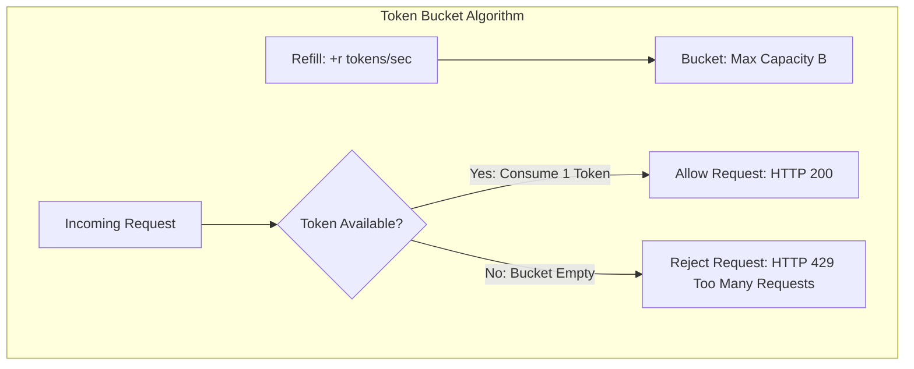

# Rate Limiting Algorithms: Token Bucket, Leaky Bucket, and Sliding Window

## Overview
**Rate limiting** is an essential defensive engineering strategy that controls the rate of incoming or outgoing traffic to a network or API. It protects backend infrastructure from denial-of-service (DDoS) attacks, brute-force credential stuffing, web scraping, and accidental cascading traffic floods.

Production rate limiters implement one of five foundational mathematical algorithms:
1. **Token Bucket**
2. **Leaky Bucket**
3. **Fixed Window Counter**
4. **Sliding Window Log**
5. **Sliding Window Counter (Redis Hybrid)**

## Why It Matters
Without rate limiting, a single runaway client running an infinite loop script can exhaust database connection pools and starve thousands of legitimate users. Rate limiters enforce fair resource sharing across multi-tenant platforms.

## Core Concepts & Algorithm Breakdown

### 1. Token Bucket
- A bucket holds up to $B$ tokens.
- Tokens refill at a constant rate of $r$ tokens per second.
- When a request arrives: if tokens $\ge 1$, consume 1 token and allow request; otherwise, reject with **HTTP 429 Too Many Requests**.
- *Advantage*: **Allows short traffic bursts** up to bucket capacity $B$, while strictly bounding long-term sustained throughput to $r$.

### 2. Leaky Bucket
- A queue of fixed capacity $B$. Requests enter the queue and leak (are processed) at a **constant, smooth rate $r$**.
- If the queue overflows, incoming requests are dropped.
- *Advantage*: Perfectly smooths out bursty traffic into a constant, uniform downstream stream.

### 3. Fixed Window Counter
- Time is divided into fixed windows (e.g., 1 minute: `12:00:00 - 12:00:59`).
- A counter increments per request. If counter $> limit$, reject.
- *Fatal Flaw (Boundary Burst Hazard)*: A user sends 100 requests at 12:00:59 and another 100 requests at 12:01:01. In a 2-second window, **200 requests pass**, doubling the allowed limit!

### 4. Sliding Window Log
- Logs the exact timestamp of every request in a sorted set (Redis ZSET).
- On new request: delete timestamps older than $(\text{now} - \text{window})$; count remaining elements.
- *Advantage*: 100% mathematically precise rate limiting.
- *Fatal Flaw*: Massive memory footprint; storing timestamps for high-volume endpoints consumes gigabytes of RAM.

### 5. Sliding Window Counter (Cloudflare / Redis Hybrid)
- Combines the memory efficiency of Fixed Window with the accuracy of Sliding Log:
  $$\text{Current Count} = \text{Requests in Current Window} + (\text{Requests in Previous Window} \times \text{Overlap Factor})$$
  *Example*: In a 60-second window, if current time is 15 seconds in (overlap factor = $75\%$):
  $$\text{Count} = \text{Current} + (\text{Previous} \times 0.75)$$
- Consumes only 2 integer counters in Redis while bounding boundary bursts within a 5% margin of error.

## Trade-offs
| Algorithm | Memory Overhead | Handles Bursts? | Smoothing Effect | Precision |
| :--- | :--- | :--- | :--- | :--- |
| **Token Bucket** | **Minimal ($O(1)$)** | **Yes (Up to capacity $B$)**| None | High |
| **Leaky Bucket** | Moderate (Queue size) | No (Converts to smooth stream)| **Maximum** | High |
| **Fixed Window** | **Minimal ($O(1)$)** | Vulnerable to 2x boundary bursts| None | Poor |
| **Sliding Window Log** | High ($O(N)$ timestamps)| Yes | None | **100% Precise** |
| **Sliding Window Counter**| **Minimal ($O(1)$)** | Yes | Good | **99% Accurate** |

## When to Use / When NOT to Use
### When to Choose Token Bucket
- General-purpose public web APIs (AWS, Stripe, GitHub). Allows users to burst when loading web pages while bounding sustained usage.

### When to Choose Leaky Bucket
- Egress queues sending traffic to strict third-party partner APIs with rigid concurrency limits.

### When to Choose Sliding Window Counter
- Distributed high-scale API Gateways backed by Redis clusters.

## Real-World Examples
- **Stripe & GitHub APIs**: Implement **Token Bucket** rate limiting. GitHub allows 5,000 requests per hour for authenticated users, returning remaining tokens via response headers: `X-RateLimit-Limit`, `X-RateLimit-Remaining`, and `X-RateLimit-Reset`.
- **Cloudflare Edge Rate Limiting**: Uses the **Sliding Window Counter** algorithm implemented in edge NGINX/Lua memory pools to block DDoS attacks with minimal memory.

## Common Pitfalls
- **Distributed Race Conditions in Redis**: Executing `GET count` followed by `SET count` in separate round trips; under high concurrency, 50 requests read the same value, causing rate limits to be exceeded. (Always use **atomic Redis Lua scripts** or `INCR` commands!).
- **Global vs User-Level Limits**: Applying a single global IP rate limit; all 5,000 corporate employees behind a single corporate NAT gateway IP get blocked simultaneously. (Combine IP limiting with API Key / User ID limits).

## Key Takeaways
- **Token Bucket** allows bursts; **Leaky Bucket** enforces smooth constant-rate processing.
- Avoid Fixed Window counters due to the 2x boundary burst vulnerability.
- In distributed environments, implement rate limiting via **atomic Redis Lua scripts**.

## Common Interview Questions
1. How does the Token Bucket algorithm handle bursty traffic compared to the Leaky Bucket algorithm?
2. What is the boundary burst problem in Fixed Window rate limiting, and how does Sliding Window solve it?
3. How do you implement a distributed rate limiter in Redis without race conditions?

## Further Reading
- [Cloudflare: How we built rate limiting capable of scaling through DDoS attacks](https://blog.cloudflare.com/counting-things-a-lot-of-different-things/)
- [IETF Draft: RateLimit Header Fields for HTTP](https://datatracker.ietf.org/doc/html/draft-ietf-httpapi-ratelimit-headers)
