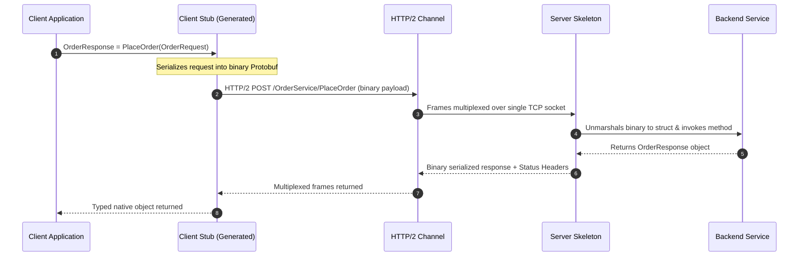
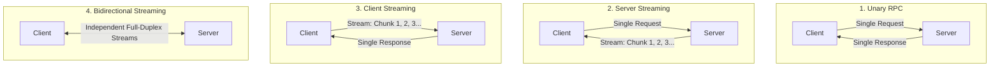
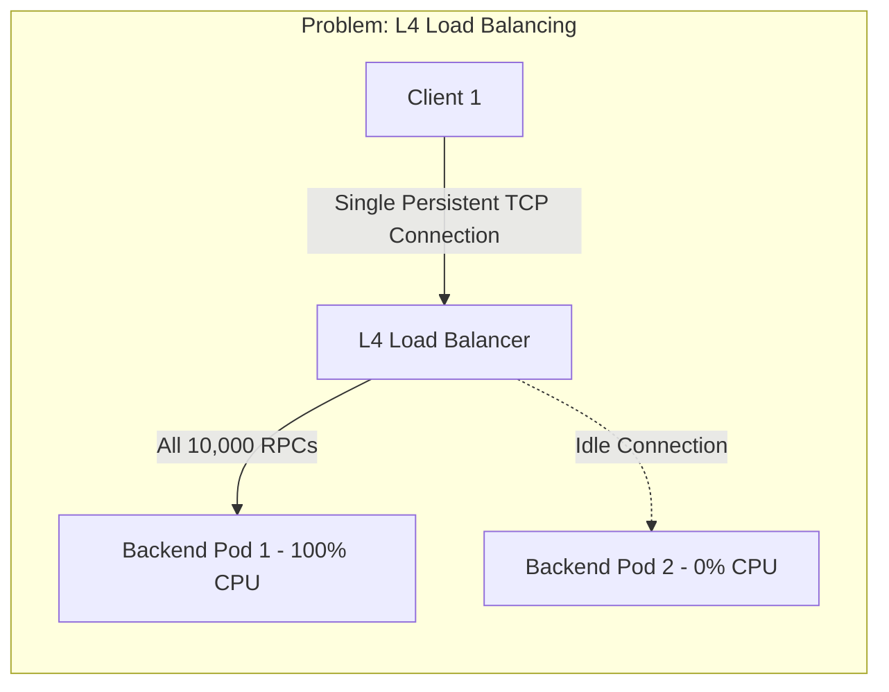

# gRPC and Protocol Buffers

gRPC is an open-source, high-performance Remote Procedure Call (RPC) framework developed by Google. It operates over HTTP/2 transport and uses Protocol Buffers (Protobuf) as its Interface Definition Language (IDL) and binary serialization format.



---

## 1. What It Is & Why It Exists

In distributed microservices, REST over JSON introduces high serialization overhead, bulky textual payloads, lack of compile-time contract enforcement, and HTTP/1.1 head-of-line blocking. 

gRPC was designed to solve these bottlenecks:
- **Binary Protocol Buffers**: Compact serialization (3x-10x smaller than JSON) and ultra-fast marshalling/unmarshalling.
- **Strict Typed Contracts**: `.proto` files define service contracts. Code generators (`protoc`) emit strongly-typed stubs in Go, Java, Python, C++, Rust, and TypeScript.
- **HTTP/2 Transport**: Native header compression (HPACK), bidirectional multiplexing over a single persistent TCP connection, and flow control.
- **Streaming Primitives**: Unary, Client-streaming, Server-streaming, and Bidirectional streaming.

---

## 2. Protocol Buffers Internals: Varints and Wire Types

Protobuf uses tag-value encoding instead of field names. Each field in a `.proto` file has a unique number:

```protobuf
syntax = "proto3";

package commerce.v1;

service OrderService {
  rpc PlaceOrder (PlaceOrderRequest) returns (PlaceOrderResponse);
  rpc StreamOrderStatus (OrderStatusRequest) returns (stream OrderStatusUpdate);
}

message PlaceOrderRequest {
  string order_id = 1;
  int64 user_id = 2;
  double total_amount = 3;
  repeated string item_skus = 4;
}

message PlaceOrderResponse {
  string order_id = 1;
  enum Status {
    PENDING = 0;
    CONFIRMED = 1;
    FAILED = 2;
  }
  Status status = 2;
  int64 created_at = 3;
}
```

### Key Encoding Mechanics:
1. **Field Tag**: `(field_number << 3) | wire_type`.
2. **Varints**: Integers use variable-length bytes (MSB indicates if more bytes follow). An integer `1` takes 1 byte instead of 4 or 8 bytes.
3. **No Field Names on the Wire**: JSON transmits keys repeatedly (`"total_amount": 199.99`); Protobuf only transmits tag `(3 << 3) | 1` (1 byte) followed by the 8-byte double.

---

## 3. The Four gRPC Communication Patterns



---

## 4. Trade-offs: gRPC vs REST vs GraphQL

| Dimension | gRPC | REST (JSON) | GraphQL |
| :--- | :--- | :--- | :--- |
| **Data Format** | Binary (Protobuf) | Text (JSON, XML) | Text (JSON) |
| **Transport** | HTTP/2 (requires end-to-end) | HTTP/1.1, HTTP/2, HTTP/3 | HTTP/1.1, HTTP/2 |
| **Payload Size** | Extremely Small | Moderate to Large | Minimal (client-selected fields) |
| **Browser Support** | Requires gRPC-Web proxy (Envoy) | Native in all browsers | Native in all browsers |
| **Load Balancing** | Complex (L7 connection pooling) | Simple (L4/L7 load balancers) | Simple (L7 load balancers) |
| **Contract Enforcement**| Strict compile-time `.proto` | Optional (OpenAPI / JSON Schema) | Strict Schema Definition (SDL) |
| **Best Used For** | Service-to-service internal RPC | Public APIs, Browser clients | Mobile BFFs, complex graph data |

---

## 5. gRPC Load Balancing Gotcha

Because gRPC uses long-lived HTTP/2 multiplexed TCP connections, standard L4 load balancers (like AWS NLB or round-robin TCP proxies) will route the initial TCP connection to one backend pod, and **all subsequent RPCs over that connection stay on that pod**.



### Solutions:
1. **L7 Proxy Load Balancing**: Envoy or NGINX parses HTTP/2 frames and balances individual requests across backends.
2. **Client-Side Load Balancing**: The gRPC client queries DNS or a control plane (xDS / Consul) to resolve all backend IPs and manages a pool of sub-channels with round-robin or P2C.

---

## 6. Real-World Case Studies

1. **Netflix**: Migrated internal IPC from REST/JSON to gRPC. Reduced CPU usage on microservices by 25% and reduced p99 internal tail latency by 40ms.
2. **Uber**: Uses Protobuf schemas stored in a monorepo with automated breaking-change detection during CI linting.
3. **CockroachDB & Kubernetes**: Native gRPC for consensus communication (Raft transport) and API controller interactions.

---

## 7. Common Pitfalls

- **Forgetting Deadlines / Timeouts**: Without client deadlines, slow downstreams will cause requests to cascade and hang client goroutines/threads forever.
- **Breaking Schema Changes**: Changing field numbers or field types breaks binary backwards compatibility. Only add new fields or deprecate existing ones.
- **Attempting gRPC from Browsers Directly**: Browsers cannot access raw HTTP/2 frames; you must use `grpc-web` with an Envoy translation proxy.

---

## 8. Key Takeaways

- gRPC delivers unmatched throughput and lower resource usage for internal microservices.
- Protobuf tags ensure fast serialization without sending repeated string field names.
- Always implement L7 or client-side load balancing to avoid connection pinning.
- Always propagate `context` with deadlines and cancellation tokens across RPC hops.

---

## 9. Interview Questions

1. *How does gRPC achieve higher performance compared to REST over JSON?*
2. *Why does L4 load balancing fail with gRPC, and how do you resolve it?*
3. *How do you version and evolve a Protocol Buffer schema without breaking existing consumers?*
