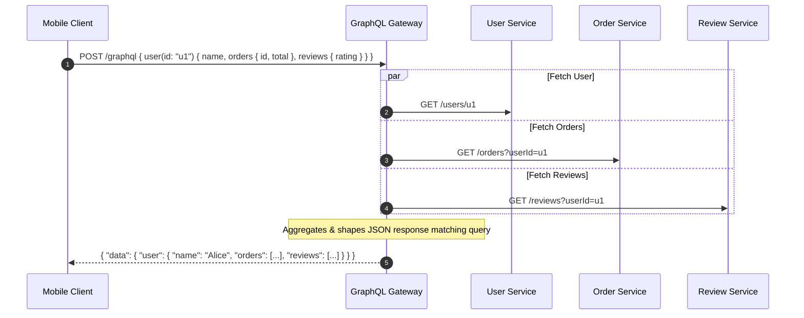
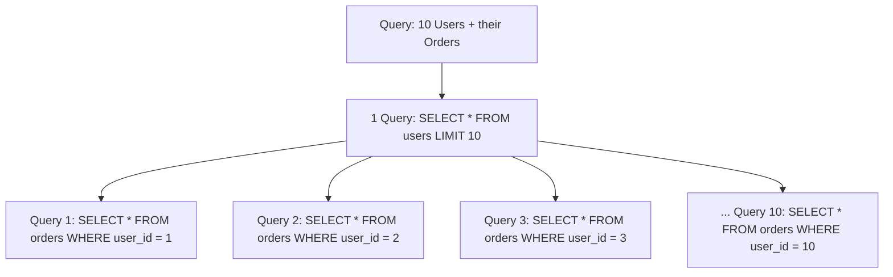

# GraphQL Schema, Resolvers, and DataLoader

GraphQL is an open-source query language for APIs and a runtime for fulfilling those queries with existing data. Developed by Meta in 2012 and open-sourced in 2015, GraphQL enables clients to define the exact structure of data required.



---

## 1. Core Concepts: Schema, Queries, and Mutations

A GraphQL API is defined by a strongly typed schema:

```graphql
type User {
  id: ID!
  name: String!
  email: String!
  orders(limit: Int = 10): [Order!]!
}

type Order {
  id: ID!
  total: Float!
  createdAt: String!
  items: [OrderItem!]!
}

type Query {
  user(id: ID!): User
}

type Mutation {
  createOrder(userId: ID!, items: [OrderItemInput!]!): Order!
}
```

---

## 2. The N+1 Problem and DataLoader

In naive GraphQL implementations, each nested resolver executes an independent database query. 


*Result*: 1 query for users + 10 queries for orders = 11 queries ($N+1$). For 1,000 users, 1,001 database queries will saturate the database pool.

### Solution: DataLoader (Batching and Caching)

DataLoader collects all individual IDs requested during a single tick of the event loop and issues a single batch query:

```mermaid
graph TD
    DL[DataLoader Batching Window] -->|Collects IDs: 1, 2, 3... 10| DB[(Database)]
    DB -->|Single Query: SELECT * FROM orders WHERE user_id IN (1,2,3...10)| DL
    DL -->|Distributes arrays back to respective resolvers| Resolvers[User Resolvers]
```

```javascript
const orderLoader = new DataLoader(async (userIds) => {
  const orders = await db.query(
    'SELECT * FROM orders WHERE user_id = ANY($1)',
    [userIds]
  );
  // Group orders by userId and return in the exact order of userIds
  const orderMap = groupBy(orders, 'userId');
  return userIds.map(id => orderMap[id] || []);
});

// Inside GraphQL Resolver:
const resolvers = {
  User: {
    orders: (parent, args, context) => context.orderLoader.load(parent.id)
  }
};
```

---

## 3. Trade-offs: GraphQL vs REST

| Dimension | GraphQL | REST |
| :--- | :--- | :--- |
| **Over/Under-Fetching** | Zero over-fetching (client requests exact fields) | Frequent over-fetching or multiple round-trips |
| **HTTP Caching** | Hard (most queries are `POST /graphql` with body) | Trivial (URL-based `GET /users/123` cached by CDNs) |
| **Attack Surface** | High (nested queries can cause recursive DoS) | Low (fixed endpoints with predictable resource costs) |
| **Client Flexibility** | Maximum flexibility | Rigid endpoints |
| **API Versioning** | Field deprecation (`@deprecated`) | URL path `/v1`, headers, or query params |
| **Monitoring** | Complex (need field-level execution metrics) | Simple (HTTP status codes, URI path metrics) |

---

## 4. Mitigating GraphQL Security & DoS Risks

Because clients define queries, malicious or poorly written queries can take down backends:

```graphql
# Malicious recursive query
query MaliciousBomb {
  user(id: "1") {
    orders {
      user {
        orders {
          user {
            orders { ... }
          }
        }
      }
    }
  }
}
```

### Production Protections:
1. **Query Depth Limiting**: Reject any query exceeding a maximum AST depth (e.g., maximum depth of 6).
2. **Query Complexity Analysis**: Assign cost points to each field (e.g., scalar = 1 pt, list = 10 pts). Reject queries exceeding 500 total points.
3. **Persisted Queries (Automatic Persisted Queries - APQ)**: Clients do not send arbitrary query strings in production. Instead, build systems hash approved queries, and clients send `POST /graphql?hash=a1b2c3d4`. This restores CDN caching and prevents arbitrary AST execution!

---

## 5. Real-World Case Studies

1. **GitHub**: Migrated its v4 API to GraphQL, enabling developers to fetch complex relationships (repos, pull requests, reviewers, comments) in a single round-trip.
2. **Shopify**: Exposes its Storefront and Admin APIs via GraphQL to allow headless storefronts to fetch only required product details.
3. **Twitter / X**: Uses GraphQL for mobile client feeds, cutting mobile payload sizes by 40%.

---

## 6. Key Takeaways

- GraphQL shines as a Backend-For-Frontend (BFF) layer aggregating disparate microservices for mobile and web clients.
- Always use DataLoader in resolvers to eliminate the $N+1$ query disaster.
- Implement Query Depth and Complexity limiting or Persisted Queries before exposing GraphQL to public untrusted clients.
