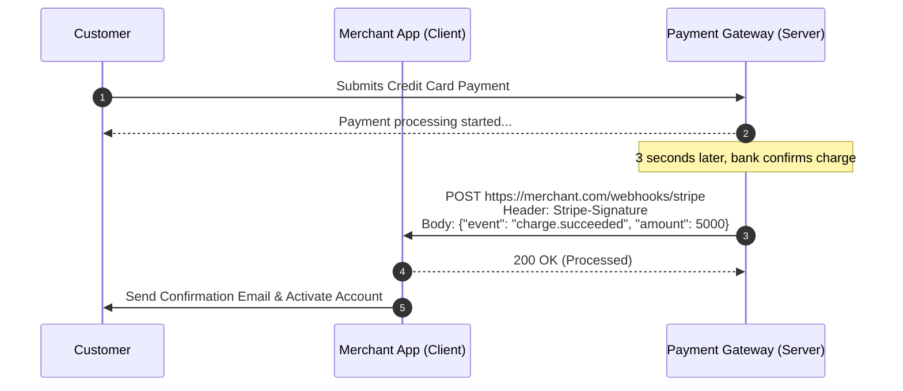
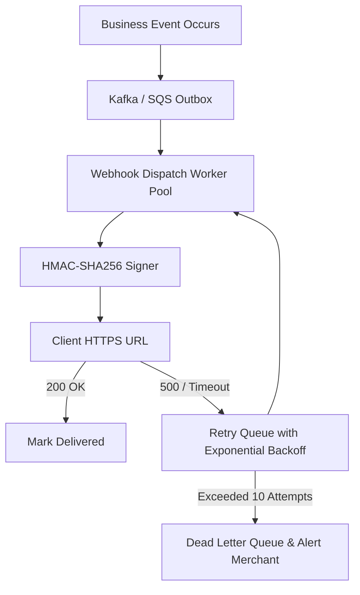
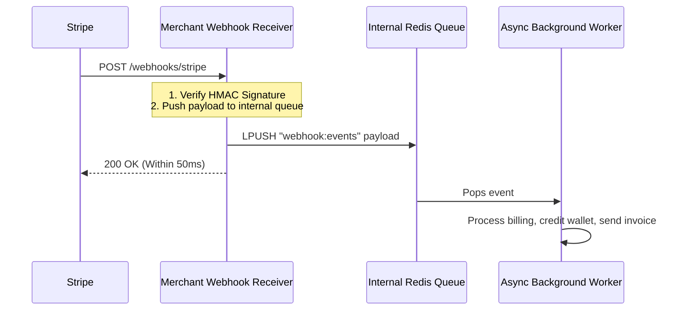

# Webhooks and Asynchronous APIs

A webhook (reverse API) is an architectural pattern where a server notifies external clients of events by making an asynchronous HTTP POST request to a client-configured URL.



---

## 1. Webhooks vs Polling vs WebSockets

| Method | Communication Direction | Efficiency | Latency | Infrastructure Overhead |
| :--- | :--- | :--- | :--- | :--- |
| **Short Polling** | Client -> Server (`GET` every 5s) | Extremely Low (99% empty responses) | 0 - 5 seconds | High server load |
| **WebSockets** | Bidirectional persistent TCP | High for browser-to-server real-time | < 50ms | High connection state on server |
| **Webhooks** | Server -> Client (`POST` on event) | Optimal (triggered only on events) | < 1 second | Stateless event delivery pipeline |

---

## 2. Production Webhook Delivery Architecture

Delivering webhooks reliably at scale requires handling client timeouts, downstream failures, network partitions, and malicious consumer URLs.



### Essential Reliability Guarantees:
1. **Exponential Backoff with Jitter**: If client returns non-2xx or times out, retry at $t = 2^n + 	ext{random\_jitter}$ (e.g., 5s, 15s, 1m, 5m, 1h, 6h, 24h).
2. **Strict Timeouts**: Limit outgoing HTTP requests to 5-10 seconds. Never allow a slow client endpoint to exhaust your worker threads.
3. **Circuit Breaking**: If an external endpoint fails 100% of requests over 1 hour, pause delivery and notify the developer via dashboard/email.

---

## 3. Security: Signatures, Replay Attacks, and SSRF

### 1. Cryptographic Signatures (HMAC-SHA256)
The sending server signs the payload with a shared secret:
```
Header: X-Signature: t=1696156800,v1=9c84b1e56b464a7c8c8...
```
Verification on client side:
$$	ext{Expected} = 	ext{HMAC-SHA256}(K_{	ext{secret}}, 	ext{timestamp} + "." + 	ext{payload})$$

### 2. Preventing Replay Attacks
Include a Unix timestamp in the signature header. The client rejects any webhook where $|T_{	ext{current}} - T_{	ext{header}}| > 300	ext{ seconds}$.

### 3. Server-Side Request Forgery (SSRF) Protection
Prevent malicious users from registering internal IPs (e.g., `http://169.254.169.254` AWS metadata or `http://localhost:8080/admin`) as their webhook URL:
- Resolve DNS and block private IP ranges (RFC 1918: `10.0.0.0/8`, `172.16.0.0/12`, `192.168.0.0/16`, link-local `169.254.0.0/16`).
- Disallow HTTP redirects (`301`/`302`) to prevent DNS rebinding attacks.

---

## 4. Consumer Best Practices: Asynchronous Processing

A webhook endpoint on the receiving side should **never** perform synchronous business logic before responding.



---

## 5. Real-World Case Studies

1. **Stripe**: Sends millions of webhooks daily with signature verification, automated retries over 3 days, and a local CLI (`stripe listen`) that tunnels webhooks to localhost for local testing.
2. **GitHub**: Triggers webhooks on git push, pull request, and deployment events to automate CI/CD runners (Jenkins, GitHub Actions).
3. **Slack**: Uses event subscriptions to send bot interactions and mention events to app servers.

---

## 6. Key Takeaways

- Always sign webhooks using HMAC-SHA256 and include timestamps to prevent replay attacks.
- Senders must implement exponential backoff with jitter and a Dead-Letter Queue.
- Receivers must verify signatures, enqueue payloads immediately, return HTTP 200 within milliseconds, and process idempotently.
