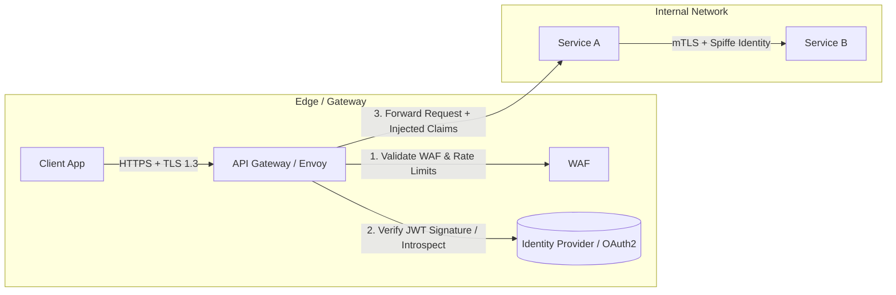
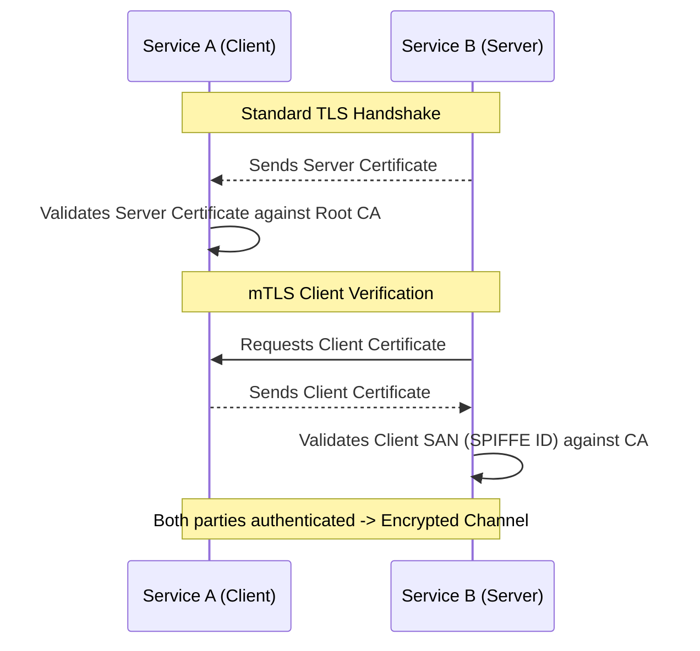

# API Security and Authentication

Securing distributed APIs requires multi-layered defense covering authentication (AuthN), authorization (AuthZ), transport security, token handling, and traffic protection.



---

## 1. Authentication Mechanisms: API Keys, OAuth2, and JWTs

### 1. API Keys
- Simple string passed in headers (`X-API-Key: abc123xyz`).
- **Use Case**: Server-to-server integration for machine identification.
- **Limitation**: Cannot represent user delegation; vulnerable if leaked in client-side code.

### 2. OAuth 2.0 & OpenID Connect (OIDC)
- OAuth 2.0 handles **delegated authorization** (e.g., "Allow app X to read my Google Drive files").
- OIDC adds an **identity layer** on top of OAuth 2.0 (`id_token`) for authentication.
- **Grant Types**:
  - *Authorization Code + PKCE*: Standard for single-page apps (SPAs) and mobile devices.
  - *Client Credentials*: Server-to-server machine communication.

### 3. JSON Web Tokens (JWT) vs Opaque Tokens

```mermaid
graph TD
    subgraph "Stateless JWT"
        J_GW[Gateway] -->|Decodes Signature with Public Key (RS256)| J_OK[Verified Locally (0 DB lookups)]
        J_Revoke[Revocation Challenge: Hard until expiry]
    end

    subgraph "Opaque Token"
        O_GW[Gateway] -->|Queries Session Store / Redis| O_DB[(Token Cache)]
        O_Revoke[Instant Revocation: Delete from Redis]
    end
```

| Feature | JWT (Stateless) | Opaque Token (Stateful) |
| :--- | :--- | :--- |
| **Verification** | In-memory via public key (asymmetric RS256/ES256) | Database or Redis lookup |
| **Latency** | Sub-millisecond | 1-5ms network round-trip |
| **Payload Size** | ~500B - 2KB (Base64 encoded headers, claims, signature) | 32-64 bytes random string |
| **Instant Revocation** | Difficult (requires token blacklist / short expiration) | Trivial (delete key from Redis) |
| **Best Practice** | Short-lived Access Token (15m) + Long-lived Refresh Token (7d) | Enterprise session management |

---

## 2. Authorization: RBAC vs ABAC

```mermaid
graph TD
    subgraph "Role-Based Access Control (RBAC)"
        User[User] --> Role[Role: Admin / Editor / Viewer]
        Role --> Perm[Permissions: read, write, delete]
    end

    subgraph "Attribute-Based Access Control (ABAC)"
        Req[Context: User, Resource, Time, Location] --> Engine{Policy Engine (OPA)}
        Engine -->|User.dept == Resource.dept AND Time in 9-5| Allow[Allow Access]
    end
```

- **RBAC**: Map permissions to roles, and roles to users. Simple to implement, but suffers from "role explosion" when fine-grained rules emerge.
- **ABAC**: Evaluates attributes (Subject, Resource, Action, Environment). Implemented via engines like Open Policy Agent (OPA) with Rego policies.

---

## 3. Mutual TLS (mTLS) for Service-to-Service Security

In zero-trust microservice architectures, edge authentication is not enough. Services must authenticate each other over internal networks.



---

## 4. OWASP API Security Top 10 (Critical Defenses)

1. **BOLA (Broken Object Level Authorization)**: A user changes `GET /api/v1/orders/100` to `/orders/101` and sees another user's order.
   - *Fix*: Always verify ownership: `WHERE order_id = :id AND user_id = :authenticated_user_id`.
2. **Broken Authentication**: Weak JWT signing algorithms (e.g., accepting `alg: "none"` or using symmetric HMAC with a guessable secret).
   - *Fix*: Enforce asymmetric RS256/ES256; validate `iss`, `aud`, and `exp`.
3. **Mass Assignment**: Client sends extra fields in JSON payload (`{"name": "Alice", "is_admin": true}`).
   - *Fix*: Use strict Data Transfer Objects (DTOs) with allow-listed fields.
4. **Lack of Rate Limiting**: Brute-force attacks against login and OTP endpoints.
   - *Fix*: IP and user-level rate limiting at the API Gateway.

---

## 5. Key Takeaways

- Never roll custom cryptography or authentication protocols. Use established standards (OAuth 2.0, OIDC, PKCE).
- Keep JWT lifetimes short (10-15 minutes) and issue refresh tokens stored in HTTP-only, Secure, SameSite cookies.
- Defend against BOLA at every data access layer by scoping queries to the authenticated tenant/user.
- Implement mTLS between microservices to enforce Zero Trust security.
