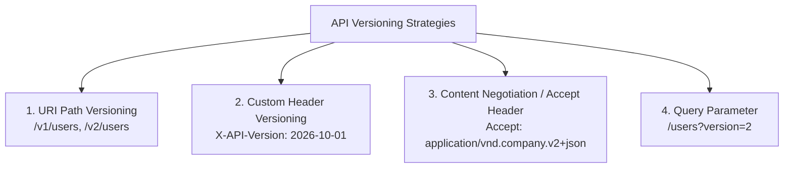
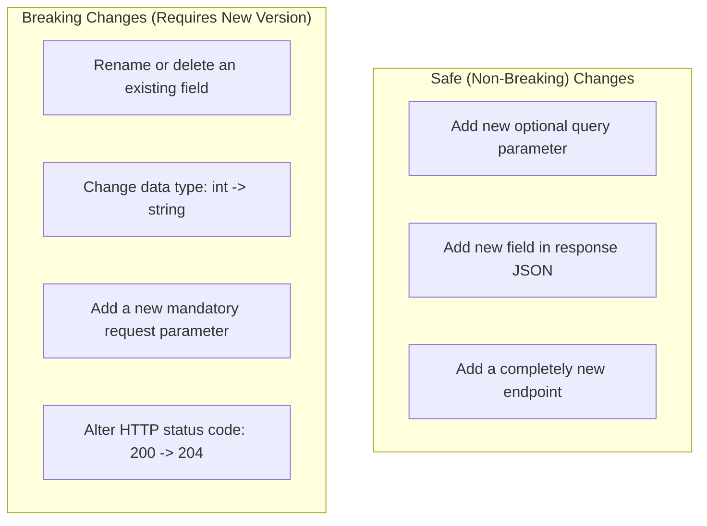
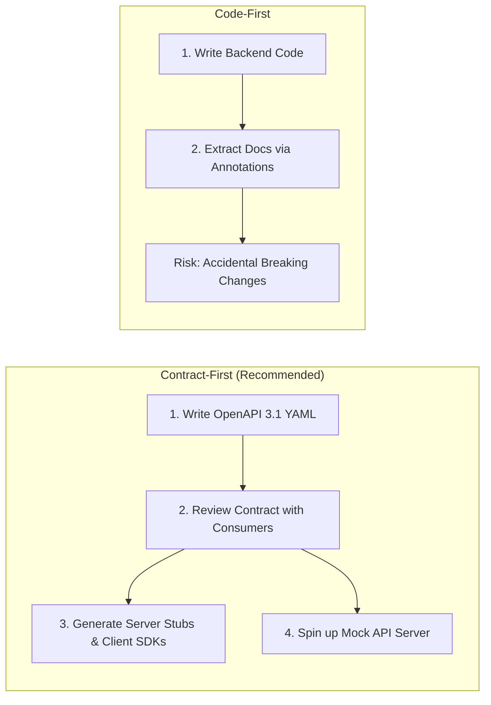
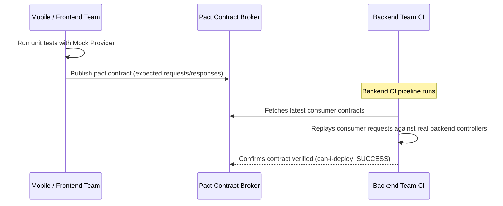

# API Documentation, Versioning, and Contracts

In microservice ecosystems, APIs are binding public contracts between teams and organizations. Effective versioning, backward compatibility, and automated schema contracts prevent outages and developer friction.

```mermaid
graph LR
    Spec[OpenAPI / Protobuf Spec in Git] --> Lint[Spectral / Buf Linting]
    Lint --> CI[Breaking Change Detection CI]
    CI --> CodeGen[SDK & Stub Generation]
    CI --> Mock[Mock Servers (Prism)]
    CI --> Docs[Interactive Docs (Swagger / Redoc)]
```

---

## 1. API Versioning Strategies

When breaking changes cannot be avoided, versioning ensures existing consumers continue operating without interruption.



### Comparative Analysis:

| Strategy | Example | Pros | Cons | Used By |
| :--- | :--- | :--- | :--- | :--- |
| **URI Path** | `https://api.example.com/v1/orders` | Clear, cache-friendly on CDNs, easy browser testing | Can lead to code duplication across controllers | Google, Twitter, Stripe (for major) |
| **Custom Header** | `X-API-Version: 2026-10-01` | Clean URLs, allows granular date-based rolling versions | Cannot be tested directly in a browser URL bar | Stripe, Twilio |
| **Accept Header** | `Accept: application/vnd.myapi.v2+json` | Follows pure REST HATEOAS standards | Hard to inspect, complicated client configurations | GitHub |

---

## 2. Backward Compatibility Rules

A breaking change forces consumers to modify their client code. Follow Postel's Law: *"Be conservative in what you send, be liberal in what you accept."*



---

## 3. Contract-First vs Code-First Development



---

## 4. Consumer-Driven Contract Testing (Pact)

Consumer-Driven Contract (CDC) testing validates that microservices adhere to expected contracts without running slow, flaky end-to-end integration environments.



---

## 5. Key Takeaways

- Prefer Contract-First development with OpenAPI 3.1 or Protocol Buffers.
- Use URI path versioning for major overhauls and date-based headers for rolling updates (Stripe model).
- Treat response fields as additive-only. Never rename or delete fields without multi-month deprecation cycles.
- Integrate automated breaking-change detectors (`openapi-diff` or `buf breaking`) directly into CI pull-request checks.
