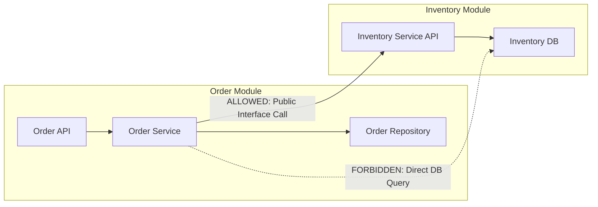

# Monoliths and Modular Monoliths

A monolithic architecture structures an entire application as a single deployable artifact executing within a shared memory space. A **modular monolith** preserves this single deployment unit while strictly enforcing logical domain boundaries at compile-time.

```mermaid
graph TD
    subgraph "Spaghetti Monolith (Tightly Coupled)"
        UI1[Web UI] --> Core1[Shared State & Mixed Logic]
        Core1 --> DB1[(Single Shared DB Without Schemas)]
    end

    subgraph "Modular Monolith (Bounded Contexts)"
        API[API / Gateway Layer] --> ModA[User Module (Private Package)]
        API --> ModB[Billing Module (Private Package)]
        API --> ModC[Catalog Module (Private Package)]
        ModA -.->|Internal Event Bus / In-Memory Interface| ModB
        ModB -.->|Internal Event Bus / In-Memory Interface| ModC
        ModA --> DB_User[(User Schema)]
        ModB --> DB_Bill[(Billing Schema)]
        ModC --> DB_Cat[(Catalog Schema)]
    end
```

---

## 1. What It Is & Why It Matters

Teams often default to microservices too early, incurring severe distributed systems overhead: network latency, distributed transactions, observability complexity, and operational cost.

The modular monolith provides the best of both worlds:
- **Zero Network Overhead**: Inter-module communication consists of function calls and in-memory pointer passing rather than JSON/HTTP serialization over sockets.
- **Transactional Simplicity**: ACID transactions are natively available across modules when necessary.
- **Single Deployment Artifact**: Continuous deployment and infrastructure footprint remain straightforward (single Docker container or binary).
- **Enforced Boundaries**: Strict package visibility (e.g., Go internal packages, Java ArchUnit / JPMS, TypeScript project references) prevents cross-domain code pollution.

---

## 2. Enforcing Module Isolation

Without tooling, modular monoliths decay into "big balls of mud." Teams must enforce boundary rules programmatically:



### Techniques for Boundary Enforcement:
1. **Public API Interface Contracts**: Modules expose only interface contracts (e.g., `inventory.CheckStock()`); internal classes, entities, and repositories remain package-private.
2. **Architecture Linter Tests (e.g., ArchUnit in Java, ESLint boundary rules)**:
   ```java
   // Example ArchUnit test
   noClasses().that().resideInAPackage("..order..")
       .should().accessClassesThat().resideInAPackage("..inventory.internal..")
       .check(importedClasses);
   ```
3. **Database Schema Separation**: Each module owns its own schema (`order_schema`, `inventory_schema`). Cross-schema foreign keys and direct cross-schema joins are prohibited.

---

## 3. Trade-offs: Modular Monolith vs Microservices

| Dimension | Modular Monolith | Microservices |
| :--- | :--- | :--- |
| **Communication Latency** | Nanoseconds (in-memory function call) | Milliseconds (TCP, TLS, L7 serialization) |
| **Operational Overhead** | Extremely Low (single binary, simple CI/CD) | High (Kubernetes, Envoy, distributed tracing) |
| **Deployment Independence** | None (whole binary deploys together) | High (independent deployments per service) |
| **Failure Blast Radius** | High (memory leak or panic crashes process) | Contained to single service |
| **Hardware Scaling** | Scale entire binary vertically or horizontally | Fine-grained scaling per resource-heavy service |
| **Data Consistency** | Local ACID transactions | Sagas / Eventual Consistency |

---

## 4. Real-World Case Studies

1. **Shopify**: Operates one of the world's largest modular monoliths in Ruby on Rails, serving hundreds of thousands of requests per second during Black Friday. Enforces strict module boundaries using `packwerk`.
2. **Stack Overflow**: Runs the entire multi-billion-page-view developer platform on a handful of monolithic .NET servers and SQL Server instances with sub-10ms response times.
3. **GitHub**: Built originally as a monolithic Rails application, evolving toward modularity while retaining a unified core for developer workflows.

---

## 5. Common Pitfalls

- **Leaking Domain Entities**: Passing raw database entities (`UserRecord`) across module boundaries instead of immutable Data Transfer Objects (DTOs).
- **Direct Cross-Module Database Joins**: Joining tables owned by another module defeats encapsulation and prevents future service extraction.
- **Uncontrolled Global State**: Shared mutable singletons that allow module A to side-effect module B silently.

---

## 6. Key Takeaways

- Start with a modular monolith before extracting microservices.
- Enforce domain boundaries in CI using architectural linters or language-level visibility.
- Isolate database schemas per module to make future microservice extraction trivial if scale demands it.
