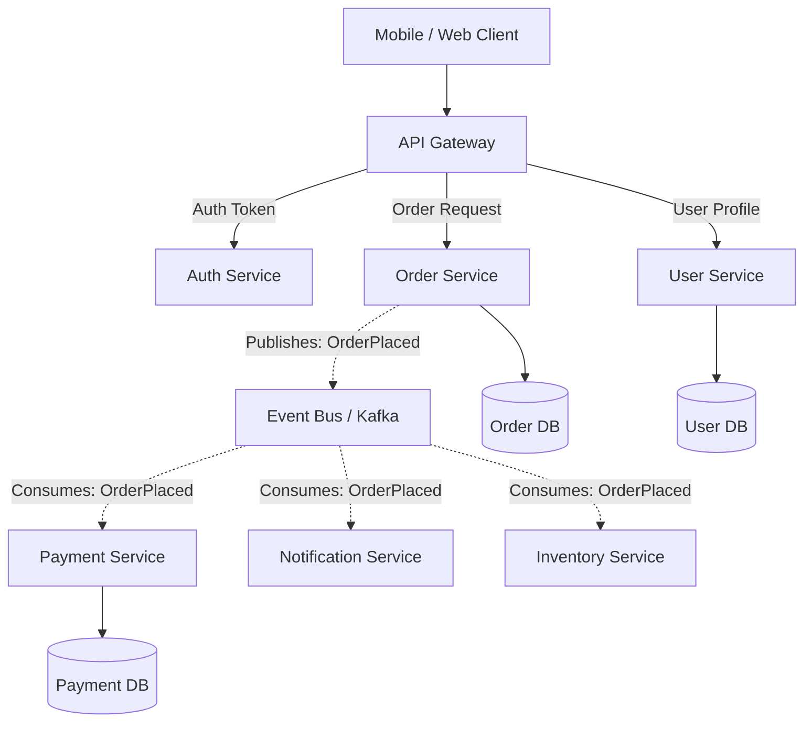

# Microservices Architecture and Distributed Pitfalls

Microservices architecture decomposes an application into a collection of independently deployable, loosely coupled services organized around business domains.



---

## 1. When Microservices Make Sense

Microservices are primarily an **organizational scaling pattern** rather than a purely technical performance optimization.

### Good Reasons to Adopt Microservices:
- **Multiple Independent Engineering Teams**: 50+ engineers where monolithic merge conflicts, deployment queues, and coordination overhead stall velocity.
- **Heterogeneous Scaling Requirements**: One component requires GPU compute or 100,000 req/sec (e.g., video transcoding or real-time telemetry), while billing runs 10 req/sec.
- **Strict Compliance / Security Boundaries**: PCI-DSS payment handling isolated from the rest of the application to minimize compliance audit scope.

---

## 2. The Distributed Tax (Hidden Costs)

Moving from in-memory calls to network-based microservices introduces severe architectural taxes:

```mermaid
graph LR
    subgraph "In-Memory Monolith Call"
        A1[Caller] -->|0.0001 ms<br/>Zero Network Latency<br/>Atomic Transaction| B1[Callee]
    end

    subgraph "Distributed Microservice Call"
        A2[Caller] -->|DNS Lookup<br/>TCP/TLS Handshake<br/>Serialization (JSON/Proto)<br/>Routing (Envoy)<br/>Network Latency (1-10ms)<br/>Partial Failure Risk| B2[Callee]
    end
```

### The 4 Major Distributed Taxes:
1. **Network Latency & Fanout Amplification**: If an API gateway calls 10 microservices sequentially, latency sums up ($10 	imes 15	ext{ms} = 150	ext{ms}$).
2. **Dual-Write & Partial Failure Problems**: Updating Service A and Service B requires distributed consensus or Sagas; network partitions can leave state permanently inconsistent.
3. **Operational Complexity**: Requires Kubernetes, service meshes (Istio/Envoy), distributed tracing (OpenTelemetry/Jaeger), central logging, and canary deployment pipelines.
4. **Data Duplication**: Cross-service querying requires denormalizing data or asynchronous event-driven replication.

---

## 3. Database-per-Service vs Shared Database

```mermaid
graph TD
    subgraph "Anti-Pattern: Shared Database"
        S1[Service 1] --> DB[(Shared DB)]
        S2[Service 2] --> DB
        Note over DB: Schema migration by S1 breaks S2 without warning
    end

    subgraph "Best Practice: Database-per-Service"
        S3[Service 1] --> DB1[(Service 1 DB)]
        S4[Service 2] --> DB2[(Service 2 DB)]
        S3 -.->|Asynchronous Event / API| S4
    end
```

The golden rule of microservices is **Database-per-Service**. If two services read and write to the same relational tables, you have a **distributed monolith**: all the network latency and deployment complexity of microservices, with all the coupling of a monolith.

---

## 4. Common Distributed Antipatterns

1. **Distributed Monolith**: Services must be deployed simultaneously in a specific order; changing one service requires modifying three others.
2. **Chatty Microservices**: Fine-grained entities making hundreds of network round-trips to assemble a single web page.
3. **Synchronous Cascade Outages**: Service A calls B, which calls C, which calls D. When D slows down, threads exhaust backward across the entire chain until the whole system crashes.

---

## 5. Real-World Case Studies

1. **Amazon**: Migrated from the "Obidos" monolith to service-oriented architectures in the early 2000s, establishing the two-pizza team structure and fueling AWS.
2. **Netflix**: Pioneered cloud-native microservices on AWS, inventing Eureka (discovery), Hystrix (circuit breaking), and Zuul (gateway) to survive frequent instance termination.
3. **Segment**: Migrated back from 140 microservices to a single monolithic repo/service for their event processing pipeline, cutting operational load and AWS costs significantly.

---

## 6. Key Takeaways

- Microservices solve team scalability and organizational bottlenecks, not code complexity.
- Always enforce Database-per-Service; never share databases across microservice boundaries.
- Build resilient communication with circuit breakers, timeouts, retries with jitter, and asynchronous events.
