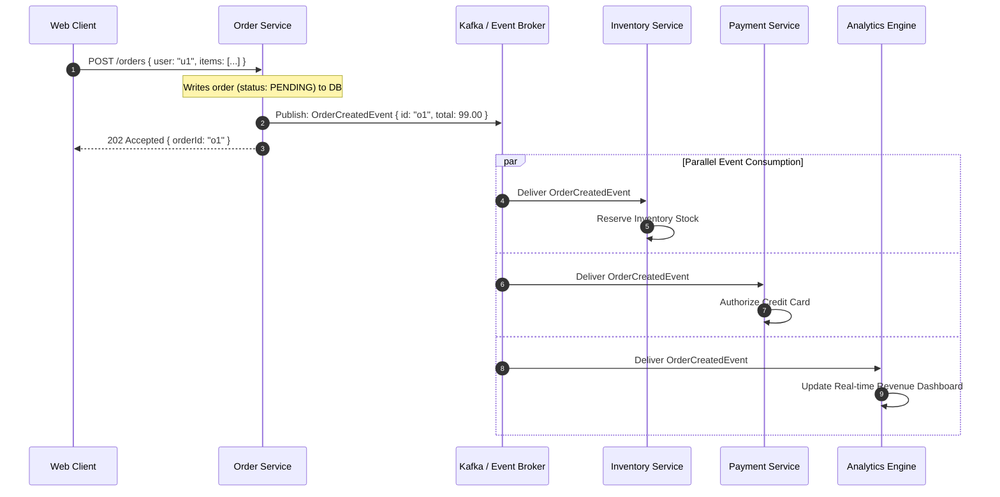
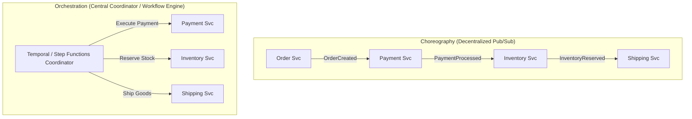

# Event-Driven Architecture (EDA)

Event-Driven Architecture (EDA) is a design paradigm in which software components communicate by producing, detecting, and consuming asynchronous state changes known as **events**.



---

## 1. Core Primitives: Events, Commands, and Queries

Understanding the semantic difference between events and commands is vital:

| Concept | Intent | Ownership | Naming Convention |
| :--- | :--- | :--- | :--- |
| **Command** | Directive: Requests an action to occur | Directed to a single specific receiver | Imperative (`CreateOrder`, `ChargeCard`) |
| **Event** | Notification: Announces a past factual occurrence | Published to broker; zero or multiple consumers | Past Tense (`OrderCreated`, `CardCharged`) |
| **Query** | Request: Asks for current state without side effects | Directed to a specific data provider | Read-only (`GetOrderById`) |

---

## 2. Event Notification vs Event-Carried State Transfer

```mermaid
graph TD
    subgraph "1. Event Notification (Thin Event)"
        P1[Publisher] -->|OrderCreated: {id: 101}| B1[Broker]
        B1 --> C1[Consumer]
        C1 -->|GET /orders/101 (HTTP callback)| P1
    end

    subgraph "2. Event-Carried State Transfer (Fat Event)"
        P2[Publisher] -->|OrderCreated: {id: 101, user: 'u1', items: [...], total: 99}| B2[Broker]
        B2 --> C2[Consumer]
        Note over C2: Processes event immediately without any upstream HTTP callback!
    end
```

- **Event Notification**: Lightweight notification containing only IDs. Minimizes payload size and data exposure, but forces consumers to query the publisher, creating downstream traffic spikes.
- **Event-Carried State Transfer (ECST)**: Full snapshot of state included in the payload. Eliminates downstream callback queries, decouples systems entirely, and enables consumers to maintain local materialized views.

---

## 3. Choreography vs Orchestration

When coordinating complex workflows across multiple services, teams must choose between decentralized choreography and centralized orchestration:



| Dimension | Choreography | Orchestration |
| :--- | :--- | :--- |
| **Coupling** | Loosely coupled; services only know about events | Tightly coupled to central workflow definition |
| **Visibility** | Difficult to visualize full workflow state | Centralized state machine dashboard |
| **Failure Handling** | Complex distributed compensations | Built-in retry and compensating transaction engine |
| **Best For** | Simple 2-3 step notification pipelines | Complex, multi-step business transactions (Sagas) |

---

## 4. Real-World Case Studies

1. **LinkedIn**: Processes trillions of events daily through Apache Kafka, which was originally built at LinkedIn for activity tracking and metric pipelines.
2. **DoorDash**: Uses event-driven dispatch to match delivery drivers, merchants, and customers in real-time.
3. **Uber**: Churns billions of location update events per second through distributed messaging brokers to calculate surge pricing and dynamic ETAs.

---

## 5. Key Takeaways

- Prefer Event-Carried State Transfer to prevent thundering herd callbacks to the publisher.
- Use past-tense naming for events to preserve the semantic guarantee that facts cannot be cancelled or altered.
- Choose orchestration (Temporal, Camunda, AWS Step Functions) when coordinating critical multi-step business transactions.
