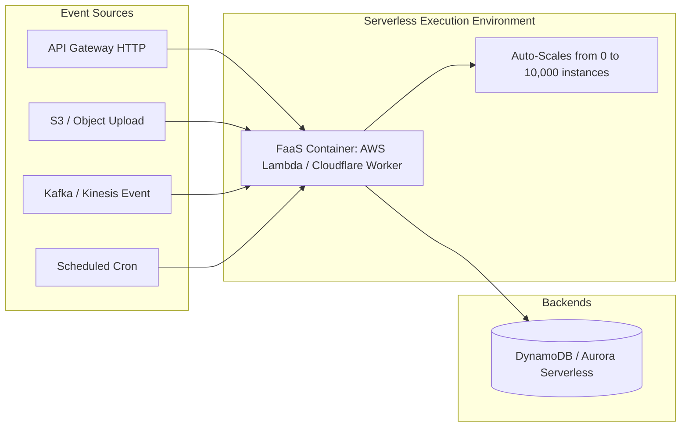
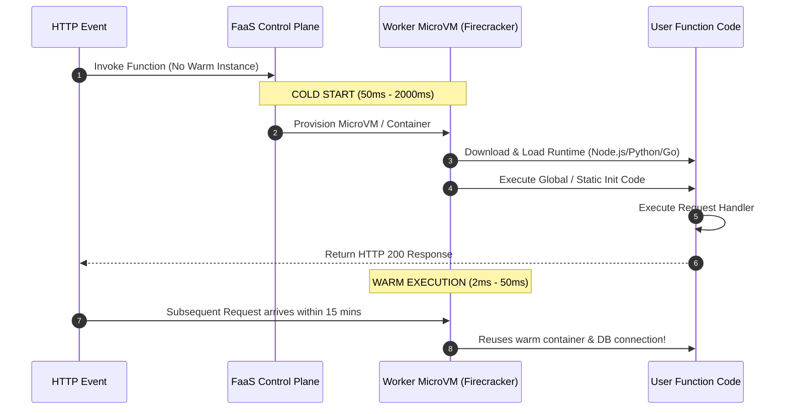
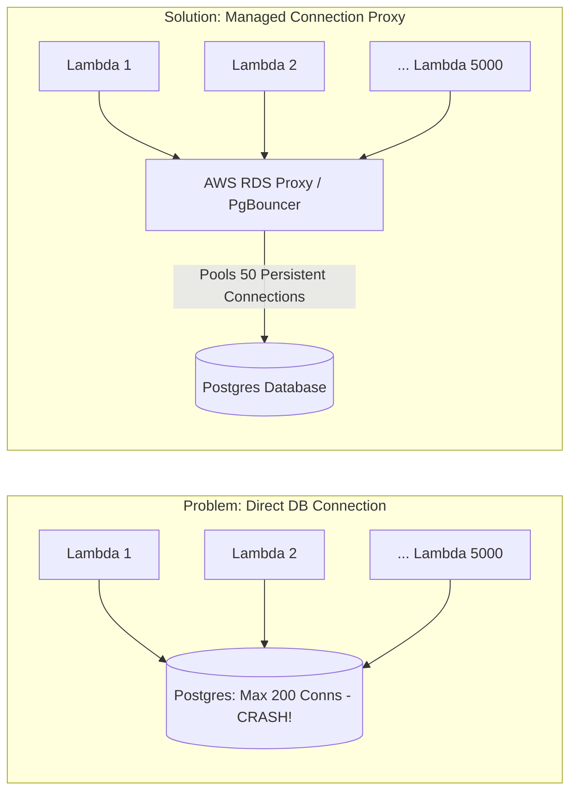

# Serverless and Function-as-a-Service (FaaS)

Serverless computing is an execution model where cloud providers dynamically manage the allocation, provisioning, and scaling of compute resources. Function-as-a-Service (FaaS) allows developers to deploy individual functions triggered by events.

---

## 1. What It Is: Ephemeral Compute with Scale-to-Zero

In traditional infrastructure (VMs, EC2, Kubernetes), you pay for provisioned capacity 24/7 regardless of incoming traffic.

Serverless introduces three core tenets:
1. **Scale-to-Zero**: When zero traffic arrives, zero compute runs and cost is zero.
2. **Event-Driven Invocation**: Functions execute strictly in response to events (HTTP request, queue message, file upload).
3. **Zero Server Management**: OS patching, security updates, and capacity provisioning are handled entirely by the cloud provider.

---

## 2. The Cold Start Problem and Container Lifecycle

### Techniques to Minimize Cold Starts:
- **Language Selection**: Go, Rust, and Node.js have startup times of 10-50ms; JVM (Java) and .NET can take 1,000-3,000ms unless pre-compiled with GraalVM Native Image.
- **Provisioned Concurrency**: Keeps a pre-warmed pool of instances running (eliminates cold starts at a fixed baseline cost).
- **V8 Isolates (Edge Workers)**: Cloudflare Workers and Fastly Compute execute functions inside V8 isolates rather than separate containers, reducing cold starts to < 5ms.

---

## 3. Database Connection Exhaustion Problem

Traditional relational databases (PostgreSQL, MySQL) assign a thread or process per TCP connection. If 5,000 Lambda functions spin up concurrently during a traffic spike, they will open 5,000 simultaneous connections, immediately crashing the database connection pool.

---

## 4. Trade-offs: Serverless vs Containers (Kubernetes)

| Dimension | Serverless (FaaS) | Containers / Kubernetes |
| :--- | :--- | :--- |
| **Scaling Speed** | Seconds (0 to 1,000+ instances instantly) | Minutes (HPA + Node Autoscaler spin-up) |
| **Idle Cost** | $0.00 (Scale-to-zero) | Continuous cost for reserved nodes |
| **Execution Limit** | Max 15 minutes (AWS Lambda) | Unlimited long-running processes |
| **Statefulness** | Strictly stateless | Stateful workloads supported (PVC, StatefulSets) |
| **Local Debugging** | Difficult (cloud mocking required) | Standard Docker container parity |
| **High Sustained Load Cost** | Extremely expensive at continuous high throughput | Significantly cheaper per compute unit |

---

## 5. Real-World Case Studies

1. **Coca-Cola**: Migrated vending machine telemetry and payment backend to AWS Lambda and API Gateway, reducing operational cost from $13,000/month to under $750/month.
2. **Netflix**: Uses AWS Lambda for automated video encoding pipelines, triggering functions on S3 chunk uploads to encode thousands of video segments in parallel.
3. **Cloudflare**: Powers edge computing with Cloudflare Workers using V8 Isolates across 300+ global data centers.

---

## 6. Key Takeaways

- Serverless is ideal for spiky, intermittent, event-driven, or asynchronous workloads.
- Avoid serverless for predictable, high-throughput, continuous 24/7 compute loads where reserved VM/container instances are vastly more cost-effective.
- Always place a connection pooler (RDS Proxy, PgBouncer) between FaaS functions and relational databases.
