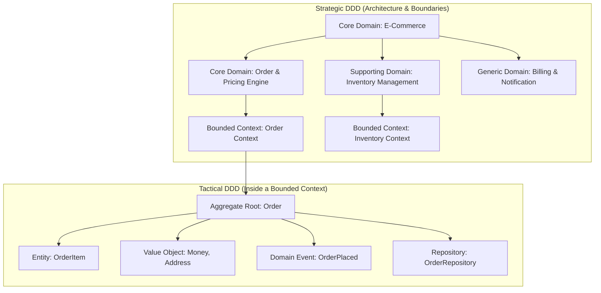
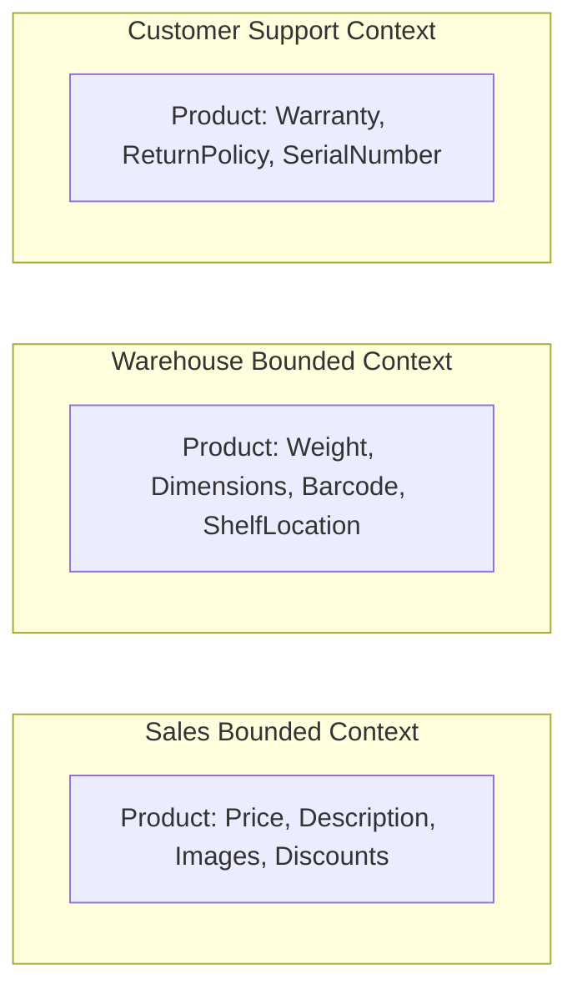

# Domain-Driven Design (DDD) Foundations

Domain-Driven Design (DDD) is a software design approach introduced by Eric Evans that centers development around a rich, evolving model of the business domain.



---

## 1. Strategic Design: Bounded Contexts and Ubiquitous Language

### 1. Ubiquitous Language
A single, unambiguous language shared between software engineers and business domain experts. 
- *Bad*: Developers say `OrderRow` and `TransactionItem`, while business teams say `LineItem`.
- *DDD Rule*: Pick one term (`LineItem`) and use it everywhere: in conversation, requirements, class names, database tables, and API fields.

### 2. Bounded Context
A linguistic boundary within which a domain model applies consistently. The same real-world object can have different models in different contexts:



---

## 2. Context Mapping Patterns

How bounded contexts integrate and share models:

```mermaid
graph LR
    subgraph Context Relationships
        U[Upstream: Core Billing] -->|Shared Kernel / Customer-Supplier| D1[Downstream: Invoice Service]
        D1 -->|Anti-Corruption Layer (ACL)| Legacy[Downstream: Legacy ERP]
    end
```

- **Shared Kernel**: Two contexts share a subset of code and database tables. High coupling; requires synchronized deployments.
- **Customer-Supplier**: Upstream provider delivers data needed by downstream consumer.
- **Anti-Corruption Layer (ACL)**: A translation layer that converts upstream foreign models into the downstream context's native domain model, protecting clean services from messy legacy schemas.

---

## 3. Tactical Design Building Blocks

| Building Block | Definition | Mutability | Equality By | Example |
| :--- | :--- | :--- | :--- | :--- |
| **Entity** | Object with a unique, persistent thread of identity | Mutable | Unique Identifier (`ID`) | `User(id=42)`, `Order(id=99)` |
| **Value Object** | Immutable object defined solely by its attributes | Immutable | Attribute equality | `Money(amount=10, currency="USD")` |
| **Aggregate Root** | Cluster of entities and value objects treated as a single transactional unit | Mutable via Root | Root Entity ID | `Order` (root) containing `OrderItems` |
| **Domain Event** | Record of a business event that has occurred in the past | Immutable | Event ID + Timestamp | `OrderCancelledEvent` |
| **Repository** | Interface abstracting persistence and retrieval of aggregate roots | N/A | N/A | `OrderRepository.save(order)` |

---

## 4. The Aggregate Rule

External objects are **only allowed to hold references to the Aggregate Root**. Direct mutation of inner entities is strictly forbidden:

```java
// VIOLATION of Aggregate Invariant
order.getItems().get(0).setPrice(0.00); // Bypasses discount rules!

// CORRECT DDD Practice
order.applyDiscountCode("BLACKFRIDAY2026"); // Enforces validation inside the Aggregate Root
```

---

## 5. Key Takeaways

- Strategic DDD (Bounded Contexts) is the premier tool for establishing clean microservice boundaries.
- Define a strict Ubiquitous Language with business domain experts to eliminate translation errors.
- Protect clean domain models from legacy APIs using an Anti-Corruption Layer (ACL).
- Enforce transactional consistency boundaries around Aggregate Roots, keeping aggregates small.
