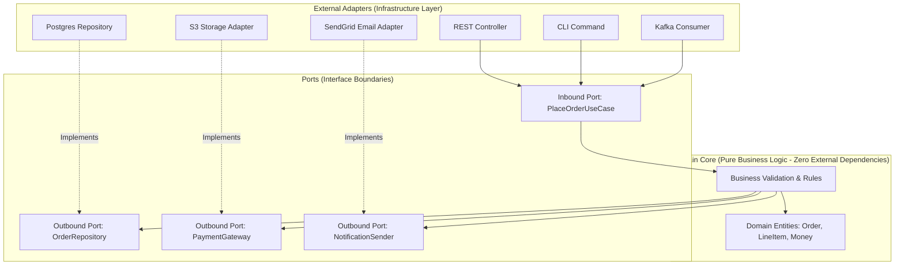

# Hexagonal and Clean Architecture (Ports and Adapters)

Hexagonal Architecture (introduced by Alistair Cockburn) and Clean Architecture (Uncle Bob Martin) organize software systems such that business rules remain completely decoupled from databases, frameworks, transport protocols, and UI.



---

## 1. The Dependency Inversion Principle (DIP)

The core tenet of Clean Architecture is: **Dependencies must point inward toward high-level business rules**. 

```mermaid
graph LR
    subgraph Traditional Layered Architecture (Tightly Coupled)
        UI[UI Layer] --> BLL[Business Logic]
        BLL --> DAL[Data Access / DB (Downstream!)]
    end

    subgraph Clean Architecture (Inverted)
        CleanBLL[Core Business Logic] --> PortInterface[Repository Interface (Port)]
        ConcreteRepo[Postgres Implementation] -.->|Implements / Inverts| PortInterface
    end
```

In Clean Architecture, your core domain knows nothing about SQL, ORMs (Hibernate, Prisma), AWS SDKs, or HTTP libraries. The database is a trivial plugin.

---

## 2. Ports and Adapters in Code

### 1. The Port (Core Domain Interface)
```go
package domain

type OrderRepository interface {
    Save(order *Order) error
    FindByID(id string) (*Order, error)
}
```

### 2. The Use Case (Application Service)
```go
type PlaceOrderUseCase struct {
    repo OrderRepository // Injected interface
}

func (uc *PlaceOrderUseCase) Execute(cmd PlaceOrderCommand) error {
    order := NewOrder(cmd.CustomerID, cmd.Items)
    return uc.repo.Save(order)
}
```

### 3. The Adapter (Infrastructure Implementation)
```go
package postgres

type PostgresOrderRepository struct {
    db *sql.DB
}

func (r *PostgresOrderRepository) Save(order *domain.Order) error {
    _, err := r.db.Exec("INSERT INTO orders (id, customer_id) VALUES ($1, $2)", order.ID, order.CustomerID)
    return err
}
```

---

## 3. Benefits and Trade-offs

| Dimension | Clean / Hexagonal Architecture | Traditional Layered Architecture |
| :--- | :--- | :--- |
| **Testability** | 100% pure in-memory unit tests with zero DB mocks | Requires spinning up Docker / test DBs |
| **Framework Independence** | Upgrade framework or DB with zero domain changes | Framework upgrades break business logic |
| **Boilerplate & Files** | Higher (requires DTO mappers, interfaces, adapters) | Lower initial setup |
| **Cognitive Load** | High for junior developers | Low (everyone writes in controllers/services) |

---

## 4. Key Takeaways

- Protect your domain model from database schemas and external API shapes.
- Use Inbound Ports for driving operations (HTTP, CLI, Kafka) and Outbound Ports for driven operations (DB, SMTP, S3).
- Swap persistence technologies or transport protocols without altering a single line of business validation logic.
