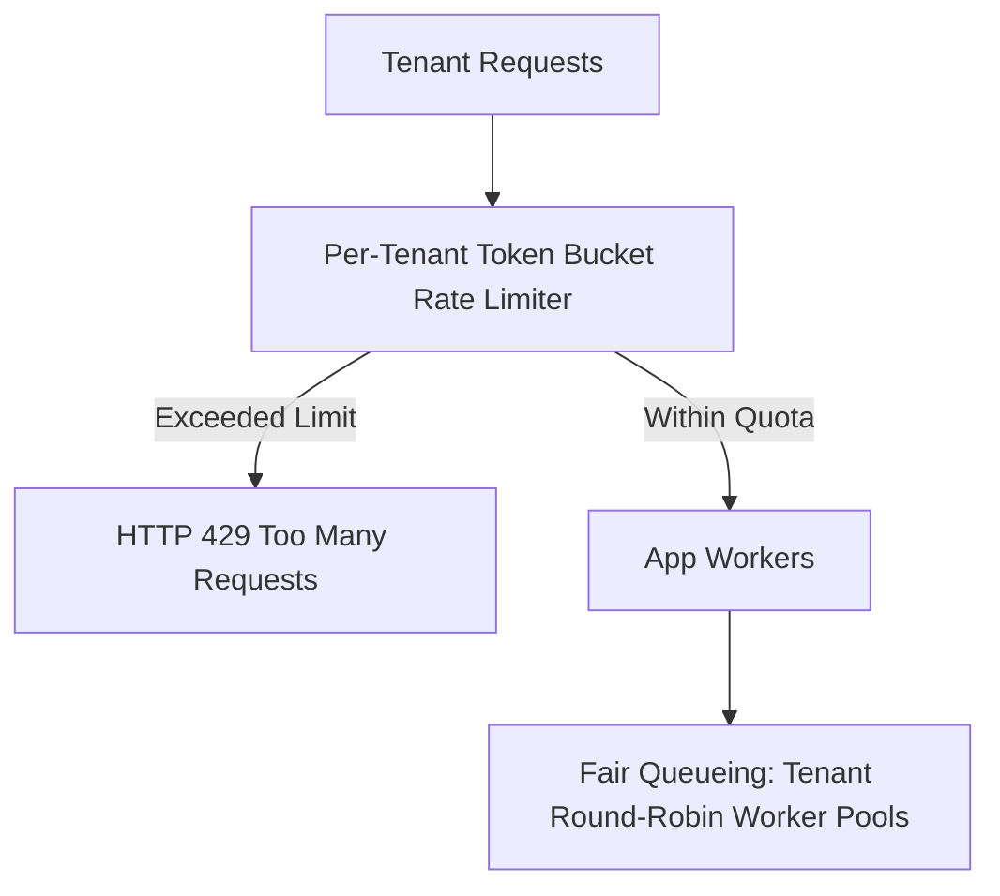

# Multi-Tenant Architecture (SaaS)

Multi-tenancy is an architectural model where a single software instance serves multiple distinct customer organizations (tenants), ensuring strict data isolation, cost efficiency, and performance predictability.

```mermaid
graph TD
    subgraph "1. Silo Model (Separate Everything)"
        T1_App[Tenant 1 App] --> T1_DB[(Tenant 1 DB)]
        T2_App[Tenant 2 App] --> T2_DB[(Tenant 2 DB)]
    end

    subgraph "2. Pool Model (Shared Everything)"
        SharedApp[Shared App Instances] --> SharedDB[(Shared Database)]
        Note over SharedDB: Every table has tenant_id column
    end

    subgraph "3. Hybrid (Bridge Model)"
        H_App[Shared App] --> H_DB_T1[(Tenant 1 DB - Enterprise)]
        H_App --> H_DB_Shared[(Shared DB - Free Tier)]
    end
```

---

## 1. Multi-Tenancy Models Comparison

| Dimension | Silo (Dedicated Database) | Pool (Shared DB, Shared Schema) | Bridge (Shared DB, Separate Schemas) |
| :--- | :--- | :--- | :--- |
| **Data Isolation** | Complete / Physical isolation | Logical isolation via `tenant_id` | Logical / Schema isolation |
| **Cost per Tenant** | High (expensive idle resources) | Minimal (maximum resource sharing) | Moderate |
| **Noisy Neighbor Risk** | Zero | High (requires rate limits) | Low to Moderate |
| **Schema Migration** | Slow ($N$ migrations for $N$ tenants) | Instant (1 migration updates all) | Moderate ($N$ schema updates) |
| **Compliance (HIPAA, SOC2)**| Trivial | Requires strict logical proof | Accepted by most auditors |

---

## 2. Preventing Cross-Tenant Data Leaks (The Golden Rule)

A multi-tenant application must **never** rely solely on application developers remembering to add `WHERE tenant_id = :id`. A single missed clause can cause catastrophic data leakage.

```mermaid
graph LR
    Req[Incoming Request with JWT] --> GW[Extract tenant_id: 'org_123']
    GW --> RLS[Postgres Row-Level Security (RLS)]
    RLS --> DB[(Database Tables)]
    Note over RLS: Enforces tenant_id = current_setting('app.current_tenant')<br/>Even 'SELECT * FROM users' returns only tenant rows!
```

### PostgreSQL Row-Level Security (RLS) Implementation:
```sql
-- 1. Enable RLS on table
ALTER TABLE orders ENABLE ROW LEVEL SECURITY;

-- 2. Create Security Policy
CREATE POLICY tenant_isolation_policy ON orders
    FOR ALL
    USING (tenant_id = current_setting('app.current_tenant_id')::uuid);

-- 3. On each request / connection acquisition:
SET LOCAL app.current_tenant_id = 'a1b2c3d4-e5f6-...';
```

---

## 3. Mitigating the "Noisy Neighbor" Problem

A single tenant generating millions of requests can consume all CPU, database connections, and cache space, starving other tenants.



### Defenses:
1. **Per-Tenant Rate Limiting**: Redis token buckets keyed by `tenant_id`.
2. **Fair Queueing**: Use separate queues or round-robin consumer loops so one tenant's backlog does not block others.
3. **Tenant Sharding**: Large enterprise tenants get dedicated shard clusters; small free-tier tenants share pool shards.

---

## 4. Key Takeaways

- Choose Pool model for standard SaaS cost efficiency; offer Silo for high-value enterprise tiers.
- Enforce database isolation at the engine level using PostgreSQL Row-Level Security (RLS) or schema-per-tenant.
- Implement per-tenant rate limiting and fair queueing to eliminate noisy neighbor degradation.
