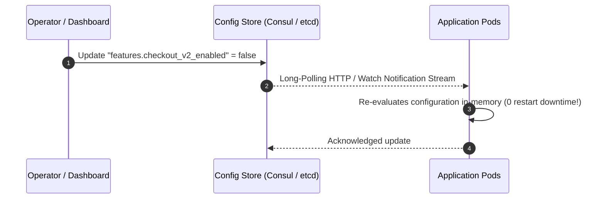

# Service Discovery and Dynamic Configuration

In dynamic cloud environments where containers and VMs constantly scale, terminate, and restart with ephemeral IP addresses, service discovery and centralized dynamic configuration are mandatory.

```mermaid
graph TD
    subgraph "Server-Side Service Discovery"
        C1[Client] --> LB[Load Balancer / Ingress]
        LB --> Registry1[(Service Registry / Kube-DNS)]
        LB --> PodA[Backend Pod A]
        LB --> PodB[Backend Pod B]
    end

    subgraph "Client-Side Service Discovery"
        C2[Client] --> Registry2[(Service Registry: Consul / Eureka)]
        Registry2 -.->|Returns: [10.0.1.5, 10.0.1.6]| C2
        C2 -->|Direct RPC with P2C / Round Robin| PodC[Backend Pod C]
    end
```

---

## 1. Client-Side vs Server-Side Service Discovery

| Dimension | Client-Side Discovery | Server-Side Discovery |
| :--- | :--- | :--- |
| **How It Works** | Client queries registry and load balances directly | Client sends to load balancer; LB queries registry |
| **Network Hops** | 1 hop (Direct client-to-backend) | 2 hops (Client -> LB -> Backend) |
| **Client Complexity**| High (requires discovery SDK in each language) | Zero (client uses standard DNS or fixed IP) |
| **Used By** | Netflix Eureka / Finagle, gRPC xDS | Kubernetes (Kube-DNS + ClusterIP), AWS ALB |

---

## 2. Dynamic Configuration Management

Hardcoded configurations or environment variables that require application restarts to update are dangerous during outages (e.g., toggling a kill-switch or reducing rate limits).



### Essential Rules for Dynamic Config:
1. **Schema Validation**: Reject invalid config values at the storage engine before propagating to nodes.
2. **Gradual Rollout (Canary Config)**: Deploy configuration changes to 5% of instances first, verify metrics, then rollout globally.
3. **Fallback Defaults**: Applications must hold hardcoded safe fallback defaults in case the dynamic config store becomes unreachable.

---

## 3. Real-World Case Studies

1. **Netflix**: Created Eureka for client-side discovery and Archaius for dynamic property management across thousands of AWS EC2 instances.
2. **Kubernetes**: Uses etcd as the backing store for all cluster state, CoreDNS for DNS-based service discovery, and ConfigMaps for dynamic volume mounts.
3. **Consul**: Provides multi-datacenter service discovery, health checking, and distributed K/V storage.

---

## 4. Key Takeaways

- Kubernetes built-in service discovery (CoreDNS + Services) is standard for cloud-native container workloads.
- Use dynamic configuration for feature flags, rate limits, and circuit breaker thresholds to modify system behavior without redeploying.
- Always implement health checking so dead instances are automatically pruned from service registries within seconds.
