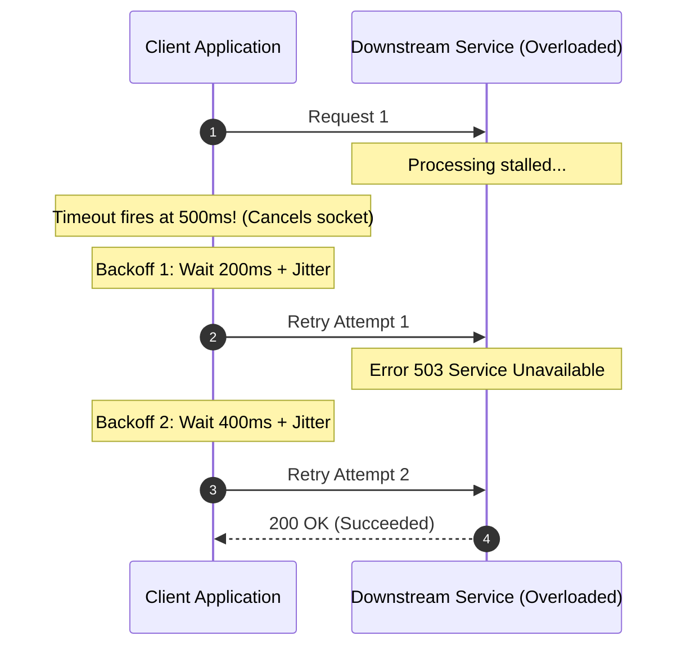
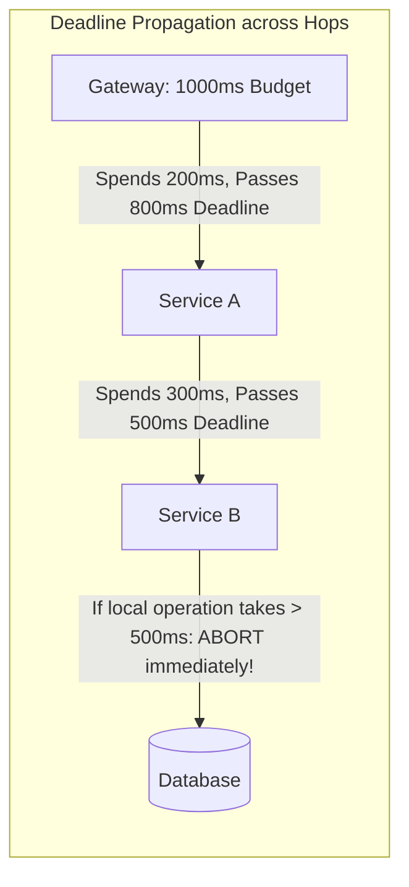

# Timeouts, Retries, and Jitter

Network requests in distributed systems fail constantly. Handling failures incorrectly—such as retrying immediately without backoff or omitting timeouts—inevitably triggers self-inflicted Distributed Denial of Service (DDoS) thundering herds that collapse recovering backends.



---

## 1. Timeouts: The First Line of Defense

Every remote network call must have an explicit timeout. A thread or goroutine waiting indefinitely on a socket leak locks, connections, and memory until the caller crashes.

### Timeout Granularity:
- **Connection Timeout**: Time allowed to establish the TCP/TLS handshake (typically 1-3 seconds).
- **Socket / Read Timeout**: Maximum time between two successive data packets (typically 500ms - 2s).
- **End-to-End Deadline**: Total maximum duration for the entire RPC operation, including all retries.



---

## 2. Exponential Backoff and Jitter Algorithms

Naive retries retry immediately at fixed intervals ($t, t, t$), synchronizing thousands of failed clients into periodic massive traffic waves.

### 1. Exponential Backoff Formula
$$T_{	ext{backoff}} = \min(T_{	ext{max}}, T_{	ext{base}} 	imes 2^{	ext{attempt}})$$

### 2. The Power of Full Jitter (AWS Research)
Adding randomness (jitter) desynchronizes retries completely across the timeline:

$$	ext{Full Jitter Sleep} = 	ext{random}(0, \min(T_{	ext{max}}, T_{	ext{base}} 	imes 2^{	ext{attempt}}))$$

```mermaid
graph TD
    subgraph "Without Jitter (Thundering Herd)"
        C1[Client 1] -->|Fails at t=0| T1[Sleeps exactly 1.0s] --> Wave[Huge Traffic Spike at t=1.0s!]
        C2[Client 2] -->|Fails at t=0| T2[Sleeps exactly 1.0s] --> Wave
        C3[Client 3] -->|Fails at t=0| T3[Sleeps exactly 1.0s] --> Wave
    end

    subgraph "With Full Jitter (Evenly Distributed)"
        J1[Client 1] -->|Fails at t=0| S1[Sleeps random: 0.23s]
        J2[Client 2] -->|Fails at t=0| S2[Sleeps random: 0.87s]
        J3[Client 3] -->|Fails at t=0| S3[Sleeps random: 0.51s]
        Note over S1,S3: Downstream receives smooth, manageable stream of retries
    end
```

---

## 3. Retry Budgets and Amplification

In a call chain $A 	o B 	o C 	o D$, if each service retries 3 times on failure:
$$	ext{Total Calls to D} = 3 	imes 3 	imes 3 = 27	ext{ requests!}$$
A small 5% failure at service D gets amplified into a 2,700% traffic storm that destroys D.

### Defenses:
1. **Retry Budgeting**: Limit retries to at most **10%** of total request volume across a 1-minute window. If overall failures exceed 10%, drop retries and fail fast.
2. **Retry Only Idempotent Operations**: Never retry non-idempotent HTTP POST payments or order placements without an `Idempotency-Key`.
3. **Retry Only Transient Errors**: Retry on `503 Service Unavailable`, `429 Too Many Requests`, and network timeouts; never retry `400 Bad Request`, `401 Unauthorized`, or `404 Not Found`.

---

## 4. Key Takeaways

- Every network client must enforce connection, read, and global context deadlines.
- Always use Exponential Backoff with Full Jitter for retry loops.
- Implement retry budgets to prevent cascading retry amplification storms.
- Only retry safe, idempotent operations on transient error codes.
