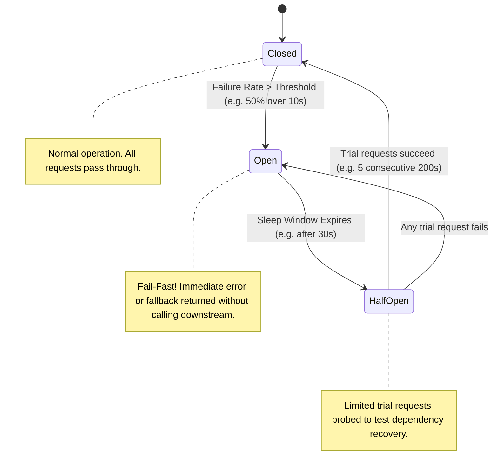
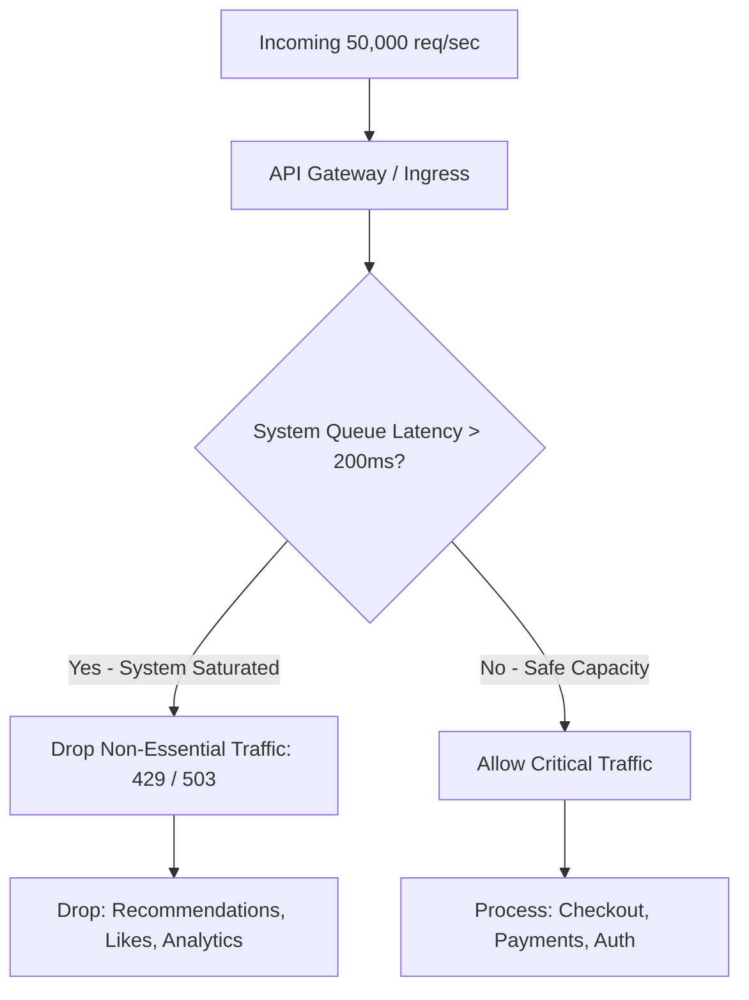

# Circuit Breaker, Bulkhead, and Load Shedding

Cascading failures are the primary killer of distributed architectures. When downstream dependencies degrade, callers must isolate failures to protect overall system availability.



---

## 1. Circuit Breaker Pattern

The Circuit Breaker pattern prevents an application from repeatedly trying to execute an operation that is almost certain to fail.

### State Transitions:
1. **Closed**: Requests flow normally. The circuit monitors rolling error rates (e.g., via sliding window of the last 100 requests).
2. **Open**: If failure rate exceeds threshold (e.g., 50% errors or p99 latency > 2s), the circuit **trips open**. All incoming calls fail immediately or return a fallback without hitting the downstream network socket.
3. **Half-Open**: After a cooldown period (e.g., 30s), the circuit allows a small number of canary probe requests through. If they succeed, it closes; if any fail, it trips open again.

---

## 2. Bulkhead Pattern (Resource Isolation)

Named after the watertight compartments in a ship's hull: if one compartment floods, the others remain sealed and the ship stays afloat.

```mermaid
graph TD
    subgraph "Unprotected Thread Pool (Sinks the Ship)"
        SharedPool[Shared Thread Pool: 100 Threads]
        ReqA[Order Requests] --> SharedPool
        ReqB[Recommendation Requests] --> SharedPool
        SharedPool --> DownstreamHang[Hanging Rec Engine - Consumes all 100 Threads!]
        Note over ReqA: Critical Orders Starved and Fail!
    end

    subgraph "Bulkhead Isolated Thread Pools"
        OrderPool[Order Pool: 70 Threads]
        RecPool[Recommendation Pool: 30 Threads]
        ReqA2[Order Requests] --> OrderPool --> OrderDB[(Order DB - Fast!)]
        ReqB2[Rec Requests] --> RecPool --> DownstreamHang2[Hanging Rec Engine]
        Note over OrderPool: Orders continue at full speed unaffected!
    end
```

### Bulkhead Implementations:
- **Thread Pool Bulkheads**: Separate worker pools per downstream dependency (used by Netflix Hystrix / Resilience4j).
- **Semaphore Bulkheads**: Atomic counter limiting concurrent in-flight requests per dependency without thread context-switching overhead.
- **Process / Pod Bulkheads**: Physical Kubernetes node taints/tolerations dedicating CPU/RAM to critical checkout services.

---

## 3. Load Shedding: Dropping Traffic to Save the System

When CPU or memory hits 95%, processing all requests will cause thrashing, out-of-memory (OOM) kernel panics, and complete outage. **Load shedding rejects excess traffic immediately so the remaining requests complete with normal latency.**



### Load Shedding Strategies:
1. **Priority Tiers**: Categorize requests into Critical (checkout), High (login), and Low (recommendations). Drop lowest tiers first when CPU > 85%.
2. **Little's Law Based Shedding (CoDel / Vegas)**: Measure queued waiting time inside the worker queue. If a request has already waited 500ms just sitting in queue, discard it before processing—the client has likely timed out already.

---

## 4. Key Takeaways

- Wrap all external network calls with a circuit breaker to fail fast during outages.
- Partition thread pools and resource quotas using Bulkheads to prevent slow auxiliary features from starving core business flows.
- Implement proactive Load Shedding based on queue wait time to preserve throughput under extreme overload.
