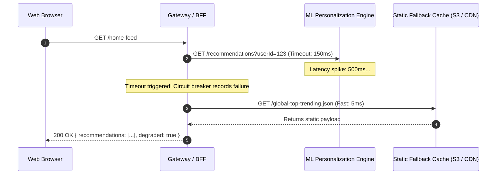

# Graceful Degradation and Fallbacks

Graceful degradation is the practice of designing a system to maintain core functionality at reduced fidelity when one or more subsystems, dependencies, or databases fail.

```mermaid
graph TD
    UserReq[User Requests Product Page] --> API[API Gateway / BFF]
    
    subgraph Core Features (Always Must Work)
        API --> PriceSvc[Pricing Service] --> PriceDB[(Price DB)]
        API --> StockSvc[Stock Service] --> StockDB[(Stock DB)]
    end

    subgraph Non-Critical Dependencies (With Fallbacks)
        API --> RecSvc[Personalized ML Recommendations]
        RecSvc -.->|Failed / Timeout!| FallbackRec[Fallback: Static Top 10 Best Sellers from Redis]
        
        API --> ReviewSvc[Customer Reviews Service]
        ReviewSvc -.->|Failed / Timeout!| FallbackRev[Fallback: Hide Reviews Tab Silently]
    end
```

---

## 1. Static vs Dynamic Fallbacks

When a downstream dependency fails or circuit breaker trips, systems should degrade gracefully rather than presenting an HTTP 500 error screen:

| Fallback Strategy | Mechanism | User Impact | Example |
| :--- | :--- | :--- | :--- |
| **Cached Stale Data** | Return data from local Redis cache with `X-Stale: true` | Sees slightly outdated content | News feed or catalog display |
| **Static Default** | Hardcoded generic response | Non-personalized content | Popular items instead of personalized ML picks |
| **Feature Toggling / Hiding**| Completely hide degraded UI section | UI renders cleanly without broken widget | Comments or reviews section omitted |
| **Asynchronous Enqueue** | Accept write to local disk/queue and confirm | Delayed confirmation | "Order received; confirmation will be emailed shortly" |

---

## 2. Netflix's Tiered Degradation Strategy

Netflix categorizes services into critical tiers:
- **Tier 1 (Non-Negotiable)**: Video playback start, user authentication, customer licensing. Must never fail.
- **Tier 2 (Degradable)**: Search, bookmarks, personalized recommendation carousels. If recommendation algorithms fail, fallback to a cached list of top 20 trending shows.
- **Tier 3 (Disposable)**: Viewing history tracking, analytics, thumbs-up ratings. Dropped instantly during peak load or degradation.

---

## 3. Designing Fallback Data Pipelines



---

## 4. Key Takeaways

- Classify every microservice and feature into Tier 1 (critical), Tier 2 (degradable), or Tier 3 (disposable).
- Ensure frontends can render partial page layouts without crashing when secondary fields are omitted.
- Test fallbacks continuously in staging so fallback code paths do not silently break.
