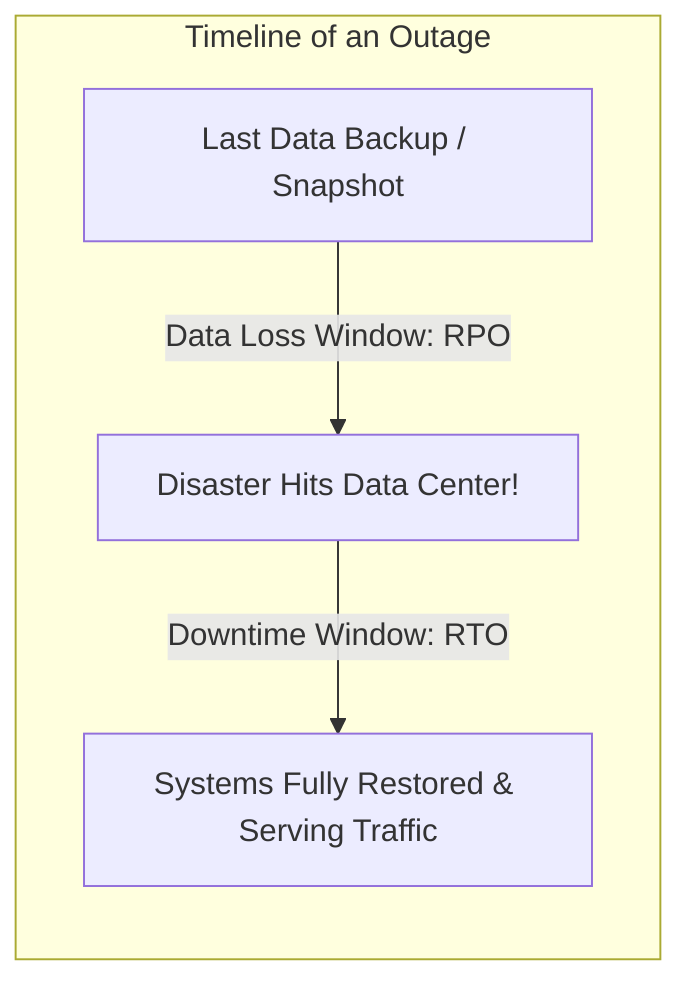

# Disaster Recovery: RPO, RTO, and Multi-Region Strategies

Disaster Recovery (DR) defines the policies, tools, and procedures that enable the recovery or continuation of vital technology infrastructure and systems following a natural or human-induced disaster.



---

## 1. The Core Metrics: RPO and RTO

- **RPO (Recovery Point Objective)**: The maximum acceptable age of files that must be recovered from backup storage for normal operations to resume if a disaster occurs. **Measures maximum tolerable data loss.**
  - *Example*: If RPO is 1 hour, backups must occur at least hourly; at most 1 hour of writes can be lost.
- **RTO (Recovery Time Objective)**: The maximum acceptable length of time that your application can be offline before normal business operations resume. **Measures maximum tolerable downtime.**
  - *Example*: If RTO is 15 minutes, systems must detect the outage and failover to a healthy region within 15 minutes.

---

## 2. Multi-Region Disaster Recovery Strategies

Cloud DR strategies span a spectrum of cost versus RTO/RPO:

```mermaid
graph TD
    subgraph "1. Backup and Restore (Cold Standby)"
        BR[RPO: Hours | RTO: 24h+ | Cost: $]
    end

    subgraph "2. Pilot Light (Core DB replicated, zero compute)"
        PL[RPO: Minutes | RTO: 1-2h | Cost: $$]
    end

    subgraph "3. Warm Standby (Scaled-down running replica)"
        WS[RPO: Seconds | RTO: Minutes | Cost: $$$]
    end

    subgraph "4. Multi-Region Active-Active (Full duplicate active clusters)"
        AA[RPO: ~0 | RTO: Seconds (Instant) | Cost: $$$$$]
    end
```

### Detailed Comparison:

| Strategy | Architecture | RPO | RTO | Relative Cost |
| :--- | :--- | :--- | :--- | :--- |
| **Backup & Restore** | Daily snapshots stored in remote S3 bucket; rebuild servers on disaster | 12-24 hours | 24-48 hours | Very Low |
| **Pilot Light** | DB replicated to DR region; minimal core infrastructure running; compute scaled on failure | < 5 minutes | 1-2 hours | Low |
| **Warm Standby** | Fully functioning scaled-down cluster running in DR region; resized on failover | Seconds | 5-15 minutes | Moderate |
| **Active-Active** | Both regions serve live traffic concurrently with Anycast / Route 53 GSLB | Zero to milliseconds | Near Zero (Instant) | Extremely High (2x-3x) |

---

## 3. Active-Active Challenges: Cross-Region Write Conflicts

Running true Active-Active across two regions separated by oceans is constrained by the speed of light:
- Latency between US-East and EU-West is $pprox 70	ext{ms}$.
- Synchronous two-phase commit across regions adds $150	ext{ms}+$ latency per write.

```mermaid
graph TD
    ClientUS[US User] --> RegUS[US-East Region: Active]
    ClientEU[EU User] --> RegEU[EU-Central Region: Active]
    RegUS <-->|Asynchronous WAN Replication (70ms lag)| RegEU
    Note over RegUS, RegEU: Conflict Resolution Required: LWW (Last-Write-Wins) or CRDTs
```

### Practical Solutions:
1. **User Pinning / Partitioning**: Users are homed to their local region. A US user's writes are always routed to US-East; an EU user writes to EU-Central.
2. **CRDTs (Conflict-free Replicated Data Types)**: Mathematically merge concurrent writes without central coordination.

---

## 4. Key Takeaways

- Clarify business RPO and RTO requirements before selecting expensive multi-region architectures.
- Pilot Light or Warm Standby provides the best balance of cost and recovery speed for 95% of enterprise applications.
- True multi-region Active-Active requires solving distributed write conflicts and handling asynchronous replication lag.
