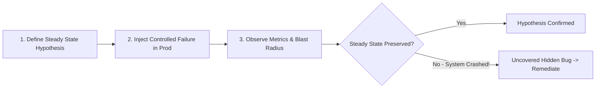

# Chaos Engineering and Failure Injection

Chaos Engineering is the discipline of experimenting on a distributed software system in production to build confidence in the system's capability to withstand turbulent conditions.



---

## 1. Principles of Chaos Engineering

Coined by Netflix during the creation of **Chaos Monkey**:
1. **Formulate a Hypothesis**: "If an entire AWS Availability Zone (AZ) dies, user checkout success rate will remain above 99.9%."
2. **Introduce Real-World Variables**: Simulate node termination, packet loss, DNS outages, clock skew, and disk filling.
3. **Minimize Blast Radius**: Start experiments on 1% of canary traffic with automated abort triggers.
4. **Run in Production**: Production environments have unique traffic patterns, data scale, and cache states that staging environments can never replicate.

---

## 2. Common Chaos Experiments Matrix

```mermaid
graph TD
    Exp[Chaos Experiments]
    Exp --> Infra[Infrastructure Layer]
    Exp --> Net[Network Layer]
    Exp --> App[Application Layer]

    Infra --> I1[Kill Random VM / Pod]
    Infra --> I2[Fill Disk to 100%]
    Infra --> I3[Saturate CPU to 100%]

    Net --> N1[Inject 200ms Latency (Toxiproxy)]
    Net --> N2[Inject 10% Packet Loss]
    Net --> N3[Block Downstream Port / Blackhole]

    App --> A1[Inject HTTP 500 Responses]
    App --> A2[Corrupt Cache Payloads]
    App --> A3[Simulate Clock Drift (Time Travel)]
```

---

## 3. Tooling Ecosystem

- **Chaos Mesh & LitmusChaos**: Cloud-native Kubernetes chaos injection engines.
- **Toxiproxy**: Shopify's open-source TCP proxy for simulating network anomalies (flaky sockets, bandwidth limits, latency).
- **Gremlin**: Enterprise chaos engineering platform with automated safety stop mechanisms.

---

## 4. Key Takeaways

- The goal of chaos engineering is to uncover hidden single-points-of-failure before they cause customer-facing outages.
- Always implement an automated kill switch that halts the experiment if error budgets or SLIs are breached.
- Never run chaos tests without comprehensive distributed observability and monitoring.
