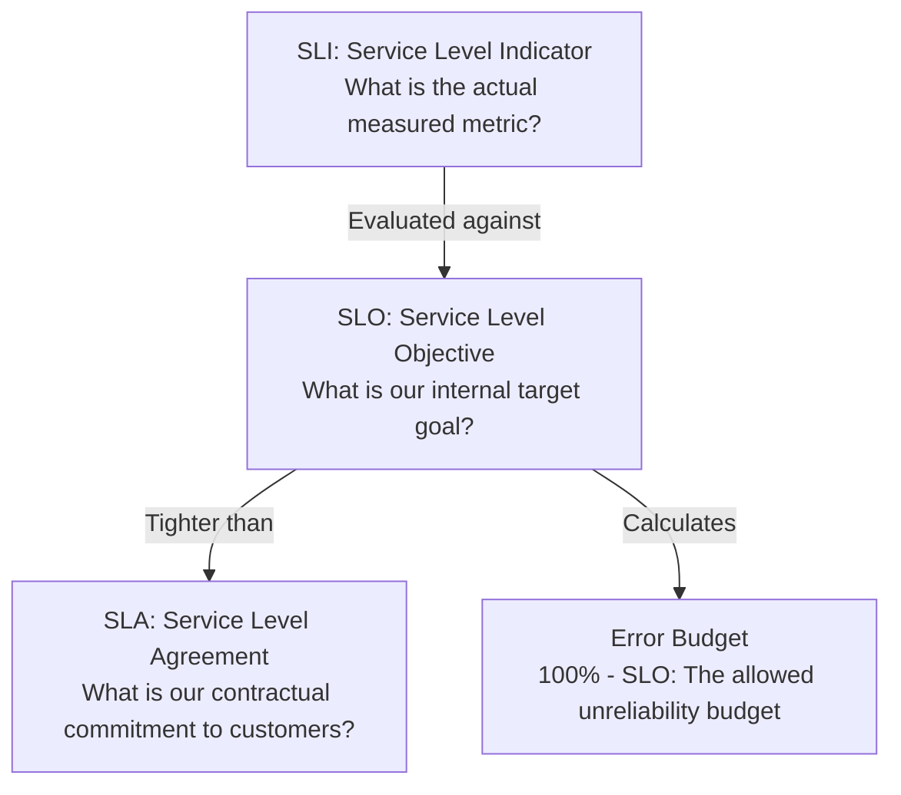
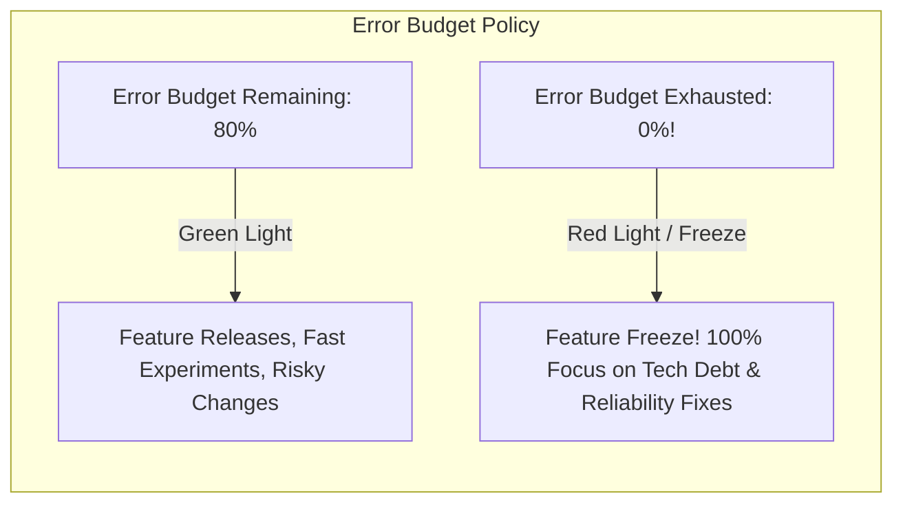

# SLIs, SLOs, SLAs, and Error Budgets

Site Reliability Engineering (SRE), pioneered by Google, aligns product engineering velocity with system reliability using mathematical error budgets.

---

## 1. Definitions and Formulations

### 1. Service Level Indicator (SLI)
A quantifiable metric measuring service performance:
$$	ext{SLI} = rac{	ext{Good Events}}{	ext{Total Events}} 	imes 100$$
- *Example*: Percentage of HTTP requests returning `< 500` status within `200ms`.

### 2. Service Level Objective (SLO)
The internal target reliability percentage set by engineering and product:
- *Example*: "99.9% of checkout requests must succeed with latency < 300ms over a rolling 30-day window."

### 3. Service Level Agreement (SLA)
The legally binding contract with customers specifying financial penalties, service credits, or refunds if breached:
- *Rule*: **SLA must always be more lenient than SLO!**
  - SLO = $99.9\%$ (Internal alert fires)
  - SLA = $99.0\%$ (Company pays customer penalty)

---

## 2. The Error Budget: Balancing Velocity and Stability

An error budget is the inverse of an SLO:
$$	ext{Error Budget} = 100\% - 	ext{SLO}$$

For a 99.9% SLO on 10,000,000 requests per month:
$$	ext{Allowed Failures} = 10,000,000 	imes 0.001 = 10,000	ext{ requests}$$

---

## 3. Key Takeaways

- Measure SLIs as the ratio of good events over valid total events.
- Never set a 100% SLO—100% reliability is economically unviable and stalls product innovation.
- Use Error Budgets as an objective decision framework to resolve tension between product development speed and operational stability.
