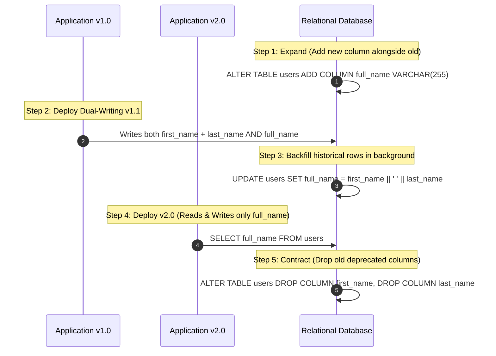

# Zero-Downtime Deployment Strategies

Zero-downtime deployment patterns release new software versions into production without interrupting active user traffic, dropping requests, or degrading availability.

```mermaid
graph TD
    subgraph "1. Rolling Deployment"
        R_Old[Old Pods: 3] --> R_Transit[Replace 1 by 1] --> R_New[New Pods: 3]
    end

    subgraph "2. Blue-Green Deployment"
        Router[Router / Load Balancer]
        Router -->|100% Traffic| Blue[Blue Environment (v1.0)]
        Router -.->|0% Traffic (Staged & Tested)| Green[Green Environment (v2.0)]
        Note over Router: Instant cutover flips pointer from Blue to Green
    end

    subgraph "3. Canary Deployment"
        C_Router[Ingress Controller]
        C_Router -->|95% Live Traffic| C_Stable[Stable Baseline (v1.0)]
        C_Router -->|5% Canary Traffic| C_Canary[Canary Test (v2.0)]
    end
```

---

## 1. Comparing Deployment Strategies

| Dimension | Rolling | Blue-Green | Canary |
| :--- | :--- | :--- | :--- |
| **Downtime** | Zero | Zero | Zero |
| **Infrastructure Cost** | Low (only needs +20% surge capacity) | High (requires 2x full production hardware) | Low (requires 5-10% extra capacity) |
| **Rollback Speed** | Slow (must roll back pod by pod) | Instant (re-route load balancer back to Blue) | Instant (drop canary traffic routing) |
| **Blast Radius** | Medium (all users hit new version gradually) | All-or-nothing cutover | Minimal (only 1-5% of users exposed) |
| **Database Compatibility**| Requires strict backward compatibility | Requires strict backward compatibility | Requires strict backward compatibility |

---

## 2. Canary Deployments with Automated Metric Analysis (Kayenta)

```mermaid
graph LR
    Canary[Canary Deployment (v2.0 - 5%)] --> Telemetry[Prometheus / Datadog Metrics]
    Telemetry --> Kayenta[Canary Analysis Engine]
    Kayenta --> Check{Error Rate or Latency Spike?}
    Check -->|No - Safe| Promote[Promote to 10%, 25%, 100%]
    Check -->|Yes - Anomaly Detected!| Rollback[Automated Rollback to v1.0 within 30s]
```

---

## 3. The Expand-Contract (Parallel Run) Database Migration Pattern

Zero-downtime deployments fail if a new version requires a database schema change that breaks the old version (e.g., renaming a column).



---

## 4. Key Takeaways

- Prefer Canary deployments with automated metric analysis for high-traffic mission-critical services.
- Never rename database columns directly in production; always use the multi-step Expand-Contract pattern.
- Ensure applications implement graceful shutdown (handling SIGTERM, closing database connections, finishing in-flight requests) before terminating.
