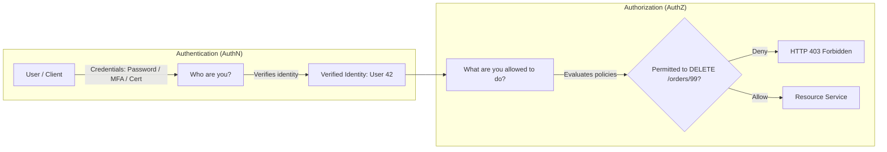

# Authentication and Authorization

Authentication (AuthN) and Authorization (AuthZ) are the foundational identity and access pillars of modern distributed systems.



---

## 1. AuthN vs AuthZ: The Critical Distinction

| Dimension | Authentication (AuthN) | Authorization (AuthZ) |
| :--- | :--- | :--- |
| **Core Question** | "Who are you?" | "What are you permitted to do?" |
| **Mechanisms** | Passwords, Passkeys (WebAuthn), TOTP MFA, X.509 client certs | RBAC, ABAC, ACLs, OAuth scopes |
| **Failure Code** | `HTTP 401 Unauthorized` | `HTTP 403 Forbidden` |
| **Transmission** | `Authorization: Bearer <token>` or mTLS cert | JWT claims, Policy Engine (OPA), Database ACL |
| **Execution Point**| Edge Gateway / Identity Provider | Application Service / Resource Layer |

---

## 2. Stateless Tokens (JWT) vs Stateful Sessions (Redis)

```mermaid
graph TD
    subgraph "Stateful Session Model"
        C1[Client] -->|Cookie: session_id=xyz| G1[Server]
        G1 -->|Network Roundtrip: 2ms| R1[(Redis Session Store)]
        R1 --> G1
        Note over R1: Instant Revocation: Delete 'xyz'
    end

    subgraph "Stateless JWT Model"
        C2[Client] -->|Header: Bearer eyJhbGci...| G2[Server / Gateway]
        G2 -->|In-Memory Cryptographic Signature Check: <0.1ms| G2
        Note over G2: Zero Database Lookups! Hard to revoke before expiry.
    end
```

---

## 3. Best Practices in Modern Architectures

1. **Short-Lived Access Tokens**: Keep JWT lifetimes to 10-15 minutes to minimize exposure if stolen.
2. **Refresh Token Rotation**: Store refresh tokens in HTTP-only, Secure, SameSite cookies. Invalidate the entire refresh token family if a revoked token is reused.
3. **Decentralized Validation**: Edge API Gateways verify JWT signatures and extract claims, injecting trusted headers (`X-User-Id`, `X-User-Roles`) into downstream microservices.

---

## 4. Key Takeaways

- Authentication establishes identity; Authorization governs permissions.
- Return `401 Unauthorized` when identity is missing or unverified, and `403 Forbidden` when the authenticated identity lacks permissions.
- Combine short-lived stateless JWTs with stateful refresh tokens for the optimal balance of performance and security control.
