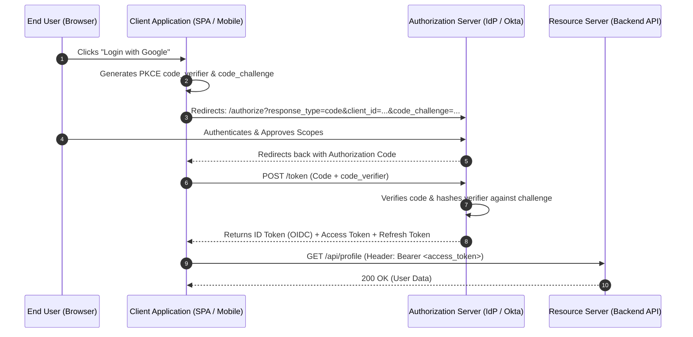

# OAuth 2.0 and OpenID Connect (OIDC)

OAuth 2.0 is the industry-standard protocol for delegated authorization. OpenID Connect (OIDC) is an identity layer built directly on top of OAuth 2.0 to provide single sign-on (SSO) and user authentication.

---

## 1. OAuth 2.0 Tokens: ID Token vs Access Token

- **ID Token (OIDC)**: A JWT formatted for the **Client Application**. Contains user profile claims (`sub`, `email`, `name`, `iss`, `exp`). Verifies *who logged in*.
- **Access Token (OAuth 2.0)**: A credential (JWT or opaque) formatted for the **Resource Server (API)**. Authorizes access to specific scopes (`read:orders`, `write:payments`).
- *Golden Rule*: The backend API must **never** accept an ID Token to authorize API requests!

---

## 2. Authorization Code Flow with PKCE (Proof Key for Code Exchange)

PKCE (RFC 7636) prevents authorization code interception attacks on public clients (mobile apps, single-page apps) that cannot safely store a client secret.

### PKCE Mechanics:
1. Client creates random secret: `code_verifier` (43-128 chars).
2. Client hashes it: `code_challenge = BASE64URL(SHA256(code_verifier))`.
3. Client sends `code_challenge` in authorization request.
4. Client trades code for tokens by sending the raw `code_verifier`.
5. IdP verifies that `SHA256(code_verifier) == code_challenge`. Stolen authorization codes are useless without the raw verifier.

---

## 3. Key Takeaways

- Use Authorization Code Flow with PKCE for all web, mobile, and desktop applications.
- Use Client Credentials Flow strictly for machine-to-machine server communication.
- ID Tokens authenticate the user to the frontend; Access Tokens authorize API calls to backends.
