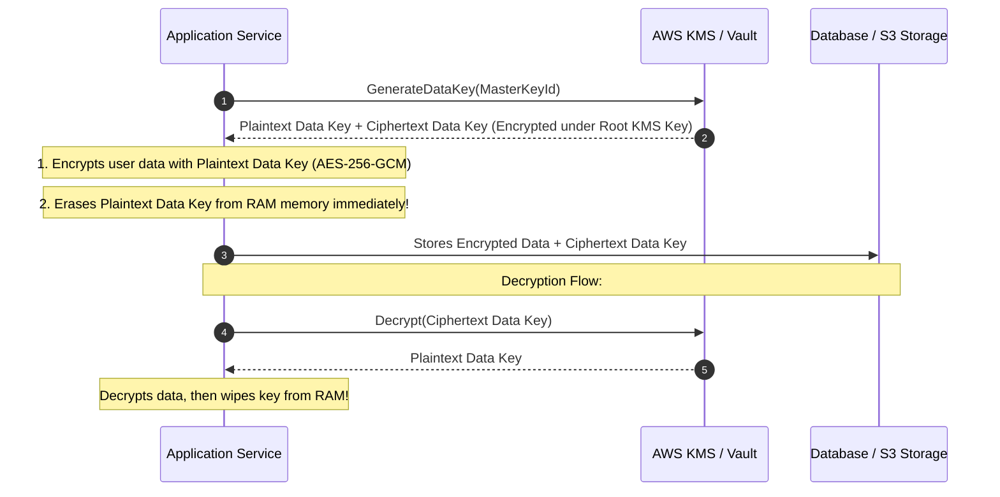

# Encryption at Rest and in Transit

Data security requires end-to-end protection against eavesdropping, physical theft, man-in-the-middle (MitM) attacks, and unauthorized database access.

```mermaid
graph LR
    Client[Client Browser] -->|TLS 1.3 (In-Transit)| Edge[Cloudflare / Cloud WAF]
    Edge -->|mTLS (In-Transit)| App[Application Service]
    App -->|Envelope Encryption: AES-256-GCM| KMS[KMS / Vault]
    App -->|Encrypted Ciphertext| DB[(Encrypted Database at Rest)]
```

---

## 1. Encryption in Transit: Modern TLS 1.3

- **TLS 1.3**: Reduces handshake latency from 2 round-trips to **1-RTT** (or 0-RTT resumption), and completely removes vulnerable legacy ciphers (RC4, 3DES, CBC mode).
- **Forward Secrecy (PFS)**: Uses ephemeral Diffie-Hellman keys (`ECDHE`). Even if the server's private master key is compromised in the future, past recorded encrypted traffic cannot be decrypted.

---

## 2. Encryption at Rest & Envelope Encryption

Directly storing master encryption keys alongside encrypted data is fatal. Production architectures use **Envelope Encryption**:



---

## 3. Key Takeaways

- Enforce TLS 1.3 with Perfect Forward Secrecy for all external and internal network communication.
- Use Envelope Encryption (KMS) so root master keys never leave dedicated Hardware Security Modules (HSMs).
- Secure sensitive columns (SSNs, credit cards) with Application-Layer Encryption before persisting to disk.
