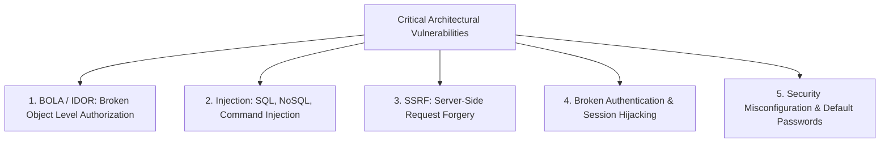

# OWASP Top Risks for System Architecture

Security must be designed into distributed architectures from inception rather than bolted on after deployment.



---

## 1. Broken Object Level Authorization (BOLA / IDOR)

The #1 vulnerability in modern APIs. An attacker manipulates an ID in an API request to view or modify someone else's data:

```http
GET /api/v1/accounts/10042/statements HTTP/1.1
Authorization: Bearer <AttackerToken (Account 9999)>
```

### Architectural Defense:
Enforce tenant and user ownership checks at the data layer or via ORM middleware:
```sql
SELECT * FROM statements 
WHERE id = :statement_id 
  AND user_id = :authenticated_user_id; -- MUST BE ENFORCED!
```

---

## 2. Server-Side Request Forgery (SSRF)

An attacker tricks a backend server into making requests to internal infrastructure (e.g., AWS metadata endpoint `169.254.169.254` or internal microservices):

```mermaid
graph LR
    Attacker[Attacker] -->|POST /convert-pdf?url=http://169.254.169.254/latest/meta-data/| WebApp[Vulnerable Web App]
    WebApp -->|Internal Request| AWSMeta[AWS Instance Metadata Service]
    AWSMeta -->>WebApp: Returns IAM Secret Keys!
    WebApp -->>Attacker: Leaks Cloud Admin Credentials!
```

### Defenses:
- Use AWS IMDSv2 (requires session token header, blocking simple SSRF).
- Resolve DNS and block private RFC-1918 IP addresses (`10.0.0.0/8`, `127.0.0.1`, `172.16.0.0/12`, `192.168.0.0/16`).

---

## 3. Key Takeaways

- BOLA is mitigated by strictly binding all database queries to the authenticated session context.
- Prevent SSRF by validating destination URLs against a strict allowlist and blocking private IP routing.
- Use parameterized queries and prepared statements exclusively to eliminate SQL injection.
