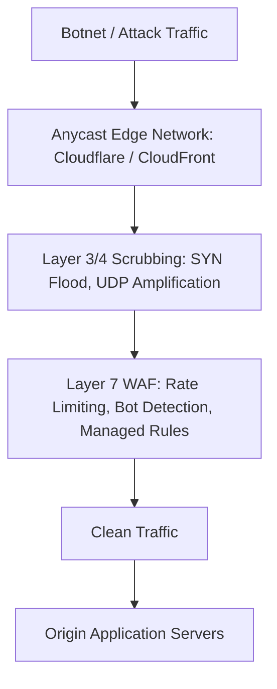

# DDoS Mitigation and Web Application Firewalls (WAF)

Distributed Denial of Service (DDoS) attacks attempt to exhaust network bandwidth, connection state tables, or application compute capacity.

---

## 1. Layers of DDoS Attacks

- **Layer 3 / 4 (Network & Transport)**:
  - *SYN Flood*: Floods server with TCP SYN packets without completing the 3-way handshake, exhausting kernel backlog connection queues.
  - *UDP Amplification*: Spoofs victim IP and sends requests to vulnerable open DNS/NTP servers, generating 50x amplified response floods.
  - *Mitigation*: Anycast BGP routing distributes floods across hundreds of global PoPs; SYN cookies absorb incomplete handshakes.
- **Layer 7 (Application Layer)**:
  - *HTTP Flood*: High-volume legitimate-looking `GET` or `POST` requests targeting heavy database search queries.
  - *Slowloris*: Sends HTTP headers extremely slowly (1 byte every 10 seconds), keeping server worker sockets open indefinitely until thread pools exhaust.
  - *Mitigation*: Web Application Firewalls (WAF), CAPTCHA challenges, strict socket read timeouts, and IP reputation scores.

---

## 2. Web Application Firewall (WAF) Architecture

WAFs inspect incoming HTTP traffic before it reaches origin servers:
1. **Signature-Based Inspection**: Blocks known SQL injection patterns (`UNION SELECT`) and cross-site scripting (`<script>`).
2. **Rate Limiting Rules**: Automatically block or challenge IPs exceeding 100 requests per minute to sensitive endpoints (`/login`, `/checkout`).
3. **Geo-Blocking & ASN Filtering**: Blocks traffic originating from unauthorized countries or suspicious data center ASNs.

---

## 3. Key Takeaways

- Absorb Layer 3 and 4 floods at the edge using Anycast and cloud scrubbing networks.
- Protect expensive Layer 7 endpoints with WAF rate limiting and managed rulesets.
- Enforce strict connection and read timeouts on reverse proxies to neutralize Slowloris attacks.
