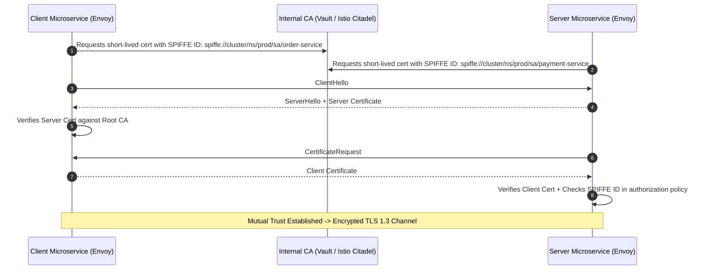

# Zero Trust Architecture and Mutual TLS (mTLS)

Traditional perimeter security ("Castle and Moat") assumes that anything inside the internal corporate or cloud network is trusted. Zero Trust replaces this with: **"Never trust, always verify."**

```mermaid
graph TD
    subgraph "Legacy Castle-and-Moat (Vulnerable)"
        Hacker[Attacker breaches VPN / Perimeter] --> Net[Internal Flat Network]
        Net --> S1[Service A: Unencrypted HTTP]
        Net --> S2[Service B: Unauthenticated DB]
        Note over Net: Attacker moves laterally across all systems!
    end

    subgraph "Zero Trust Architecture"
        Client1[Service A] -->|mTLS + SPIFFE Identity Check| Srv1[Service B]
        Note over Srv1: Every single packet is encrypted and mutually authenticated!
    end
```

---

## 1. The Core Tenets of Zero Trust

1. **Verify Explicitly**: Authenticate and authorize based on all available data points (identity, location, device health, service credentials).
2. **Least Privilege Access**: Grant access with Just-In-Time (JIT) and Just-Enough-Access (JEA) policies.
3. **Assume Breach**: Minimize blast radius by segmenting networks, encrypting all traffic internally, and continuously monitoring telemetry.

---

## 2. Mutual TLS (mTLS) Deep Dive

In standard HTTPS, only the server proves its identity with an X.509 certificate. In **Mutual TLS (mTLS)**, both the client and server present and verify certificates:



---

## 3. Key Takeaways

- Perimeter-only security is obsolete; internal networks must be assumed compromised.
- Implement mTLS via service meshes (Istio, Linkerd) to automate certificate rotation and encryption without touching application code.
- Enforce authorization policies based on cryptographic identities (SPIFFE/SPIRE).
