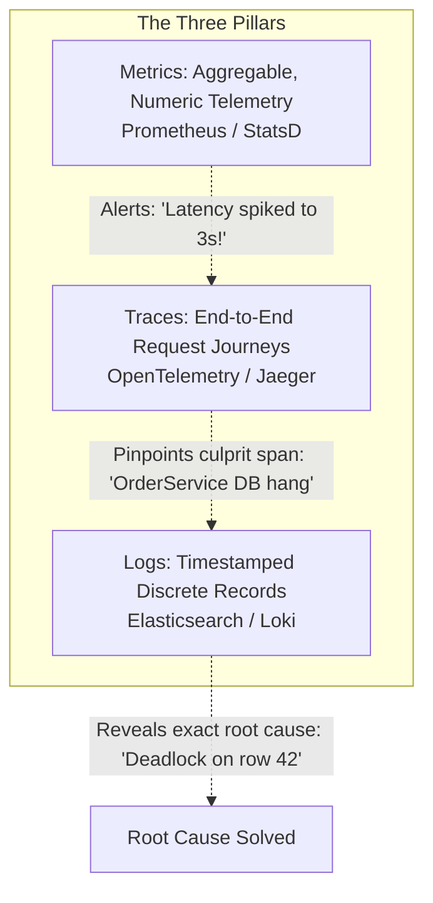
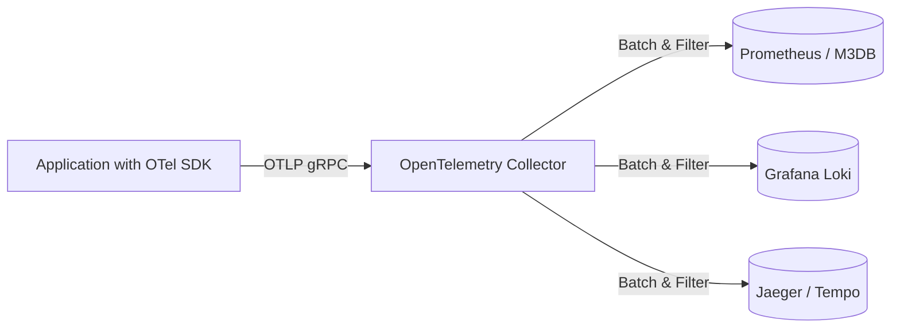

# The Three Pillars of Observability: Metrics, Logs, and Traces

Observability is a measure of how well internal states of a system can be inferred solely from knowledge of its external outputs. In distributed architectures, observability relies on three complementary telemetry pillars: Metrics, Logs, and Traces.

---

## 1. Comparing the Three Pillars

| Pillar | Definition | Cardinality / Volume | Retention | Best For |
| :--- | :--- | :--- | :--- | :--- |
| **Metrics** | Numeric aggregations over fixed time intervals ($t$) | Low to Medium | Long (1-2 years, downsampled) | Real-time alerting, dashboards, trend analysis |
| **Logs** | Structured text lines detailing discrete events | Massive (High cost) | Short (7-30 days) | Post-mortem deep forensic debugging |
| **Traces** | Directed Acyclic Graph (DAG) of spans representing request lifecycle | High (Sampled: 1-10%) | Short (3-14 days) | Pinpointing latency bottlenecks in microservices |

---

## 2. OpenTelemetry (OTel): The Unified Standard

Historically, teams maintained separate SDKs for Prometheus, StatsD, Fluentd, and Zipkin. **OpenTelemetry** standardizes telemetry APIs, SDKs, and wire protocols (OTLP) across all languages into a single vendor-neutral collector.

---

## 3. Key Takeaways

- Metrics notify you that a problem exists; Traces tell you *where* the bottleneck is; Logs tell you *why* it failed.
- Adopt OpenTelemetry (OTel) to prevent vendor lock-in to proprietary monitoring vendors.
- Sample traces intelligently (head or tail-based) to control storage and network ingestion costs.
