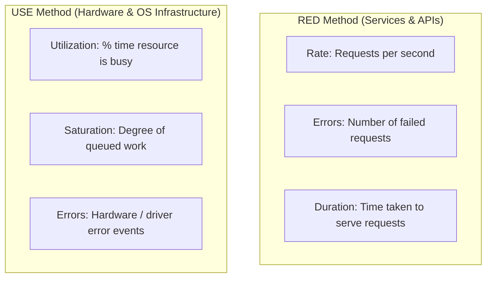
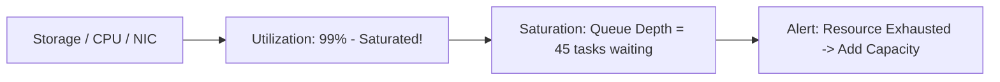

# Monitoring Methodologies: RED and USE Methods

Standardizing metrics across hundreds of heterogeneous microservices requires structured frameworks: the **RED Method** for request-driven services, and the **USE Method** for resource infrastructure.



---

## 1. The RED Method (Services and Microservices)

Invented by Tom Wilkie, the RED method focuses on what matters to end-users:
1. **Rate**: Throughput (requests per second) being handled by the service.
2. **Errors**: The count of failing requests per second (HTTP 5xx, gRPC status errors).
3. **Duration**: Distribution of request latencies (measured in percentiles: p50, p95, p99).

```mermaid
graph LR
    Req[Incoming Traffic] --> MetricCollection[Prometheus Middleware]
    MetricCollection --> Rate[http_requests_total [Rate]]
    MetricCollection --> Errors[http_requests_total{status=~'5..'}]
    MetricCollection --> Duration[http_request_duration_seconds_bucket [Histogram]]
```

---

## 2. The USE Method (Resource Infrastructure)

Created by Brendan Gregg for analyzing system performance bottlenecks:
1. **Utilization**: Percentage of time a resource is actively performing work (e.g., CPU at 85%, Disk IO utilization).
2. **Saturation**: Extra work that cannot be processed immediately and is queued waiting (e.g., CPU run queue depth, TCP backlog, disk wait queue).
3. **Errors**: Count of error events (e.g., dropped network packets, disk write errors).



---

## 3. Key Takeaways

- Apply the **RED Method** to all HTTP/RPC microservice endpoints to measure user experience.
- Apply the **USE Method** to all infrastructure resources (CPU, Memory, Disk, Network interfaces).
- Never alert solely on averages; always track latency using p90, p99, and p99.9 percentiles.
