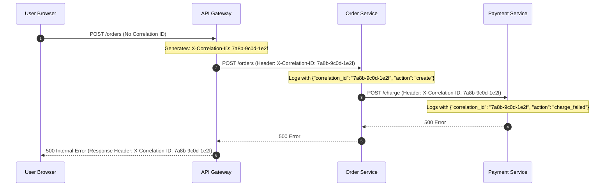

# Structured Logging and Correlation IDs

Unstructured plain-text logs (`printf("User logged in")`) are virtually useless in distributed microservices. Structured JSON logging paired with Correlation IDs enables instant searchability and end-to-end request tracing.



---

## 1. Structured JSON Log Schema

Logs should be emitted as single-line JSON objects to standard output (`stdout`), where log collectors (Fluentbit, Vector) ingest and index them:

```json
{
  "timestamp": "2026-10-01T20:25:00.123Z",
  "level": "ERROR",
  "service": "payment-service",
  "correlation_id": "7a8b-9c0d-1e2f",
  "user_id": "usr_9981",
  "order_id": "ord_5521",
  "message": "Payment gateway declined card: Insufficient funds",
  "gateway_error_code": "CARD_DECLINED",
  "duration_ms": 342,
  "stack_trace": "..."
}
```

---

## 2. Correlation ID Propagation Rules

1. **Edge Injection**: If incoming request lacks `X-Correlation-ID` (or `traceparent`), the Edge API Gateway generates a UUIDv4.
2. **Context Passing**: Transport headers into language context (e.g., Go `context.Context`, Node.js `AsyncLocalStorage`, Java `MDC`).
3. **Outbound Forwarding**: HTTP/gRPC client interceptors automatically inject the header into all outbound calls.
4. **Return in Errors**: Always return the Correlation ID in HTTP error responses so customers can share it with customer support.

---

## 3. Key Takeaways

- Always log in structured JSON format; never emit unstructured text strings.
- Pass Correlation IDs across every network hop and thread boundary.
- Mask PII (credit cards, passwords, SSNs) at the logger level before emitting.
