# Distributed Tracing (OpenTelemetry and Jaeger)

Distributed tracing tracks the execution flow and performance of requests as they propagate across multi-tier microservices, message queues, and databases.

```mermaid
gantt
    title Distributed Trace Waterfall: POST /checkout (Total: 420ms)
    dateFormat X
    axisFormat %s ms

    section API Gateway
    Authenticate & Route : 0, 40
    section Order Service
    Validate Order       : 40, 90
    Create Order Record  : 90, 160
    section Payment Service
    Authorize Stripe Card : 160, 360
    section Kafka Broker
    Publish OrderPlaced   : 360, 390
    section Response
    Serialize JSON Response: 390, 420
```



---

## 1. Core Primitives: Traces and Spans

- **Span**: The fundamental unit of work. Contains a name, start time, duration, attributes (tags), status code, and optional events.
- **Trace**: A tree or Directed Acyclic Graph (DAG) of spans representing an entire end-to-end request.
- **Trace Context (W3C TraceContext)**: Standardized HTTP headers (`traceparent`):
  ```
  traceparent: 00-4bf92f3577b34da6a3ce929d0e0e4736-00f067aa0ba902b7-01
               |  |                                |                |
             ver  Trace ID (16 bytes)              Span ID (8 bytes) Trace Flags
  ```

---

## 2. Trace Sampling Strategies

Tracing 100% of billions of requests exhausts storage and consumes up to 20% of network bandwidth.

```mermaid
graph TD
    subgraph "Head-Based Sampling (Decided at Gateway)"
        Req1[Incoming Request] --> HeadChoice{Random Sample 1%?}
        HeadChoice -->|Yes| TraceAll[Trace all downstream hops]
        HeadChoice -->|No| DropTrace[Drop tracing context]
    end

    subgraph "Tail-Based Sampling (Decided at OTel Collector)"
        Req2[All Spans Streamed to Collector Buffer] --> CollectorBuffer[Memory Buffer (30s)]
        CollectorBuffer --> TailCheck{Did Trace Error OR Exceed 1000ms?}
        TailCheck -->|Yes - Anomaly!| Keep[Keep 100% of Outlier Traces]
        TailCheck -->|No - Normal Fast Trace| Discard[Sample 0.1% of Normal Traces]
    end
```

---

## 3. Key Takeaways

- Adopt the W3C TraceContext standard (`traceparent`) across all internal microservice calls.
- Use Head-Based sampling for basic traffic control and Tail-Based sampling to capture 100% of errors and latency outliers.
- Annotate spans with useful high-cardinality metadata (e.g., `user.id`, `tenant.id`, `order.id`).
