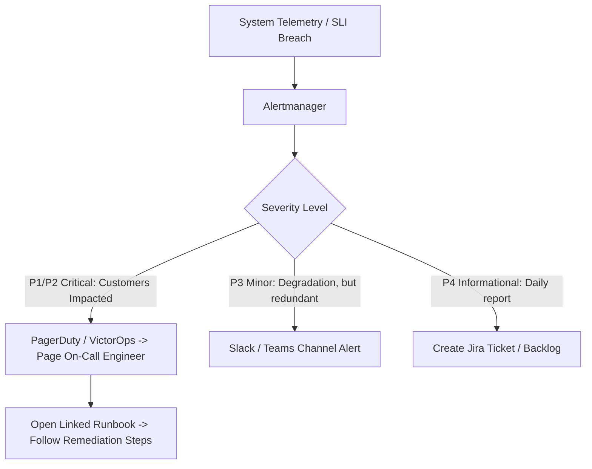

# Alerting Best Practices, Runbooks, and On-Call

Alerting must be actionable, symptom-based, and resilient against alert fatigue. An un-actionable alert woken up at 3:00 AM leads to burnout and missed production outages.



---

## 1. Alert on Symptoms, Not Causes

- **Bad (Cause-Based)**: "Server 4 CPU at 92%!" (Who cares if users are experiencing zero errors and sub-50ms latency?)
- **Good (Symptom-Based)**: "Checkout error rate > 1.5% for 3 consecutive minutes!" (Direct customer impact requiring immediate intervention).

---

## 2. Anatomy of a Production Alert

Every critical on-call alert must contain four essential components:
1. **Summary & Impact**: "Payment processing failure rate is 8.2% (impacts ~500 users/minute)."
2. **Dashboard Link**: One-click link to Grafana dashboard showing relevant RED metrics.
3. **Runbook Link**: Clear step-by-step remediation guide.
4. **Trigger Condition**: Exact Prometheus PromQL query that tripped the alert.

```yaml
# Prometheus Alert Rule
- alert: HighPaymentFailureRate
  expr: (sum(rate(http_requests_total{service="payment",status=~"5.."}[5m])) 
        / sum(rate(http_requests_total{service="payment"}[5m]))) * 100 > 5
  for: 3m
  labels:
    severity: critical
  annotations:
    summary: "Payment Service error rate exceeds 5%"
    runbook_url: "https://wiki.company.internal/runbooks/payment-failure"
```

---

## 3. Key Takeaways

- Page humans only for critical, user-facing, actionable emergencies.
- Every alert must include a direct link to a tested Runbook.
- Continuously tune alerts; delete flapping alerts that do not require immediate human action.
