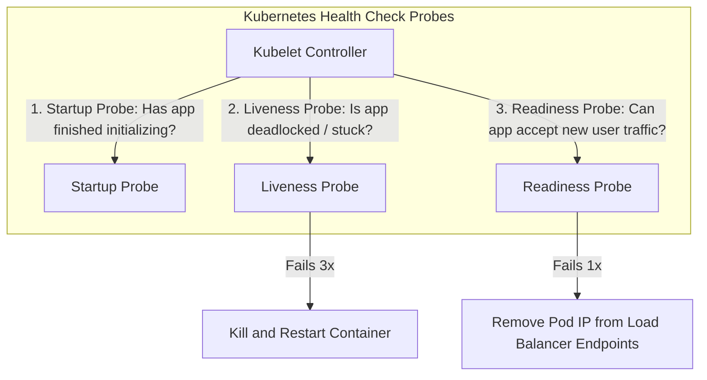

# Health Checks and Operational Dashboards

Health checks allow orchestrators (Kubernetes, AWS ALB) to monitor service lifecycles, route traffic away from failing pods, and restart hung processes safely.

---

## 1. The Three Health Probes

1. **Startup Probe**: Runs during initialization (loading ML models, warming caches). Disables liveness and readiness checks until it succeeds.
2. **Liveness Probe**: Determines if the application process is deadlocked or in an unrecoverable state. If it fails, Kubernetes kills and restarts the container.
   - *Pitfall*: Never check downstream dependencies (DB, Redis) in a liveness probe! If the DB goes down, killing all web pods will cause a catastrophic restart storm.
3. **Readiness Probe**: Determines if the pod is ready to accept incoming traffic. If the database connection pool is temporarily saturated, the readiness probe fails and the load balancer stops sending new requests until it recovers.

---

## 2. Designing Operational Dashboards

A great operational dashboard tells a complete story at a glance:
- **Top Row (Executive / Health)**: Overall Request Rate, Global Error Rate (5xx), p95/p99 Latency.
- **Middle Row (Service Dependencies)**: Database query latency, Redis cache hit ratio, external API dependency latency.
- **Bottom Row (Infrastructure / Saturation)**: CPU utilization, Memory usage (JVM Heap / RSS), Pod restart count.

---

## 3. Key Takeaways

- Never check downstream dependencies in Liveness probes.
- Use Readiness probes to shed traffic when local resource queues or connection pools fill up.
- Build hierarchical dashboards: high-level business SLIs at top, low-level infrastructure at bottom.
